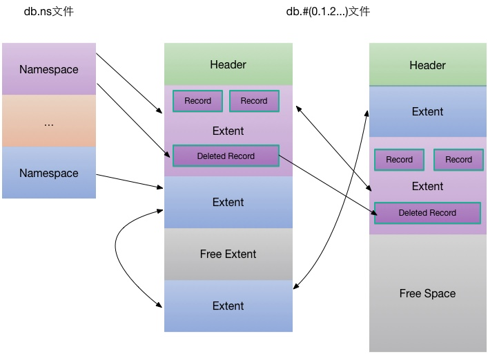

在 MongoDB 发展的早期，并没有存储引擎的概念，文档的存储使用一种简单的基于 mmap 的存储管理机制，到 MongoDB 3.0，MongoDB 引入 WiredTiger 后，有了多存储引擎的支持，原来的存储机制也抽象为 mmapv1 存储引擎，并作为 默认的存储引擎。

在 MongoDB 3.2里，WiredTiger 取代 mmapv1 成为默认的存储引擎，其在性能、数据压缩、行级锁的支持上远胜 mmapv1，但在有些场景，比如大量集合的存储、inplace-update 的场景，目前 WiredTiger 还不能很好的胜任（这方面的改进已在官方的 Roadmap 上），mmapv1 的核心在于其足够简单，本文将详解 mmapv1 存储引擎的实现机制。

MongoDB 的 mongod 服务管理一个数据目录，可包含多个DB，每个DB的数据单独组织，本文主要介绍 mmapv1 存储引擎的数据组织方式。

## Database

每个Database(DB)由一个.ns文件及若干个数据文件组成

```text
$ll mydb.*
-rw-------  1 ydzhang  staff  67108864  7  4 14:05 mydb.0
-rw-------  1 ydzhang  staff  16777216  7  4 14:05 mydb.ns
```

数据文件从0开始编号，依次为mydb.0、mydb.1、mydb.2等，文件大小从64MB起，依次倍增，最大为2GB。

## Namespace

每个DB包含多个namespace（对应mongodb的**collection**名），mydb.ns实际上是一个hash表（采用线性探测方式解决冲突），用于快速定位某个namespace的起始位置。

hash表里的一个节点包含的元数据结构如下，每个节点大小为628Bytes，16M的NS文件最多可存储26715个namespace。

```c++
struct Node {
    int hash;
    Namespace key;
    NamespaceDetails value;
};
```

- key为namespace的名字，为固定长度128字节的字符数组。
- hash为namespce的hash值，用于快速查找
- value包含一个namespace所有的元数据

namespace元数据结构如下:

```c++
class NamespaceDetails {
    DiskLoc firstExtent; // 第一个extent位置
    DiskLoc lastExtent;  // 最后一个extent位置
    DiskLoc deletedListSmall[SmallBuckets];  // 不同大小的删除记录列表
    ...
};
```

其中DiskLoc代表某个数据文件的具体偏移位置，数据文件使用mmap映射到内存空间进行管理，内存的管理（哪些数据何时换入/换出）完全交给OS管理。

```c++
class DiskLoc {
    int _a;  // 数据文件编号，如mydb.0编号为0
    int ofs; // 文件内部偏移
 };
```

## 数据文件

每个数据文件被划分成多个extent，每个extent只包含一个`namespace`的数据，同一个`namespace`的所有`extent`之间以双向链表形式组织。

namesapce的元数据里包含指向第一个及最后一个extent的位置指针，通过这些信息，就可以遍历一个namespace下的所有extent数据。

每个数据文件包含一个固定长度头部DataFileHeader

```c++
class DataFileHeader {
    DataFileVersion version;
    int fileLength;
    DiskLoc unused;
    int unusedLength;
    DiskLoc freeListStart;
    DiskLoc freeListEnd;
    char reserve[];
 };
```

Header中包含数据文件版本、文件大小、未使用空间位置及长度、空闲extent链表起始及结束位置。extent被回收时，就会放到数据文件对应的空闲extent链表里。

unusedLength为数据文件未被使用过的空间长度，unused则指向未使用空间的起始位置。

## Extent

每个extent包含多个Record（**对应mongodb的document**）,同一个extent下的所有record以双向链表形式组织。

```c++
struct Extent {
    unsigned magic;  // 用于检查extent数据有效性
    DiskLoc myLoc;   // extent自身位置

    /* 前一个/后一个 extent位置指针 */
    DiskLoc xnext;
    DiskLoc xprev;

    int length;  // extent总长度 

    DiskLoc firstRecord;  // extent内第一个record位置指针
    DiskLoc lastRecord;   // extent内最后一个record位置指针
    char _extentData[4];  // extent数据
};
```

## Record

每个Record对应mongodb里的一个文档，每个Record包含固定长度16bytes的描述信息。

```c++
class Record {
    int _lengthWithHeaders;  // Record长度
    int _extentOfs;          // Record所在的extent位置指针
    int _nextOfs;            // 前一个Record位置信息
    int _prevOfs;            // 后一个Record位置信息
    char _data[4];           // Record数据
};
```

Record被删除后，会以DeleteRecord的形式存储，其前两个字段与Record是一致的。

```c++
class DeletedRecord {
   int _lengthWithHeaders;  // record长度
   int _extentOfs;          // record所在的extent位置指针
   DiskLoc _nextDeleted;    // 下一个已删除记录的位置
}；
```

一个namespace下的所有的已删除记录（可以回收并复用的存储空间）以单向链表的形式，为了最大化存储空间利用率，不同size（32B、64B、128B...）的记录被挂在不同的链表上，NamespaceDetail里的deletedListSmall/deletedListLarge包含指向这些不同大小链表头部的指针。





## 写入Record

1. 检查对应的namespace对应的删除记录链表里是否有合适的DeletedRecord可以利用，如果有，则直接复用删除空间写入记录。
2. 检查数据文件的freeList里是否有合适大小的空闲extent可以利用，如果有则直接利用空闲的extent，将记录写入。
3. 第1、2步都不成功，则写创建新的extent写入记录；创建新extent时，如果当前的数据文件没有足够的空闲空间，则创建新的数据文件。

## 删除Record

删除的记录会以DeleteRecord的形式插入到对应集合的删除链表里，删除的空间在下一次写入新的记录时可能会被利用上；但也有可能一直用不上而浪费。比如某个128Bytes大小的记录被删除后，接下来写入的记录一直大于128B，则这个128B的DeletedRecord不能有效的被利用。

当删除很多时，可能产生很多不能重复利用的"存储碎片"，从而导致存储空间大量浪费；可通过对集合进行[compact](https://link.zhihu.com/?target=http%3A//docs.mongodb.org/manual/reference/command/compact/)来整理存储碎片。

## 更新Record [固定格式的记录]

更新Record时，分2种情况

1. 更新的Record比原来小，可以直接复用现有的空间（原地更新）；多余的空间如果足够多，会将剩余空间插入到DeletedRecord链表；
2. 更新的Record比原来大，更新相当于删除 + 新写入，原来的空间会插入到DeletedRecord链表里。

更新跟删除类似，也有可能产生很多存储碎片；如果业务场景里更新很多，可通过合理设置[Record Padding](https://link.zhihu.com/?target=http%3A//docs.mongodb.org/v2.4/core/record-padding/)，尽量让每次更新都直接复用现有存储空间。

## 查询Record

没有索引的情况下，查询某个Record需要遍历整个集合，读取出符合条件的Record；如果经常需要根据每个纬度查询Record，则需要给集合建立索引以提供查询效率。