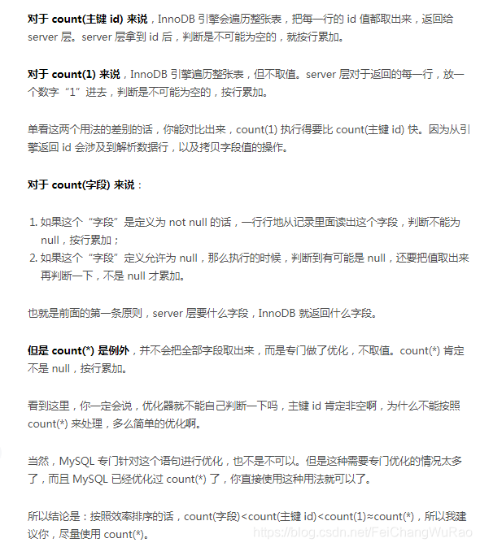

**执行效果上：** 
count(*)包括了所有的列，相当于行数，在统计结果的时候，不会忽略列值为NULL 
count(1)包括了所有列，用1代表代码行，在统计结果的时候，不会忽略列值为NULL 
count(列名)只包括列名那一列，在统计结果的时候，会忽略列值为空（这里的空不是只空字符串或者0，而是表示**null**）的计数，即某个字段值为NULL时，不统计 。

**执行效率上：** 
**列名为主键，**count(列名)会比count(1)快 
**列名不为主键**，count(1)会比count(列名)快 
如果表多个列并且没有主键，则 count（1） 的执行效率优于 count（*） 
如果有主键，则 select count（主键）的执行效率是最优的 
如果表只有一个字段，则 select count（\*）最优

当表的数据量大些时，对表作分析之后，使用count(1)还要比使用count(\*)用时多了！ 
**执行计划上:**
count(1)和count(\*)的效果是一样的。 但是在表做过分析之后，count(1)会比count(\*)的用时少些（1w以内数据量），不过差不了多少。 如果count(1)是聚索引,id,那肯定是count(1)快。但是差的很小的。 因为count(*),自动会优化指定到那一个字段。所以没必要去count(1)，用count(*),sql会帮你完成优化的

因此：count(1)和count(*)基本上是没有差别！ sql调优功能

大致的意思
count(字段)，根绝字段判断为不为不空，根据字段定义，考虑要不要累加返回值，既然你引擎都返回值了，那我server层 “ +1 ”
count(id),根据id主键取值，累加返回值，也是server层 “ +1 ”
count(1)，同样会遍历，但不取值，引擎告诉不为空那我就 “+1”
count(*),也不取值，而且人家还是经过优化的

根据上面的推倒，搜主键肯定比搜正常字段快， 不取值的一定比取值的快（我就是查数统计一下，你给我这一行所有的值也没啥用啊）， 优化过的比没优化过的快

以下排行是按照效率，而不是时间
count（*） > count（1） > count（id） > count（字段）