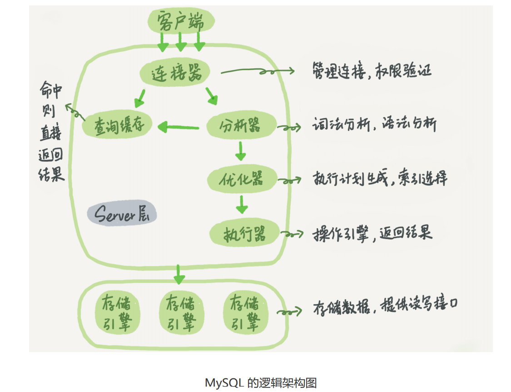
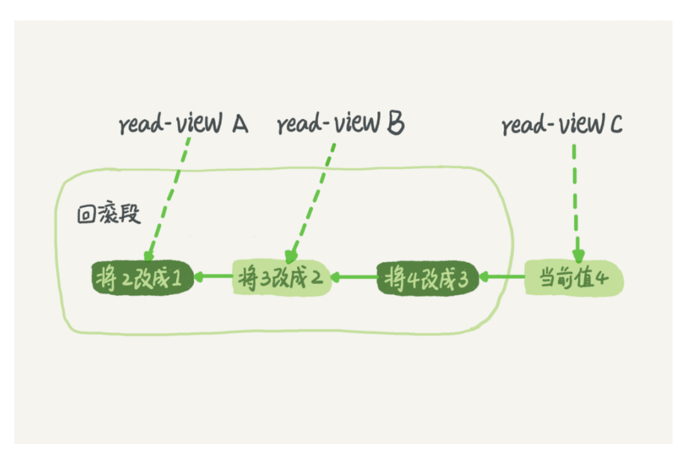

# #Mysql实战45讲总结

> 我希望更多的能以一个问题的方式总结出这45讲的干货。

[MySQL 的 crash-safe 原理解析](https://zhuanlan.zhihu.com/p/142491549)

## 第一讲：一条SQL查询语句是如何执行的？

### 1. 一条 SQL 的执行过程时怎样的？

连接器->分析器->优化器->执行器



涵盖 MySQL 的大多数核 心服务功能，以及所有的内置函数（如日期、时间、数学和加密函数等），所有跨存储引擎 的功能都在这一层实现，比如**存储过程、触发器、视图**等。

### 2. 如何处理 Mysql 由于长连接过多导致内存占用过大的问题？

a. 定期断开长连接。使用一段时间，**或者程序里面判断执行过一个占用内存的大查询后， 断开连接，之后要查询再重连。**

b, 如果你用的是 MySQL 5.7 或更新版本，可以在每次执行一个比较大的操作后，通过执行 **mysql_reset_connection** 来重新初始化连接资源。这个过程不需要重连和重新做权限验 证，但是会将连接恢复到刚刚创建完时的状态。

注： `mysql_reset_connection` 是 MySQL api

### 3.  MySQL 服务层的查询缓存会带来哪些问题？

a. 缓存更新的粒度过高，一个表更新整个缓存均失效， 这对一个压力较大的库来说是十分痛苦的，会导致命中率及其低。

b. 但也不是说没坏处，任何事有利有弊端，该缓存对静态表及其友好，（配置表）

c. MySQL 也提供了这种“按需使用”的方式。你可以将参数 `query_cache_type` 设置 成 DEMAND，这样对于默认的 SQL 语句都不使用查询缓存。而对于你确定要使用查询缓 存的语句，可以用 SQL_CACHE 显式指定，像下面这个语句一样：

```sql
select SQL_CACHE * from T where ID=10；
```

query_cache_type 支持 

0 关闭， 1 开启， 2 按需使用 

### 4.如果执行一个 SQL 语句 出现字段错误，或者说找不到字段，问题出现在服务层的哪个阶段？

我认为是优化器的，优化器会进行优化分析，比如用先执行哪个条件，使用哪个索引。如 果没有对应的字段就会报错的，我看其他评论说是执行器，原因是这个时候才打开表获取数据，但是表的字段不是数据啊，是事先定义好的，所以可以直接读取的，不需要打开表。

## 第二讲：一条更新语句是如何被执行的。

### 1. 什么是 WAL 技术？

WAL 全称为 Write Ahead Logging，指的是先写日志（buffer）再写磁盘。根据不同的策略减少 IO 的写入次数。

### 2. redo log 如何保证 crash safe？

 crash safe 指的是即使数据库发生异常重启，之前提交的记录都不会丢失。 inodb提供的 redo log也称为事务日志，由InnoDB存储引擎层产生。记录的是数据库中每个页的修改，而不是某一行或某几行修改成怎样，可以用来恢复提交后的物理数据页（恢复数据页，且只能恢复到最后一次提交的位置，因为修改会覆盖之前的）。

### 3. bin log 是什么？有什么作用？

bin log 是 Mysql Server 实现的，所有引擎都可以使用，记录的是 sql 语句， redo log 是循环写的而 bin log 不同，bin log 是写一个文件，满了再写下一个文件。有一点需要注意， bin log 不允许一个事务的log 跨 日志文件，因此日志文件大小可能会大于 bin log 设置的最大大小。

#### 4. bin log 不是服务层的东西嘛，为什么 二阶段提交会先写 redo log？

只有引擎层执行完了才会写日志，先写 redo log 是因为 redo log 在引擎曾，然后通知服务层，我写完了，服务层再写 bin log。然后服务层的执行器通知引擎层提交事务。于是引擎把刚刚写入的 redo log 改成提交（commit）状 态，更新完成。

### 5. 怎样让数据库恢复到半个月内任意一秒的状态？

binlog 会记录所有的逻辑操作，并且是采用“追加写”的形式。如果你 的 DBA 承诺说半个月内可以恢复，那么备份系统中一定会保存最近半个月的所有 binlog，同时系统会定期做整库备份。这里的“定期”取决于系统的重要性，可以是一天 一备，也可以是一周一备。（因此  binlog 保证了数据库的持久性。）

**谈一句，丢数据是一定的，我们有很多策略能保证减少数据丢失的量，但这是一个权衡问题**

### 6.不使用 两阶段提交会造成哪些问题？

a. 先写 redo log 后写 binlog。**假设在 redo log 写完，**binlog 还没有写完的时候， MySQL 进程异常重启。由于我们前面说过的，redo log 写完之后，系统即使崩溃，仍 然能够把数据恢复回来，所以恢复后这一行 c 的值是 1。 但是由于 binlog 没写完就 crash 了，**这时候 binlog 里面就没有记录这个语句。因此， 之后备份日志的时候，存起来的 binlog 里面就没有这条语句。 然后你会发现，如果需要用这个 binlog 来恢复临时库的话，由于这个语句的 binlog 丢 失，这个临时库就会少了这一次更新，恢复出来的这一行 c 的值就是 0，与原库的值不 同。** 

b. 先写 binlog 后写 redo log。如果在 binlog 写完之后 crash，由于 redo log 还没写， 崩溃恢复以后这个事务无效，所以这一行 c 的值是 0。但是 binlog 里面已经记录了“把 c 从 0 改成 1”这个日志。所以，**在之后用 binlog 来恢复**的时候就多了一个事务出来， 恢复出来的这一行 c 的值就是 1，与原库的值不同。

### 7. 第二讲提供的几个命令

redo log 用于**保证 crash-safe 能力**。innodb_flush_log_at_trx_commit 这个参数设置成 1 的时候，表示每次事务的 redo log 都直接持久化到磁盘。这个参数我建议你设置成 1， 这样可以保证 MySQL 异常重启之后数据不丢失。 sync_binlog 这个参数设置成 1 的时候，表示每次事务的 binlog 都持久化到磁盘。这个参 数我也建议你设置成 1，这样可以保证 MySQL 异常重启之后 binlog 不丢失。


##  第三讲：事务隔离：为什么你改了我还看不见？

### 1. 谈谈多个事务同时执行的时候，可能出现什么问题？

a. 脏读

b. 不可重复读

c.幻读

### 2. SQL标准的事务隔离级别包括哪些？

a. 读未提交： 一个事务还没提交时，它做的变更就能被别的事务看到。（不创建视图）

b. **读提交**: 一个事务提交之后，他做的变更才会被其他事务看到。（在每个SQL 语句开始执行的时候创建视图）

c. **可重复读**：一个事务执行过程中看到的数据，总是和这个事务启动的时候看到的数据一致的。（创建事务开始的时候，创建视图。）

d. 串行化： 对同一行记录，写加写锁，读加读锁。当出现锁冲突的时候，后访问的事务必须等前一个事务执行完成,才能继续执行。（加锁）

查看隔离级别

```mysql
show variables like 'transaction_isolation';
```

```tex
mysql> show variables like 'transaction_isolation';                                                                 +-----------------------+-----------------+                                                                         | Variable_name         | Value           |                                                                          +-----------------------+-----------------+                                                                          | transaction_isolation | REPEATABLE-READ |                                                                     
+-----------------------+-----------------+                                                                             1 row in set, 1 warning (0.07 sec)                                                                                                                           
```

### 3. 不同事务隔离适用的可场景有哪些？

可重复读： 对比当前银行卡余额与上个月银行卡余额的差额。 可重复读保证读的时候视图时静态的。

### 4. 事务隔离是怎么实现的？

在每条记录在更新的时候，都会同时记录一条回滚操作。记录上的最新值，通过回滚操作，能回到前一个状态。

回滚日志会记录，每一个字段的回滚日志，如下图。



不同的时刻启动的事务会有不同的 read-view。在视图 a，b，c 中对同一个记录存在不同的版本。这就是 mvcc ，对于 视图 a 要想得到1必须将当前值一次回滚。

### 5. 回滚日志应该什么时候删除呢？/为什么不推荐使用长事务？

当不需要的时候，嗯，一句废话。我从上面这个图可以看到，当 read-view 不被占用的时候，就可以被删除了。当 read-view A长时间执行，则 数据库中 对它可能用到的回滚记录，将一直保存。回滚数据占空间也就罢了，甚至可能会拖垮数据库。（在第二讲，有更详细的介绍）

### 6.  事务的启动方式有哪些？

``` mysql
# 1.显示启动
begin/ start transaction 
commit
# 2
set autocommit=0;
# 该命令将这个线程自动提交关掉，只要执行一个 select 语句 事务就启动了，事务会持续到 commit 或者 rollback 语句，或者 断开连接
# 3
commit work and chain; # 自动提交并且开始新一轮的事务
```

### 7. 如何查询长事务

```mysql
#在 information_schema 库中。
```


## 第四讲：

### 1.索引的常见类型？

a. 哈希表 ： 由于哈希表的**排列**并不是递增的，哈希表对于区间查询的速度很慢

b. 有序数组： 有序数组在等值查询和范围查询场景中性能是十分优秀的，但在插入效率中会导致大量的操作，因此 有序数组只适用于 静态存储引擎。

c. 二叉搜索树： 为了使得查询最少的访问磁盘，更偏向于使用n叉树进行存储。 查找一个值最多三次访问磁盘。N叉树由于在读写上的性能优点，以及适配磁盘的访问模式，已经广泛应用在数据库的引擎中。

### 2.innodb 为什么选择了 B+ 树作为它的存储结构？


### 3. 有哪些索引类型？

根据叶子节点的内容，索引类型分为主键索引和非主键索引。

主键索引的叶子节点存放的是整行数据，在 innodb 中， 主键索引也成为聚簇索引。

非主键索引的叶子节点的内容是主键的值，在 innodb里，非主键索引也成为二级索引。

### 4. 基于主键的索引和普通索引的查询有什么区别？

基于非主键索引的查询需要多扫描一颗索引树。因此在应用中应该尽快使用主键查询。

### 5.能谈谈索引页的分裂情况吗？


### 6. 一定要使用自增主键吗？

a. 递增主键好处

 I. 递增主键得插入，每次插入都是追加插入，不会涉及到挪动其他记录，也不会触发叶子节点的分裂。

而带有业务字段做主键，往往不容易保证有序插入，这样数据写的成本更高。

我这里有一个疑问，更多的关于，聊天的 个人 id 字段该如何设计。

像 QQ 这种， 申请者能拿到一个 QQ 号码 ，而 大家的 QQ 号码 都是篇随机的，没有听说谁申请到 的 ID 号码，是连续的。这种方案是如何做的呢。

我能想到的是预分配， 将用户字段多增加一个字段称为分配字段。批量生成 id 号 当用户申请的时候，填写个人信息。

但是这时候又面临着 查找的时候慢。 

因此将用户id 作为用户信息表的外键 同时建立索引，查找的时候直接查 用户信息表。这样就避免了用户信息表分页的情况。但这种情况涉及到了回表，但是也有手段不进行回表，就是联合索引。

查表得时候直接查 用户信息表得索引 外键字段。

**我们更应该选择数字而不是字符来做主键**

### 第五讲：索引

覆盖索引会引起回表得原因在于，我们所需要得数据只有主索引上才有。

由于覆盖索引能够减少树得搜索次数，显著提高性能，因此使用覆盖索引是一个常用得性能优化手段。

覆盖索引是一种典型得以空间换时间得 方式，因此是否使用覆盖索引也是一种权衡之术。

### 1. 最左原则

#### 最左原则第一问题，在建立联合索引如何安排索引内得顺序？

一、 如果通过调整顺序，可以减少维护一个索引，那么这个索引往往就是需要优先考虑采用的。

二、第二考虑空间，通过多维护索引使得减少空间也是一个很好的方式。

### 2.索引下推

索引下推是 Mysql 5.6 引入的， 它可以对索引的字段优先判断，直接过滤掉不满足条件的记录，来达成减少回表的目的。

## 第六讲： 事务到底是隔离还是不隔离的？


## 第五讲：全局锁和表锁：给表加个字段怎么这么难

### 0. 锁的分类： innodb 与 My**的锁的区别。

innodb 有 全局锁，表锁和行锁三种。

my** 只有表锁。

### 1.  全局锁的命令与场景

```mysql
Flush tables with read lock #( FTWRL )
```

全局锁： 全局锁就是对整个数据库实例加锁，会阻塞数据的更改与表结构定义。

一般用于 备份数据库但是由于阻塞特性所以会导致库的阻塞。

MySQL 提供 mysqldump 工具 通过 `-single-transaction`创建一个事务得到一致性视图，由于mvvc 的原因还是可以数据正常更新。

### 2. 既然全库可读为什么不使用 `set global readonly = true` 的方式呢？

a. readonly 一般用于判定 主库还是备库。

b. 在一个 session 中如果客户端断开会释放这个全局锁。

### 3.   说说表锁？

表锁语法：

```mysql
lock tables ... read / write；

unlock tables ...;
```

颗粒度太大

另一类表锁： MDL (metadata lock), 隐式使用，

当一个表做增删改查的时候，加 MDL 读锁， 当对标结构变更的时候加 MDL 写锁。

### 4. 如何优雅的给线上小表添加字段？

a. 杀死长事务

b. 设定 alter tables 的等待时间，如果在这个指定的等待时间能够把 MDL 写锁最好，如果不行放弃，重试。

## 第六讲：如何减少行锁对性能的影响？

### 1.什么是两阶段锁?

innodb 中行锁是需要的时候才加上的，但不是不需要了就立即释放，而是等待事务的结束才释放。这个就是两阶段所协议。

### 2. 如何检测死锁？

a. 设置超时时间 `innodb_lock_wait_timeout`

b. 发起死锁检测，主动回滚死锁链的某一个事务。 将参数设为 `innodb_deadlock_detect`设置为 on。

但是死锁检测会浪费资源，尤其是在 热点行执行的时候。

a. 保证没有死锁，关闭临时检测

b. 控制并发度

### 3.  如何删除 一个表内的前1000条数据，

a. 直接执行 delete from T limit 1000；

b. 一个session 执行20次删除

c. 20个连接执行一次删除

第二种好， 如果是 加了天然条件可以使得1000行分开考虑第三种。

## 第四十四讲：自增id用没了怎么办？

### 1. 表自增 id

表自增 id 达到上限的时候，在申请 下一个 id，得到的值是不变的。

如果可能达到上限 应该创建 8个字节的 bigint unsigned 类型

插入的时候，会报错主键已经存在

### 2. innodb  系统自增 row_id

如果未指定 主键，那么innodb 会给你创建一个不可见，长度为6个字节的 row_id。 innodb 维护了一个 全局的 dict_sys.row_id值，所有无主键的 innodb 表，每插入一行数据，都将当前的 dict_sys.row_id值所作为要插入数据的 row_id，然后把 dict_sys.row_id 值加1 。

实际上 innodb row_id 为8个字节，但是只用到了 6个字节。如果申请到的 row_id 已经存在，则会覆盖原有数据。

因此我们更应该在 innodb 建立索引，因为把错误暴漏出来是最好的方法。

### 3.Xid3

xid应对事务，mysql 内部维护了 global_query_id 每次执行的时候，这个变量会加1，同时会把 query_id 赋值给 xid。 global_query_id 重启后清零。

不同事务的binlog xid 可能是相同的。

### 4. innodb trx_id (事务id)

innodb事务可见性的核心思想在于，每一行数据都记录它更新的 trx_id 当一个事务读取一行诗句的时候，去判断这个数据是否可见。就是通过一致性视图与这行数据的 trx_id 做对比。
