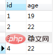
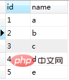
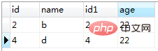

在join后面可以接on条件和where条件，在这里我主要就是说这两者之间的差别

建立两张简单的用来测试的表并添加数据，如下所示，一张表名为id_name，另一张表名为id_age

首先看看不添加条件——t2.age ='22'时的结果

SELECT * from id_name t1 LEFT JOIN id_age t2 on t1.id = t2.id
得到

1、在这里以left join为例，首先运行where加条件——t2.age ='22'时

SELECT * from id_name t1 LEFT JOIN id_age t2 on t1.id = t2.id where t2.age ='22'
得到结果如下

可以得到where条件是在left join操作完成后所进行的条件筛选

2、当运行on加条件——t2.age ='22'时

SELECT * from id_name t1 LEFT JOIN id_age t2 on t1.id = t2.id and t2.age ='22'
得到结果如下

可得到on条件是在left join之前先进行条件筛选，而后才对两个表格join操作

在这里是以left join为例，对于inner join来说由于其性质，这两种条件得到的结果会是一样，但中间内部过程还是有差异的

on比where起作用更早，，先根据on条件进行多表的连接操作，生成一个临时表再通过where来筛选

那 on 和where 那个更高效呢

如果是inner join, 放on和放where产生的结果一样, 但没说哪个效率速度更高? 如果有outer join (left or right), 就有区别了, 因为on生效在先, 已经提前过滤了一部分数据, 而where生效在后.

综合一下, 感觉还是放在on里更有效率, 因为它先于where执行.
先笛卡尔积, 然后再on过滤, 如果join是inner的, 就继续往下走, 如果join 是left join, 就把on过滤掉的左主表中的数据再添加回来; 然后再执行where里的过滤;

**on中不是最终过滤, 因为后面left join还可能添加回来, 而where才是最终过滤.**

只有当使用外连接(left, right)时, on 和 where 才有这个区别, 如果用inner join, 在哪里制定都一样, 因为on 之后就是where, 中间没有其它步骤.

