提到事务，相信大家都不陌生，事务的ACID四大特性，也是面试时经常问的，不过一般情况下，我们可能想到的是传统关系型数据库的事务，其实，Redis也是提供了事务机制的，本篇博客就来讲解下Redis的事务机制。

## 1. 事务演示

Redis的事务提供了一种将多个命令请求打包，然后一次性、按顺序性地执行多个命令的机制。

在事务执行期间，服务器不会中断事务而去执行其它客户端的命令请求，它会将事务中的所有命令执行完毕，然后才去处理其它客户端的命令请求。

下图展示了一个Redis事务的执行过程：

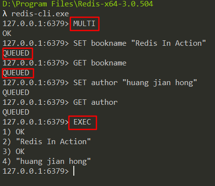

可以看出，事务以`MULTI`命令开始，然后将多个命令放到事务当中，最后由`EXEC`命令将这个事务提交给服务器执行。

## 2. 事务实现原理

一个事务从开始到结束会经历以下3个阶段：

1. 事务开始
2. 命令入队
3. 事务执行

### 2.1 事务开始

`MULTI`命令的执行标志着事务的开始。

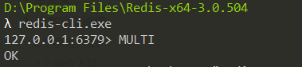

执行完该命令后，客户端状态的flags属性会打开REDIS_MULTI标识，表示该客户端从非事务状态切换至事务状态。

### 2.2 命令入队

当一个客户端处于**非事务状态**时，这个客户端发送的命令会立即被服务器执行：

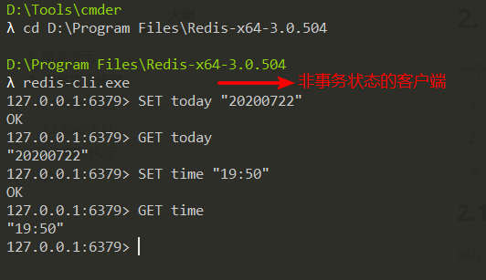

当一个客户端处于**事务状态**时，这个客户端发送的命令，服务器是否会立即执行，分为以下2种情况：

1. 如果客户端发送的命令为`MULTI`、`EXEC`、`WATCH`、`DISCARD`四个命令中的其中1个，服务器会立即执行这个命令。
2. 如果客户端发送的命令为以上4个命令外的其它命令，服务器不会立即执行这个命令，而是将其放到事务队列里，然后向客户端返回`QUEUED`回复。

以上流程可以使用以下流程图来表示：

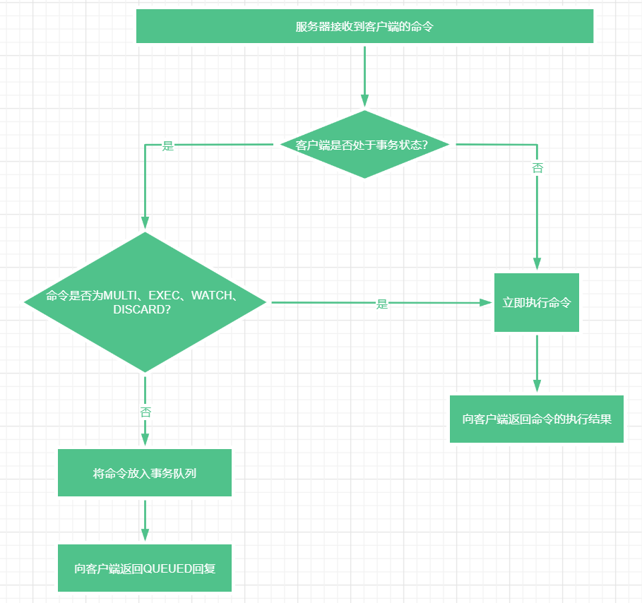

这里首先提下`DISCARD`命令，这个命令用于取消事务，放弃执行事务块内的所有命令，如下所示：

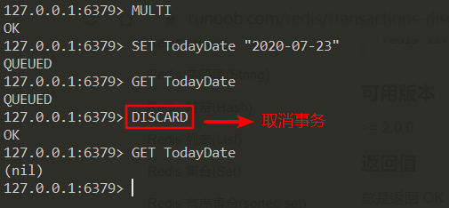

然后提下**事务队列**，每个Redis客户端都有自己的事务状态，事务状态存储在客户端状态的mstates属性里：

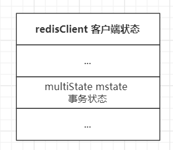

事务状态包含1个事务队列和1个已入队命令的数量，如下所示：

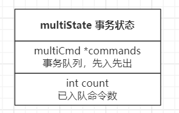

事务队列是一个multiCmd类型的数组，数组中的每个multiCmd结构保存了一个已入队命令的相关信息，比如：

1. 指向命令实现函数的指针，如GET命令、SET命令
2. 命令的参数
3. 参数的数量

事务队列以**先进先出（FIFO）**的方式保存入队的命令。

### 2.3 事务执行

当一个处于事务状态的客户端执行`EXEC`命令时，服务器会遍历这个客户端的事务队列，执行队列中保存的所有命令（**按先入先出顺序**），然后将执行命令的结果一次性返回给客户端。

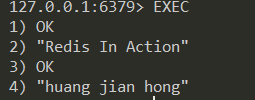

## 3. WATCH命令的实现原理

`WATCH`命令用于监视任意数量的数据库键，并在`EXEC`命令执行时，检测被监视的键是否被修改，如果被修改了，服务器将拒绝执行事务，并向客户端返回空回复。

为了更好的理解，我们做个演示，首先，我们打开客户端1，执行`WATCH`命令监视键“name”，然后开启一个事务：

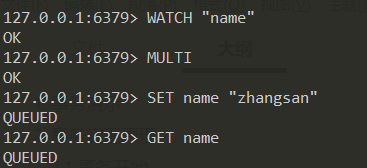

此时，先不要执行EXEC命令，打开客户端2，执行以下命令修改“name”键的值：

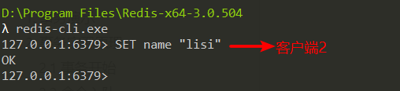

然后，在客户端1执行EXEC命令时，会返回空回复，因为“name”键的值在客户端2已经被修改：

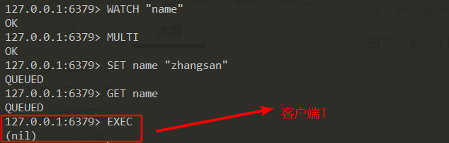

那么，`WATCH`命令的实现原理是什么样的呢？我们从以下3个方面来分析：

1. 使用WATCH命令监视数据库键
2. 监视机制的触发
3. 判断事务是否安全

### 3.1 使用WATCH命令监视数据库键

每个Redis数据库都保存着1个`watched_keys`字典，这个字典的键是某个被WATCH命令监视的数据库键，字典的值是一个链表，链表中记录了所有监视相应数据库键的客户端。

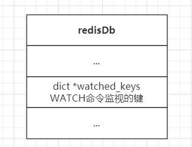

举个例子，假如客户端1正在监视键“name”，客户端2正在监视键“age”，那么`watched_keys`字典存储的数据大概如下：

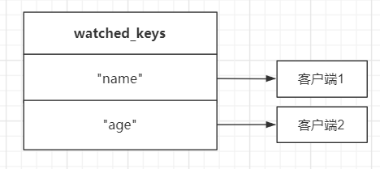

如果此时客户端3执行了以下`WATCH`命令：

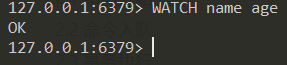

那么`watched_keys`字典存储的数据就变为：

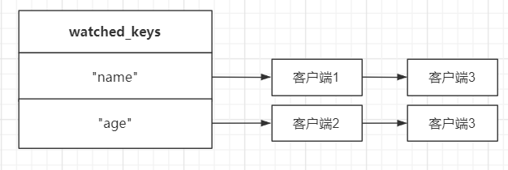

### 3.2 监视机制的触发

那么问题来了，既然`watched_keys`字典存储了被WATCH命令监视的键，那么监视机制是如何被触发的呢？

答案是所有对数据库修改的命令，比如`SET`、`LPUSH`、`SADD`等，在执行之后都会对`watched_keys`字典进行检查，如果有客户端正在监视刚刚被命令修改的键，那么所有监视该键的客户端的`REDIS_DIRTY_CAS`标识将被打开，表示该客户端的事务安全性已经被破坏。

以上图为例，如果键“name”的值被修改，那么客户端1、客户端3的`REDIS_DIRTY_CAS`标识会被打开。

### 3.3 判断事务是否安全

最后非常关键的一步是，当服务器接收到一个客户端发来的`EXEC`命令时，服务器会根据这个客户端是否打开了`REDIS_DIRTY_CAS`标识来决定是否执行事务，判断的流程图如下所示：

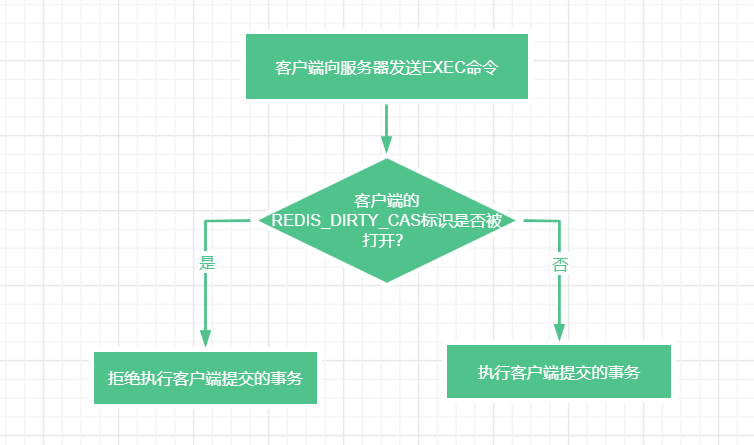

## 4. 事务执行失败举例

先来看第1个例子，这个事务因为**命令入队出错**被服务器拒绝执行，事务中的所有命令都不会被执行：

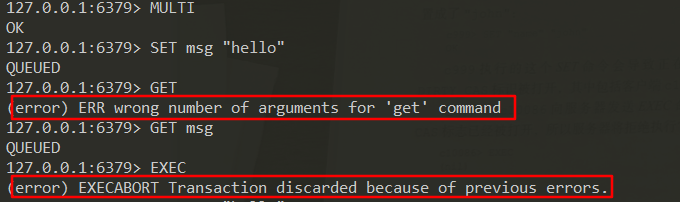

再来看第2个例子，事务入队时出现了**不存在的命令**，服务器将拒绝执行这个事务：

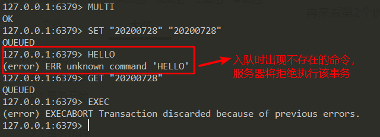

再来看第3个例子，`RPUSH`命令在执行期间报错了，但后续命令仍然继续执行，并且之前执行的命令没有受到任何影响：

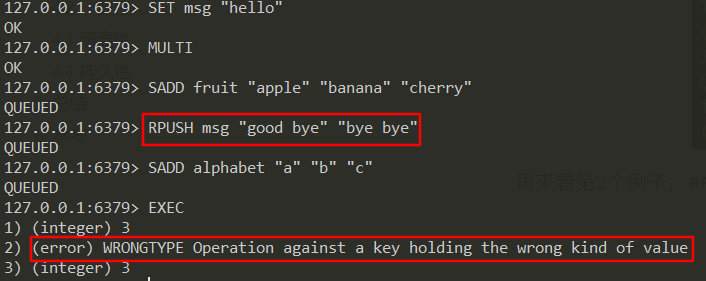

这个例子也说明**Redis事务不支持回滚机制**。

## 5. 总结

Redis的事务提供了一种将多个命令打包，然后一次性、有序地执行的机制，

它的原理是多个命令会被入队到事务队列中，然后按先进先出（FIFO）的顺序执行，

并且事务在执行过程中不会被中断，当事务队列中的所有命令都被执行完毕之后，事务才会结束。