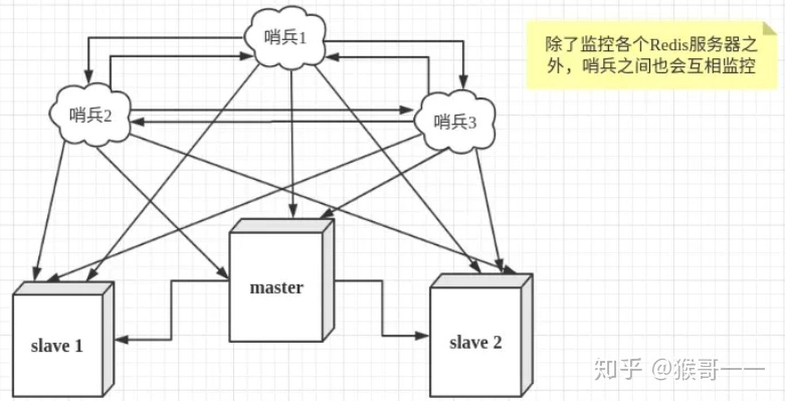

> 最近在面试过程中被面试官问到 Redis 集群数据是如何复制的，由于之前没有准备直接懵了。
> 事后查了查这个问题其实也挺简单，如果你之前也不知道，没问题，赶紧浅尝辄止，速度3遍即可入门。

阅读本文，你可能会有哪些收获呢？

- 首先，你会知道有三种集群模式
- 然后对每种集群模式的原理有个大概了解
- 当然还能看到集群演变的影子
- 最后还会有手把手的实操

**Redis 支持三种集群方案**

- 主从复制模式
- Sentinel（哨兵）模式
- Cluster 模式

## **Redis 集群的三种模式**

### **主从复制模式**

### **主从复制的作用**

通过持久化功能，Redis保证了即使在服务器重启的情况下也不会丢失（或少量丢失）数据，因为持久化会把内存中数据保存到硬盘上，重启会从硬盘上加载数据。 但是由于数据是存储在一台服务器上的，如果这台服务器出现硬盘故障等问题，也会导致数据丢失。（通过同步RDB）

为了避免单点故障，通常的做法是将数据库复制多个副本以部署在不同的服务器上，这样即使有一台服务器出现故障，其他服务器依然可以继续提供服务。

为此， **Redis 提供了复制（replication）功能，可以实现当一台数据库中的数据更新后，自动将更新的数据同步到其他数据库上**。

在复制的概念中，数据库分为两类，一类是主数据库（master），另一类是从数据库(slave）。主数据库可以进行读写操作，当写操作导致数据变化时会自动将数据同步给从数据库。而从数据库一般是只读的，并接受主数据库同步过来的数据。一个主数据库可以拥有多个从数据库，而一个从数据库只能拥有一个主数据库。

**总结：引入主从复制机制的目的有两个**

- **一个是读写分离，分担 "master" 的读写压力**
- **一个是方便做容灾恢复**

### **主从复制原理**

- 从数据库启动成功后，连接主数据库，发送 SYNC 命令；
- 主数据库接收到 SYNC 命令后，**开始执行 BGSAVE 命令生成 RDB 文件并使用缓冲区记录此后执行的所有写命令；**
- 主数据库 BGSAVE 执行完后，向所有从数据库发送快照文件，并在发送期间继续记录被执行的写命令；
- 从数据库收到快照文件后丢弃所有旧数据，载入收到的快照；
- 主数据库快照发送完毕后开始向从数据库发送缓冲区中的写命令；
- 从数据库完成对快照的载入，开始接收命令请求，并执行来自主数据库缓冲区的写命令；（**从数据库初始化完成**）
- 主数据库每执行一个写命令就会向从数据库发送相同的写命令，从数据库接收并执行收到的写命令（**从数据库初始化完成后的操作**）
- 出现断开重连后，2.8之后的版本会将断线期间的命令传给重数据库，增量复制。
- 主从刚刚连接的时候，进行全量同步；全同步结束后，进行增量同步。当然，如果有需要，slave 在任何时候都可以发起全量同步。Redis 的策略是，无论如何，首先会尝试进行增量同步，如不成功，要求从机进行全量同步。

### SYNC 命令

从主服务节点初始化流复制。

Redis 从节点调用 [SYNC](https://www.redis.com.cn/commands/sync.html) 来从主节点启动流复制。在 redis 新版本中已经被 [PSYNC](https://www.redis.com.cn/commands/psync.html) 代替。

更多信息可以参考 [Redis 复制](https://www.redis.com.cn/topics/replication)。

### PSYNC replicationid offset

用于复制功能(replication)的内部命令。用于在 slave 节点上执行这个命令向 master 节点请求复制流。

{replicationid} 为master的运行id；{offset}为slave自己的复制偏移量

当slave第一次连接master，slave不知道master的replicationid，也不知道自己偏移量，这时候会传一个问号和-1，告诉master节点是第一次同步。格式为`psync ? -1`

更多信息请参考 [复制（Replication）](https://www.redis.com.cn/topics/replication.html) 文档。

### **主从复制优缺点**

**主从复制优点**

- 支持主从复制，主机会自动将数据同步到从机，可以进行读写分离；
- 为了分载 Master 的读操作压力，Slave 服务器可以为客户端提供只读操作的服务，写服务仍然必须由Master来完成；
- Slave 同样可以接受其它 Slaves 的连接和同步请求，这样可以有效的分载 Master 的同步压力；
- Master Server 是以非阻塞的方式为 Slaves 提供服务。所以在 Master-Slave 同步期间，客户端仍然可以提交查询或修改请求；
- Slave Server 同样是以非阻塞的方式完成数据同步。在同步期间，如果有客户端提交查询请求，Redis则返回同步之前的数据；

**主从复制缺点**

- Redis不具备自动容错和恢复功能，主机从机的宕机都会导致前端部分读写请求失败，需要等待机器重启或者手动切换前端的IP才能恢复（**也就是要人工介入**）；
- 主机宕机，宕机前有部分数据未能及时同步到从机，切换IP后还会引入数据不一致的问题，降低了系统的可用性；
- 如果多个 Slave 断线了，**需要重启的时候，尽量不要在同一时间段进行重启。因为只要 Slave 启动，就会发送sync 请求和主机全量同步，当多个 Slave 重启的时候，可能会导致 Master IO 剧增从而宕机。**
- Redis 较难支持在线扩容，在集群容量达到上限时在线扩容会变得很复杂；

### **Sentinel（哨兵）模式**

第一种主从同步/复制的模式，当主服务器宕机后，需要手动把一台从服务器切换为主服务器，这就需要人工干预，费事费力，还会造成一段时间内服务不可用。这不是一种推荐的方式，更多时候，我们优先考虑哨兵模式。

哨兵模式是一种特殊的模式，首先 Redis 提供了哨兵的命令，**哨兵是一个独立的进程，作为进程，它会独立运行。其原理是哨兵通过发送命令，等待Redis服务器响应，从而监控运行的多个 Redis 实例**。

### **哨兵模式的作用**

- 通过发送命令，让 Redis 服务器返回监控其运行状态，包括主服务器和从服务器；
- 当哨兵监测到 master 宕机，会自动将 slave 切换成 master ，然后通过**发布订阅模式**通知其他的从服务器，修改配置文件，让它们切换主机；

然而一个哨兵进程对Redis服务器进行监控，也可能会出现问题，为此，我们可以使用多个哨兵进行监控。各个哨兵之间还会进行监控，这样就形成了多哨兵模式。

### **故障切换的过程**

假设主服务器宕机，哨兵1先检测到这个结果，系统并不会马上进行 failover 过程，仅仅是哨兵1主观的认为主服务器不可用，这个现象成为**主观下线**。当后面的哨兵也检测到主服务器不可用，并且数量达到一定值时，那么哨兵之间就会进行一次投票，投票的结果由一个哨兵发起，进行 failover 操作。切换成功后，就会通过发布订阅模式，让各个哨兵把自己监控的从服务器实现切换主机，这个过程称为**客观下线**。这样对于客户端而言，一切都是透明的。

### **哨兵模式的工作方式：**

- 每个Sentinel（哨兵）进程以每秒钟一次的频率向整个集群中的 Master 主服务器，Slave 从服务器以及其他Sentinel（哨兵）进程发送一个 PING 命令。
- 如果一个实例（instance）距离最后一次有效回复 PING 命令的时间超过 down-after-milliseconds 选项所指定的值， 则这个实例会被 Sentinel（哨兵）进程标记为主观下线（SDOWN）
- 如果一个 Master 主服务器被标记为主观下线（SDOWN），则正在监视这个 Master 主服务器的所有 Sentinel（哨兵）进程要以每秒一次的频率确认 Master 主服务器的确进入了主观下线状态
- 当有足够数量的 Sentinel（哨兵）进程（大于等于配置文件指定的值）在指定的时间范围内确认 Master 主服务器进入了主观下线状态（SDOWN）， 则 Master 主服务器会被标记为客观下线（ODOWN）
- 在一般情况下， 每个 Sentinel（哨兵）进程会以每 10 秒一次的频率向集群中的所有 Master 主服务器、Slave 从服务器发送 INFO 命令。
- 当 Master 主服务器被 Sentinel（哨兵）进程标记为客观下线（ODOWN）时，Sentinel（哨兵）进程向下线的 Master 主服务器的所有 Slave 从服务器发送 INFO 命令的频率会从 10 秒一次改为每秒一次。
- 若没有足够数量的 Sentinel（哨兵）进程同意 Master主服务器下线， Master 主服务器的客观下线状态就会被移除。若 Master 主服务器重新向 Sentinel（哨兵）进程发送 PING 命令返回有效回复，Master主服务器的主观下线状态就会被移除。

### **哨兵模式的优缺点**

**优点：**

- 哨兵模式是基于主从模式的，所有主从的优点，哨兵模式都具有。
- 主从可以自动切换，系统更健壮，可用性更高(**可以看作自动版的主从复制**)。

**缺点：**

- Redis较难支持在线扩容，在集群容量达到上限时在线扩容会变得很复杂。

### **Cluster 集群模式（Redis官方）**

Redis Cluster是一种服务器 Sharding 技术，3.0版本开始正式提供。

Redis 的哨兵模式基本已经可以实现高可用，读写分离 ，但是在这种模式下每台 Redis 服务器都存储相同的数据，很浪费内存，所以在 redis3.0上加入了 Cluster 集群模式，实现了 Redis 的分布式存储，**也就是说每台 Redis 节点上存储不同的内容**。

在这个图中，每一个蓝色的圈都代表着一个 redis 的服务器节点。它们任何两个节点之间都是相互连通的。客户端可以与任何一个节点相连接，然后就可以访问集群中的任何一个节点。对其进行存取和其他操作。

### **集群的数据分片**

Redis 集群没有使用**一致性 hash**，而是引入了哈希槽【hash slot】的概念。

Redis 集群有16384 个哈希槽，每个 key 通过 **CRC16 校验后对 16384 取模来决定放置哪个槽。**集群的每个节点负责一部分hash槽，举个例子，比如当前集群有3个节点，那么：

- 节点 A 包含 0 到 5460 号哈希槽
- 节点 B 包含 5461 到 10922 号哈希槽
- 节点 C 包含 10923 到 16383 号哈希槽

这种结构很容易添加或者删除节点。**比如如果我想新添加个节点 D ， 我需要从节点 A， B， C 中得部分槽到 D 上。如果我想移除节点 A ，需要将 A 中的槽移到 B 和 C 节点上，然后将没有任何槽的 A 节点从集群中移除即可。由于从一个节点将哈希槽移动到另一个节点并不会停止服务，所以无论添加删除或者改变某个节点的哈希槽的数量都不会造成集群不可用的状态。**

在 Redis 的每一个节点上，都有这么两个东西，一个是插槽（slot），它的的取值范围是：0-16383。还有一个就是 cluster，可以理解为是一个集群管理的插件。当我们的存取的 Key到达的时候，Redis 会根据 CRC16 的算法得出一个结果，然后把结果对 16384 求余数，这样每个 key 都会对应一个编号在 0-16383 之间的哈希槽，通过这个值，去找到对应的插槽所对应的节点，然后直接自动跳转到这个对应的节点上进行存取操作。

### **Redis 集群的主从复制模型**

为了保证高可用，redis-cluster集群引入了主从复制模型，一个主节点对应一个或者多个从节点，当主节点宕机的时候，就会启用从节点。当其它主节点 ping 一个主节点 A 时，如果半数以上的主节点与 A 通信超时，那么认为主节点 A 宕机了。如果主节点 A 和它的从节点 A1 都宕机了，那么该集群就无法再提供服务了。

### **集群的特点**

- 所有的 redis 节点彼此互联(PING-PONG机制)，内部使用二进制协议优化传输速度和带宽。
- 节点的 fail 是通过集群中超过半数的节点检测失效时才生效。
- 客户端与 Redis 节点直连，不需要中间代理层.客户端不需要连接集群所有节点，连接集群中任何一个可用节点即可。