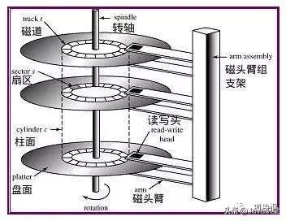

# [redis为何单线程 效率还这么高 为何使用跳表不使用B+树做索引(阿里)](https://www.cnblogs.com/aspirant/p/11704530.html)

如果想了解 redis 与Memcache的区别参考：[Redis和Memcache的区别总结](https://www.cnblogs.com/aspirant/p/8883871.html)

阿里的面试官问问我为何redis 使用跳表做索引，却不是用B+树做索引

因为B+树的原理是 **叶子节点存储数据，非叶子节点存储索引**，B+树的每个节点可以存储多个关键字，它将节点大小设置为磁盘页的大小，充分利用了磁盘预读的功能。每次读取磁盘页时就会读取一整个节点,每个叶子节点还有指向前后节点的指针，为的是最大限度的降低磁盘的IO;因为数据在内存中读取耗费的时间是从磁盘的IO读取的百万分之一

而Redis是 内存中读取数据，不涉及IO，因此使用了跳表； 

至于redis的跳表原理 参考：[聊聊Mysql索引和redis跳表 ---redis的有序集合zset数据结构底层采用了跳表原理 时间复杂度O(logn)(阿里)](https://www.cnblogs.com/aspirant/p/11475295.html)

mysql的B+索引原理 参考：[一步步分析为什么B+树适合作为索引的结构 以及索引原理 (阿里面试)](https://www.cnblogs.com/aspirant/p/9214485.html)

Kafka索引 参考：[kafka如何实现高并发存储-如何找到一条需要消费的数据(阿里)](https://www.cnblogs.com/aspirant/p/11481332.html)

接下来问题来了：为何 redis使用单线程 读取速度还这么块呢

今天下午，烟哥吃饱了撑着没事干，上班时间到处工(zhuang)作(bi)！只见同事小刘的桌上摆了一本Redis相关的书籍，内心嘿嘿一笑：“终于，又有机会勾搭小刘了！”

于是有了如下对话

 

 

"嗯，不要方，跟着我思路来想！"烟哥道。

"假设，此刻有任务A和任务B，现在有如下两种执行方式"

方式一:两个线程，一个线程执行A，另一个线程执行B方式二:一个线程，先执行A，执行完以后继续执行B

"请问，哪种方式执行更快？"

 

 

只见烟哥眉头微微一皱，说道:"我夜观天象，掐指一算，小刘你大学在上《计算机组成原理》这门课的时候，一定逃课了！"

"应该是方式二更快，因为方式一中，CPU在切换线程的时候，有一个上下文切换时间，而这个上下文切换时间是非常耗时的！打个比方，一个CPU主频是 2.6GHz，这意味着每秒可以执行：2.6*10^9 个指令，那么每个指令的时间大概是0.38ns！而一次上下文切换，将近需要耗时2000ns！而这个时间内，CPU什么都干不了，只是做了保存上下文都动作！"

 

 

"OK，就是在I/O操作都时候，例如磁盘I/O，网络I/O等！为什么一般是在I/O操作都时候，要用多线程呢(面试高频题，必背)？因为I/O操作一般可以分为两个阶段:即等待I/O准备就绪和真正操作I/O资源！"

"以磁盘操作为例，磁盘的结构如下"

 

 

"在磁盘上数据是分磁道、分簇存储的，而数据往往并不是连续排列在同一磁道上，所以磁头在读取数据时往往需要在磁道之间反复移动，因此这里就有一个寻道耗时！另外，盘面旋转将请求数据所在扇区移至读写头下方也是需要时间，这里还存在一个旋转耗时！"

"那么，在这一时间段（即"I/O等待"）内，线程是在“阻塞”着等待磁盘，此时操作系统可以将那个空闲的CPU核心用于服务其他线程。因此在I/O操作的情况下，使用多线程，效率会更高！"

"OK,现在回到我们的问题！Redis读写数据有涉及到I/O操作么？"

 

 

"所以啊，Redis不涉及I/O操作，因此设计为单线程是效率最高的！那么，既然你知道既然Redis的性能和CPU无关，那你知道Redis的性能瓶颈在哪么？"

小刘无奈的摇了摇头！

一般在两个地方

其一是机器内存大小，内存大小关系到Redis存储的数据量其二是网络带宽，这点我仔细说一下Redis客户端执行一条命令分为四个过程：发送命令、命令排队、命令执行、返回结果

而其中发送命令+返回结果这一过程被称为Round Trip Time（RTT，往返时间）

Redis的客户端和服务端可能部署在不同的机器上。例如客户端在北京，Redis服务端在上海，两地直线距离约为1300公里，那么1次RTT时间=1300×2/（300000×2/3）=13毫秒（光在真空中传输速度为每秒30万公里，这里假设光纤为光速的2/3），那么客户端在1秒内大约只能执行80次左右的命令，这就和Redis的高并发高吞吐特性背道而驰啦！所以一般情况下，都是就近部署！