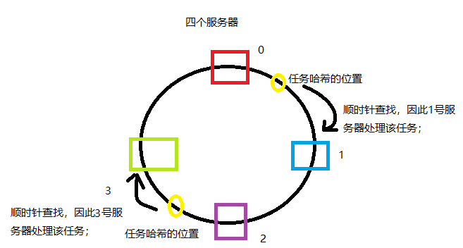
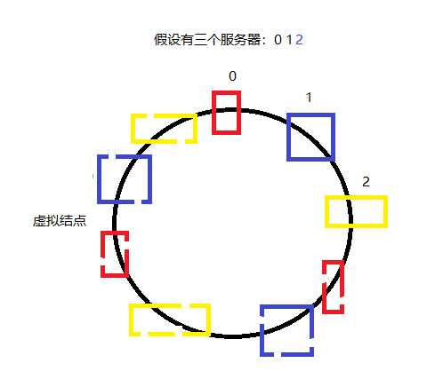
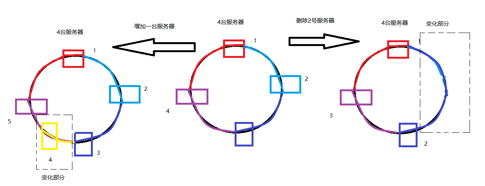

# murmurhash一致性哈希算法

> Murmurhash: 是一种非加密型哈希函数，适用于一般的哈希检索操作。高运算性能，低碰撞率，由Austin Appleby创建于2008年，现已应用到Hadoop、libstdc++、nginx、libmemcached等开源系统。2011年Appleby被Google雇佣，随后Google推出其变种的CityHash算法。 一致性哈希算法…

　 Murmurhash: 是一种非加密型哈希函数，适用于一般的哈希检索操作。高运算性能，低碰撞率，由Austin Appleby创建于2008年，现已应用到Hadoop、libstdc++、nginx、libmemcached等开源系统。2011年Appleby被Google雇佣，随后Google推出其变种的CityHash算法。

一致性哈希算法的主要步骤：

- 首先求出缓存服务器结点的哈希值，将其映射到0~2^32的环上；
- 然后用同样的方法求出存储数据的键的哈希值，并映射到环上；
- 最后是从数据映射的位置顺时针查找，将数据发送给找到的第一个服务器上。

# 一、一致性哈希原理

根据上述对于一致性哈希算法思想以及步骤的描述，它的基本原理及过程如图1所示：

# 二、处理哈希偏斜

　　由于每个服务器在环上的分布是不均匀的，所以就有可能会存在哈希偏斜的问题，如图2所示；解决这一问题所采用的方法就是引用虚拟结点；如果这三个服务器按照如图2的样子进行排列，那么在0~1之间的哈希值都会交给1进行处理,1~ 2之间的哈希值都会交给2进行处理,2~0之间的哈希值都会交给0进行处理，这样导致的结果就是0的负载是太大，当0服务器撑不住崩溃后，会陆续使得1和2的负载增大导致整个服务器集群崩溃这种分布就称为哈希偏斜;

　　所以我们引入虚拟结点，解决这一问题;这样2~1之间的哈希值就不会全部交给0来处理，而是照样根据顺序查找，当查找到某虚拟结点时，根据结点之间的关系映射到真实的结点上让其进行处理;

# 三、一致性哈希的优点

　　相比于直接哈希来讲，一致性哈希算法的优点在于每个服务器都不会受到其他服务的增加或删除的影响。对于一致性哈希，当需要从环中删掉一个服务器时，其他的服务器不会被其干扰，删除后的结果就是，删除点的下一个服务器所处理的范围除了原来的部分之外，还增加了删除的那台服务器所需要处理的部分。但这并不影响剩下的服务器正常工作 ；相应的，当需要在环中增加一个结点时，增加的结果就是增加点的下一个服务器的处理范围减小，减少的部分由增加的服务器进行处理，同样并不影响其他的服务器正常工作；如下图3所示：

# 四、一致性哈希的特点

**均衡性(Balance)**

​    平衡性是指哈希的结果能够尽可能分布到所有的缓冲中去，这样可以使得所有的缓冲空间都得到利用。很多哈希算法都能够满足这一条件。

**单调性(Monotonicity)**

​    单调性是指如果已经有一些内容通过哈希分派到了相应的缓冲中，又有新的缓冲区加入到系统中，也就是当缓冲区大小变化时一致性哈希(Consistent hashing)尽量保护已分配的内容不会被重新映射到新缓冲区。简单的哈希算法往往不能满足单调性的要求，如最简单的线性哈希：x → ax + b mod (P)在上式中，P表示全部缓冲的大小。不难看出，当缓冲大小发生变化时(从P1到P2)，原来所有的哈希结果均会发生变化，从而不满足单调性的要求。

​    哈希结果的变化意味着当缓冲空间发生变化时，所有的映射关系需要在系统内全部更新。而在P2P系统内，缓冲的变化等价于Peer加入或退出系统，这一情况在P2P系统中会频繁发生，因此会带来极大计算和传输负荷。单调性就是要求哈希算法能够应对这种情况。

**分散性(Spread)**

​    在分布式环境中，终端有可能看不到所有的缓冲，而是只能看到其中的一部分。当终端希望通过哈希过程将内容映射到缓冲上时，由于不同终端所见的缓冲范围有可能不同，从而导致哈希的结果不一致，最终的结果是相同的内容被不同的终端映射到不同的缓冲区中。这种情况显然是应该避免的，因为它导致相同内容被存储到不同缓冲中去，降低了系统存储的效率。分散性的定义就是上述情况发生的严重程度。好的哈希算法应能够尽量避免不一致的情况发生，也就是尽量降低分散性。

**负载(Load)**

​    负载问题实际上是从另一个角度看待分散性问题。既然不同的终端可能将相同的内容映射到不同的缓冲区中，那么对于一个特定的缓冲区而言，也可能被不同的用户映射为不同的内容。与分散性一样，这种情况也是应当避免的，因此好的哈希算法应能够尽量降低缓冲的负荷。