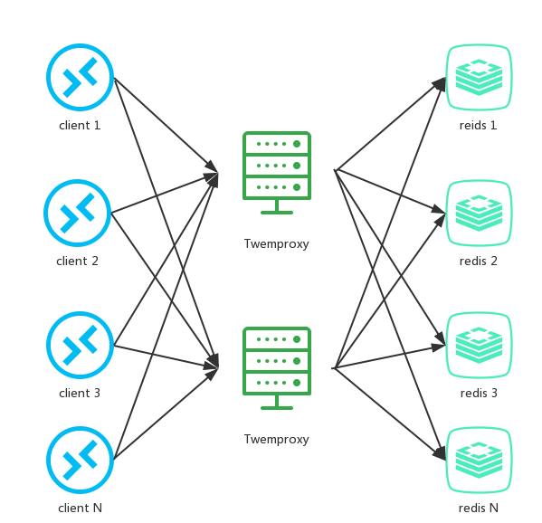

# [开发如何避免redis集群访问倾斜和数据倾斜](https://segmentfault.com/a/1190000017387491)

概述

redis 集群部署方式大部分采用类 Twemproxy 的方式进行部署。即通过 Twemproxy 对 redis key 进行分片计算，将 redis key 进行分片计算，分配到多个 redis 实例中的其中一个。tewmproxy 架构图如下：


由于 Twemproxy 背后的多个 redis 实例在内存配置和 cpu 配置上都是一致的，所以一旦出现访问量倾斜或者数据量倾斜，则可能会导致某个 redis 实例达到性能瓶颈，从而使整个集群达到性能瓶颈。

## hot key出现造成集群访问量倾斜

*Hot key*，即热点 key，指的是在一段时间内，该 key 的访问量远远高于其他的 redis key， 导致大部分的访问流量在经过 proxy 分片之后，都集中访问到某一个 redis 实例上。hot key 通常在不同业务中，存储着不同的热点信息。比如

1. 新闻应用中的热点新闻内容；
2. 活动系统中某个用户疯狂参与的活动的活动配置；
3. 商城秒杀系统中，最吸引用户眼球，性价比最高的商品信息；

……

### 解决方案

#### 1. 使用本地缓存

在 client 端使用本地缓存，从而降低了redis集群对hot key的访问量，但是同时带来两个问题：1、如果对可能成为 hot key 的 key 都进行本地缓存，那么本地缓存是否会过大，从而影响应用程序本身所需的缓存开销。2、如何保证本地缓存和redis集群数据的有效期的一致性。
针对这两个问题，先不展开讲，先将第二个解决方案。

#### 2. 利用分片算法的特性，对key进行打散处理

我们知道 hot key 之所以是 hot key，是因为它只有一个key，落地到一个实例上。所以我们可以给hot key加上前缀或者后缀，把一个hotkey 的数量变成 redis 实例个数N的倍数M，从而由访问一个 redis key 变成访问 N * M 个redis key。
N*M 个 redis key 经过分片分布到不同的实例上，将访问量均摊到所有实例。

代码如下：

```go
//redis 实例数
const M = 16

//redis 实例数倍数（按需设计，2^n倍，n一般为1到4的整数）
const N = 2

func main() {
//获取 redis 实例 
    c, err := redis.Dial("tcp", "127.0.0.1:6379")
    if err != nil {
        fmt.Println("Connect to redis error", err)
        return
    }
    defer c.Close()

    hotKey := "hotKey:abc"
    //随机数
    randNum := GenerateRangeNum(1, N*M)
    //得到对 hot key 进行打散的 key
    tmpHotKey := hotKey + "_" + strconv.Itoa(randNum)
    
    //hot key 过期时间
    expireTime := 50
    
    //过期时间平缓化的一个时间随机值
    randExpireTime := GenerateRangeNum(0, 5)

    data, err := redis.String(c.Do("GET", tmpHotKey))
    if err != nil {
        data, err = redis.String(c.Do("GET", hotKey))
        if err != nil {
            data = GetDataFromDb()
            c.Do("SET", "hotKey", data, expireTime)
            c.Do("SET", tmpHotKey, data, expireTime + randExpireTime)
        } else {
            c.Do("SET", tmpHotKey, data, expireTime + randExpireTime)
        }
    }
}
```

在这个代码中，通过一个大于等于 1 小于 M * N 的随机数，得到一个 tmp key，程序会优先访问tmp key，在得不到数据的情况下，再访问原来的 hot key，并将 hot key的内容写回 tmp key。值得注意的是，tmp key的过期时间是 hot key 的过期时间加上一个较小的随机正整数，保证在 hot key 过期时，所有 tmp key 不会同时过期而造成缓存雪崩。这是一种通过坡度过期的方式来避免雪崩的思路，同时也可以利用原子锁来写入数据就更加的完美，减小db的压力。

另外还有一件事值得一提，默认情况下，我们在生成 tmp key的时候，会把随机数作为 hot key 的后缀，这样符合redis的命名空间，方便 key 的收归和管理。但是存在一种极端的情况，就是hot key的长度很长，这个时候随机数不能作为后缀添加，原因是 Twemproxy 的分片算法在计算过程中，越靠前的字符权重越大，考后的字符权重则越小。也就是说对于key名，前面的字符差异越大，算出来的分片值差异也越大，更有可能分配到不同的实例（具体算法这里不展开讲）。所以，对于很长 key 名的 hot key，要对随机数的放入做谨慎处理，比如放在在最后一个命令空间的最前面（eg：由原来的 space1:space2:space3_rand 改成 space1:space2:rand_space3）。

## big key 造成集群数据量倾斜

*big key* ，即数据量大的 key ，由于其数据大小远大于其他key，导致经过分片之后，某个具体存储这个 big key 的实例内存使用量远大于其他实例，造成，内存不足，拖累整个集群的使用。big key 在不同业务上，通常体现为不同的数据，比如：

1. 论坛中的大型持久盖楼活动；
2. 聊天室系统中热门聊天室的消息列表；

……

### 解决方案

#### 对 big key 进行拆分

对 big key 存储的数据 （big value）进行拆分，变成value1，value2… valueN,

1. 如果big value 是个大json 通过 mset 的方式，将这个 key 的内容打散到各个实例中，减小big key 对数据量倾斜造成的影响。

```gams
//存
mset key1, vlaue1, key2, vlaue2 ... keyN, valueN
//取
mget key1, key2 ... keyN
```

1. 如果big value 是个大list，可以拆成将list拆成。= list_1， list_2, list3, listN
2. 其他数据类型同理。

## 既是big key 也是 hot key

在开发过程中，有些 key 不只是访问量大，数据量也很大，这个时候就要考虑这个 key 使用的场景，存储在redis集群中是否是合理的，是否使用其他组件来存储更合适；如果坚持要用 redis 来存储，可能考虑迁移出集群，采用一主一备（或1主多备）的架构来存储。

## 其他

### 如何发现 hot key，big key

#### 1. 事前-预判

在业务开发阶段，就要对可能变成 hot key ，big key 的数据进行判断，提前处理，这需要的是对产品业务的理解，对运营节奏的把握，对数据设计的经验。

#### 2.事中-监控和自动处理

##### 监控

1. 在应用程序端，对每次请求 redis 的操作进行收集上报;不推荐，但是在运维资源缺少的场景下可以考虑。开发可以绕过运维搞定）；
2. 在proxy层，对每一个 redis 请求进行收集上报;（推荐，改动涉及少且好维护）；
3. 对 redis 实例使用monitor命令统计热点key（不推荐，高并发条件下会有造成redis 内存爆掉的隐患）；
4. 机器层面，Redis客户端使用TCP协议与服务端进行交互，通信协议采用的是RESP。如果站在机器的角度，可以通过对机器上所有Redis端口的TCP数据包进行抓取完成热点key的统计（不推荐，公司每台机器上的基本组件已经很多了，别再添乱了）；

##### 自动处理

通过监控之后，程序可以获取 big key 和 hot key，再报警的同时，程序对 big key 和 hot key 进行自动处理。或者通知程序猿利用一定的工具进行定制化处理（在程序中对特定的key 执行前面提到的解决方案）

#### 3.事后

尽量还是不要事后了吧，都是血和泪的教训，不展开讲。