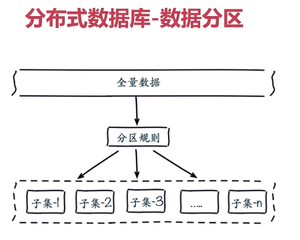
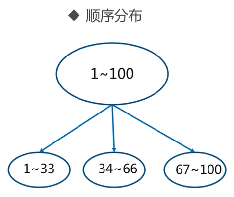
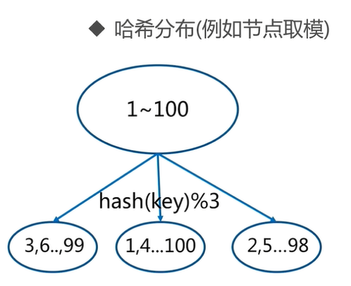
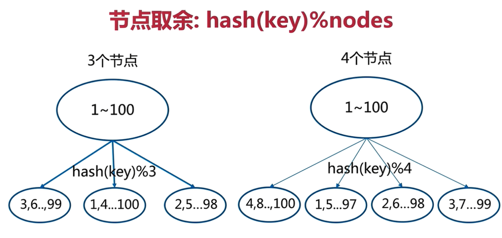
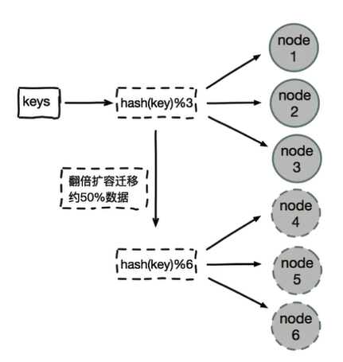
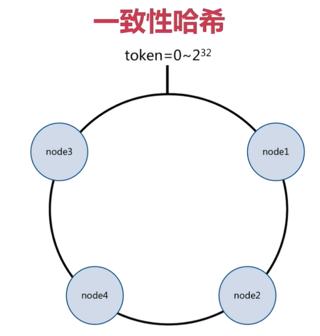
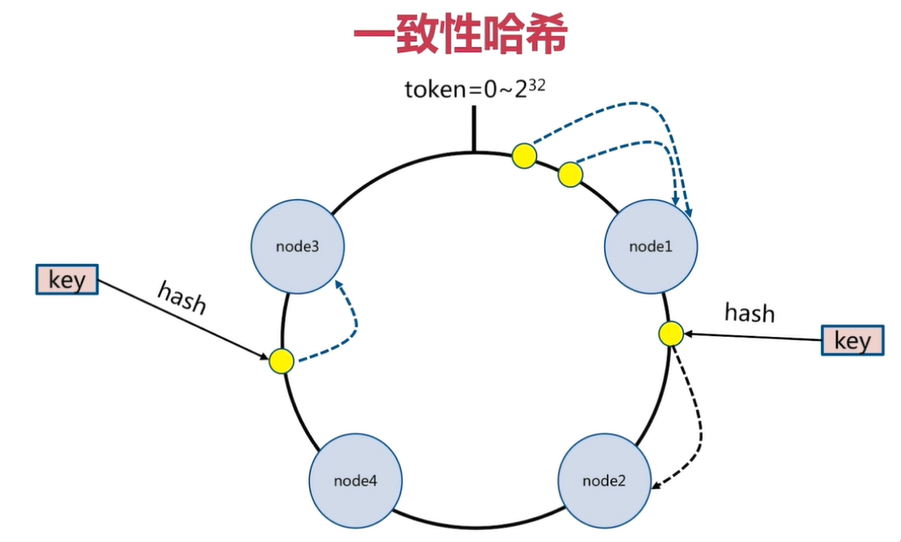
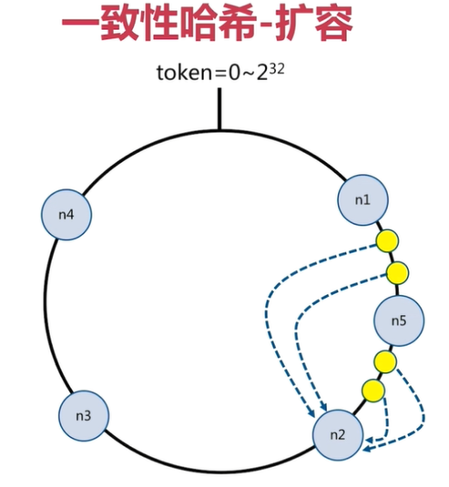

## 2.数据分布

### 2.1 为什么要做数据分布

全量数据，单机Redis节点无法满足要求，按照分区规则把数据分到若干个子集当中



### 2.2 常用数据分布方式之顺序分布

```
比如：1到100个数字，要保存在3个节点上，按照顺序分区，把数据平均分配三个节点上
1号到33号数据保存到节点1上，34号到66号数据保存到节点2上，67号到100号数据保存到节点3上
```



> 顺序分区常用在关系型数据库的设计

### 2.3 常用数据分布方式之哈希分布

```
例如1到100个数字，对每个数字进行哈希运算，然后对每个数的哈希结果除以节点数进行取余，余数为1则保存在第1个节点上，余数为2则保存在第2个节点上，余数为0则保存在第3个节点，这样可以保证数据被打散，同时保证数据分布的比较均匀
```



哈希分布方式分为三个分区方式：

#### 2.3.1 节点取余分区

比如有100个数据，对每个数据进行hash运算之后，与节点数进行取余运算，根据余数不同保存在不同的节点上



节点取余方式是非常简单的一种分区方式

节点取余分区方式有一个问题：即当增加或减少节点时，原来节点中的80%的数据会进行迁移操作，对所有数据重新进行分布

> 节点取余分区方式建议使用多倍扩容的方式，例如以前用3个节点保存数据，扩容为比以前多一倍的节点即6个节点来保存数据，这样只需要适移50%的数据。数据迁移之后，第一次无法从缓存中读取数据，必须先从数据库中读取数据，然后回写到缓存中，然后才能从缓存中读取迁移之后的数据



节点取余方式优点：

```
客户端分片
配置简单：对数据进行哈希，然后取余
```

节点取余方式缺点：

```
数据节点伸缩时，导致数据迁移
迁移数量和添加节点数据有关，建议翻倍扩容
            
```

#### 2.3.2 一致性哈希分区

一致性哈希原理：

```
将所有的数据当做一个token环，token环中的数据范围是0到2的32次方。然后为每一个数据节点分配一个token范围值，这个节点就负责保存这个范围内的数据。
```



```c++
对每一个key进行hash运算，被哈希后的结果在哪个token的范围内，则按顺时针去找最近的节点，这个key将会被保存在这个节点上。
```





```
在上面的图中，有4个key被hash之后的值在在n1节点和n2节点之间，按照顺时针规则，这4个key都会被保存在n2节点上，
如果在n1节点和n2节点之间添加n5节点，当下次有key被hash之后的值在n1节点和n5节点之间，这些key就会被保存在n5节点上面了
在上面的例子里，添加n5节点之后，数据迁移会在n1节点和n2节点之间进行，n3节点和n4节点不受影响，数据迁移范围被缩小很多

同理，如果有1000个节点，此时添加一个节点，受影响的节点范围最多只有千分之2
一致性哈希一般用在节点比较多的时候
```

一致性哈希分区优点：

```
采用客户端分片方式：哈希 + 顺时针(优化取余)
节点伸缩时，只影响邻近节点，但是还是有数据迁移.
```

一致性哈希分区缺点：

```
翻倍伸缩，保证最小迁移数据和负载均衡
```

#### 2.3.3 虚拟槽分区

虚拟槽分区是Redis Cluster采用的分区方式

预设虚拟槽，每个槽就相当于一个数字，有一定范围。每个槽映射一个数据子集，一般比节点数大

> Redis Cluster中预设虚拟槽的范围为0到16383


步骤：

```
1.把16384槽按照节点数量进行平均分配，由节点进行管理
2.对每个key按照CRC16规则进行hash运算
3.把hash结果对16383进行取余
4.把余数发送给Redis节点
5.节点接收到数据，验证是否在自己管理的槽编号的范围
    如果在自己管理的槽编号范围内，则把数据保存到数据槽中，然后返回执行结果
    如果在自己管理的槽编号范围外，则会把数据发送给正确的节点，由正确的节点来把数据保存在对应的槽中
```

> 需要注意的是：Redis Cluster的节点之间会共享消息，每个节点都会知道是哪个节点负责哪个范围内的数据槽

虚拟槽分布方式中，由于每个节点管理一部分数据槽，数据保存到数据槽中。当节点扩容或者缩容时，对数据槽进行重新分配迁移即可，数据不会丢失。
虚拟槽分区特点：

```
使用服务端管理节点，槽，数据：例如Redis Cluster
可以对数据打散，又可以保证数据分布均匀
```