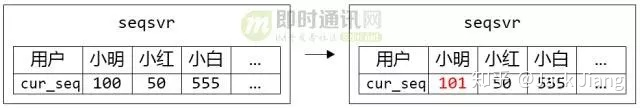
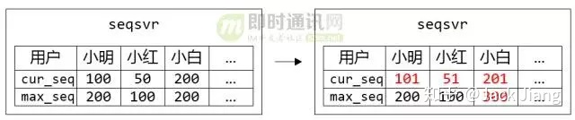
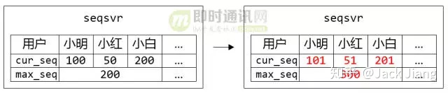
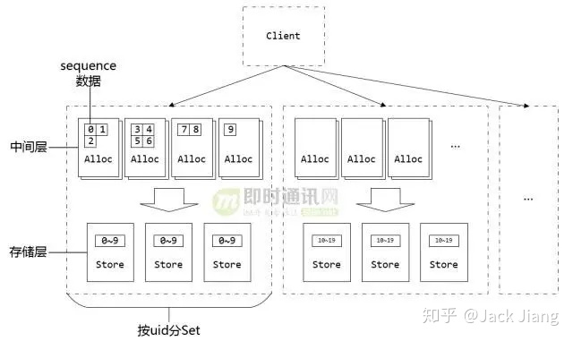

## 1、点评 

对于IM系统来说，如何做到IM聊天消息离线差异拉取（差异拉取是为了节省流量）、消息多端同步、消息顺序保证等，是典型的IM技术难点。

**就像即时通讯网整理的以下IM开发干货系列一样：**

《[IM消息送达保证机制实现(一)：保证在线实时消息的可靠投递](https://link.zhihu.com/?target=http%3A//www.52im.net/thread-294-1-1.html)》

《[IM消息送达保证机制实现(二)：保证离线消息的可靠投递](https://link.zhihu.com/?target=http%3A//www.52im.net/thread-594-1-1.html)》

《[如何保证IM实时消息的“时序性”与“一致性”？](https://link.zhihu.com/?target=http%3A//www.52im.net/thread-714-1-1.html)》

《[IM单聊和群聊中的在线状态同步应该用“推”还是“拉”？](https://link.zhihu.com/?target=http%3A//www.52im.net/thread-715-1-1.html)》

《[IM群聊消息如此复杂，如何保证不丢不重？](https://link.zhihu.com/?target=http%3A//www.52im.net/thread-753-1-1.html)》

《[浅谈移动端IM的多点登陆和消息漫游原理](https://link.zhihu.com/?target=http%3A//www.52im.net/thread-867-1-1.html)》

《[IM群聊消息究竟是存1份(即扩散读)还是存多份(即扩散写)？](https://link.zhihu.com/?target=http%3A//www.52im.net/thread-1616-1-1.html)》

上面这些文章所涉及的IM聊天消息的**省流量、可靠投递、离线拉取、时序性、一致性、多端同步**等等问题，总结下来其实就是要解决好一个问题：即如何保证聊天消息的唯一性判定和顺序判定。

很多群友在讨论这个问题的时候，普遍考虑的是使用整型自增序列号作为消息ID（即MsgId）：这样既能保证消息的唯一性又方便保证顺序性，但问题是在分布式情况下是很难保证消息id的唯一性且顺序递增的，维护id生成的一致性难度太大了（网络延迟、调试出错等等都可能导致不同的机器取到的消息id存在碰撞的可能）。

不过，通过本文中微信团队分享的微信消息序列号生成思路，实际上要解决消息的唯一性、顺序性问题，可以将一个技术点分解成两个：即将原先每条消息一个自增且唯一的消息ID分拆成两个关键属性——消息ID（msgId）、消息序列号（seqId），即消息ID只要保证唯一性而不需要兼顾顺序性（比如直接用UUID）、消息序列号只要保证顺序性而不需要兼顾唯一性（就像本文中微信的思路一样），这样的技术分解就能很好的解决原本一个消息ID既要保证唯一性又要保证顺序性的难题。

那么，如何优雅地解决“消息序列号只要保证顺序性而不需要兼顾唯一性”的问题呢？这就是本文所要分享的内容，强烈建议深入理解和阅读。

**本文因篇幅较长，分为上下两篇，敬请点击阅读：**

> 上篇：《[微信技术分享：微信的海量IM聊天消息序列号生成实践（算法原理篇）](https://link.zhihu.com/?target=http%3A//www.52im.net/thread-1998-1-1.html)》（本文）
> 下篇：《[微信技术分享：微信的海量IM聊天消息序列号生成实践（容灾方案篇）](https://link.zhihu.com/?target=http%3A//www.52im.net/thread-1999-1-1.html)》

**学习交流：**

> \- 即时通讯开发交流3群：[185926912](https://link.zhihu.com/?target=https%3A//link.jianshu.com/%3Ft%3Dhttp%3A%2F%2Fshang.qq.com%2Fwpa%2Fqunwpa%3Fidkey%3D051ed62f79e15485c9b5af622dd5b1c87b26bedb890b068be79dd2006fc80ccf)[推荐]
> \- 移动端IM开发入门文章：《[新手入门一篇就够：从零开发移动端IM](https://link.zhihu.com/?target=https%3A//link.jianshu.com/%3Ft%3Dhttp%3A//www.52im.net/thread-464-1-1.html)》

## 2、正文引言

微信在立项之初，就已确立了利用数据版本号（注：具体的实现也就是本文要分享的消息序列号）实现终端与后台的数据增量同步机制，确保发消息时消息可靠送达对方手机，避免了大量潜在的家庭纠纷。时至今日，微信已经走过第五个年头，这套同步机制仍然在消息收发、朋友圈通知、好友数据更新等需要数据同步的地方发挥着核心的作用。

而在这同步机制的背后，需要一个高可用、高可靠的消息序列号生成器来产生同步数据用的版本号（注：因为序列号天生的递增特性，完全可以当版本号来使用，但又不仅限于版本号的用途）。1、点评 

对于IM系统来说，如何做到IM聊天消息离线差异拉取（差异拉取是为了节省流量）、消息多端同步、消息顺序保证等，是典型的IM技术难点。

**就像即时通讯网整理的以下IM开发干货系列一样：**

《[IM消息送达保证机制实现(一)：保证在线实时消息的可靠投递](https://link.zhihu.com/?target=http%3A//www.52im.net/thread-294-1-1.html)》

《[IM消息送达保证机制实现(二)：保证离线消息的可靠投递](https://link.zhihu.com/?target=http%3A//www.52im.net/thread-594-1-1.html)》

《[如何保证IM实时消息的“时序性”与“一致性”？](https://link.zhihu.com/?target=http%3A//www.52im.net/thread-714-1-1.html)》

《[IM单聊和群聊中的在线状态同步应该用“推”还是“拉”？](https://link.zhihu.com/?target=http%3A//www.52im.net/thread-715-1-1.html)》

《[IM群聊消息如此复杂，如何保证不丢不重？](https://link.zhihu.com/?target=http%3A//www.52im.net/thread-753-1-1.html)》

《[浅谈移动端IM的多点登陆和消息漫游原理](https://link.zhihu.com/?target=http%3A//www.52im.net/thread-867-1-1.html)》

《[IM群聊消息究竟是存1份(即扩散读)还是存多份(即扩散写)？](https://link.zhihu.com/?target=http%3A//www.52im.net/thread-1616-1-1.html)》

上面这些文章所涉及的IM聊天消息的省流量、可靠投递、离线拉取、时序性、一致性、多端同步等等问题，总结下来其实就是要解决好一个问题：即如何保证聊天消息的唯一性判定和顺序判定。

很多群友在讨论这个问题的时候，普遍考虑的是使用整型自增序列号作为消息ID（即MsgId）：这样既能保证消息的唯一性又方便保证顺序性，但问题是在分布式情况下是很难保证消息id的唯一性且顺序递增的，维护id生成的一致性难度太大了（网络延迟、调试出错等等都可能导致不同的机器取到的消息id存在碰撞的可能）。

不过，通过本文中微信团队分享的微信消息序列号生成思路，实际上要解决消息的唯一性、顺序性问题，可以将一个技术点分解成两个：即将原先每条消息一个自增且唯一的消息ID分拆成两个关键属性——消息ID（msgId）、消息序列号（seqId），即消息ID只要保证唯一性而不需要兼顾顺序性（比如直接用UUID）、消息序列号只要保证顺序性而不需要兼顾唯一性（就像本文中微信的思路一样），这样的技术分解就能很好的解决原本一个消息ID既要保证唯一性又要保证顺序性的难题。

那么，如何优雅地解决“消息序列号只要保证顺序性而不需要兼顾唯一性”的问题呢？这就是本文所要分享的内容，强烈建议深入理解和阅读。

**本文因篇幅较长，分为上下两篇，敬请点击阅读：**

> 上篇：《[微信技术分享：微信的海量IM聊天消息序列号生成实践（算法原理篇）](https://link.zhihu.com/?target=http%3A//www.52im.net/thread-1998-1-1.html)》（本文）
> 下篇：《[微信技术分享：微信的海量IM聊天消息序列号生成实践（容灾方案篇）](https://link.zhihu.com/?target=http%3A//www.52im.net/thread-1999-1-1.html)》

**学习交流：**

> \- 即时通讯开发交流3群：[185926912](https://link.zhihu.com/?target=https%3A//link.jianshu.com/%3Ft%3Dhttp%3A%2F%2Fshang.qq.com%2Fwpa%2Fqunwpa%3Fidkey%3D051ed62f79e15485c9b5af622dd5b1c87b26bedb890b068be79dd2006fc80ccf)[推荐]
> \- 移动端IM开发入门文章：《[新手入门一篇就够：从零开发移动端IM](https://link.zhihu.com/?target=https%3A//link.jianshu.com/%3Ft%3Dhttp%3A//www.52im.net/thread-464-1-1.html)》

## 2、正文引言

微信在立项之初，就已确立了利用数据版本号（注：具体的实现也就是本文要分享的消息序列号）实现终端与后台的数据增量同步机制，确保发消息时消息可靠送达对方手机，避免了大量潜在的家庭纠纷。时至今日，微信已经走过第五个年头，这套同步机制仍然在消息收发、朋友圈通知、好友数据更新等需要数据同步的地方发挥着核心的作用。

而在这同步机制的背后，需要一个高可用、高可靠的消息序列号生成器来产生同步数据用的版本号（注：因为序列号天生的递增特性，完全可以当版本号来使用，但又不仅限于版本号的用途）。这个消息序列号生成器我们微信内部称之为 seqsvr ，目前已经发展为一个每天万亿级调用的重量级系统，其中每次申请序列号平时调用耗时1ms，99.9%的调用耗时小于3ms，服务部署于数百台4核 CPU 服务器上。

本篇将重点介绍微信的消息序列号生成器 seqsvr 的算法原理、架构核心思想，以及 seqsvr 随着业务量快速上涨所做的架构演变（下篇《[微信技术分享：微信的海量IM聊天消息序列号生成实践（容灾方案篇）](https://link.zhihu.com/?target=http%3A//www.52im.net/thread-1999-1-1.html)》会着重讨论分布式容灾方案，敬请关注）。

## 3、关于作者

**曾钦松：**微信高级工程师，负责过微信基础架构、微信翻译引擎、微信围棋PhoenixGo，致力于高可用高性能后台系统的设计与研发。2011年毕业于西安电子科技大学，早先曾在腾讯搜搜从事检索架构、分布式数据库方面的工作。

## 4、技术思路

微信服务器端为每一份需要与客户端同步的数据（例如聊天消息）都会赋予一个唯一的、递增的序列号（后文称为 sequence ），作为这份数据的版本号（这是利用了序列号递增的特性）。在客户端与服务器端同步的时候，客户端会带上已经同步下去数据的最大版本号，后台会根据客户端最大版本号与服务器端的最大版本号，计算出需要同步的增量数据，返回给客户端。这样不仅保证了客户端与服务器端的数据同步的可靠性，同时也大幅减少了同步时的冗余数据（就像这篇文章中讨论的一样：《[如何保证IM实时消息的“时序性”与“一致性”？](https://link.zhihu.com/?target=http%3A//www.52im.net/thread-714-1-1.html)》）。

**这里不用乐观锁机制来生成版本号，而是使用了一个独立的 seqsvr 来处理序列号操作：**

1）一方面因为业务有大量的 sequence 查询需求——查询已经分配出去的最后一个 sequence ，而基于 seqsvr 的查询操作可以做到非常轻量级，避免对存储层的大量 IO 查询操作；

2）另一方面微信用户的不同种类的数据存在不同的 Key-Value 系统中，使用统一的序列号有助于避免重复开发，同时业务逻辑可以很方便地判断一个用户的各类数据是否有更新。

**从 seqsvr 申请的、用作数据版本号的 sequence ，具有两种基本的性质：**

1）递增的64位整型变量；

2）每个用户都有自己独立的64位 sequence 空间。

举个例子，小明当前申请的 sequence 为100，那么他下一次申请的 sequence ，可能为101，也可能是110，总之一定大于之前申请的100。而小红呢，她的 sequence 与小明的 sequence 是独立开的，假如她当前申请到的 sequence 为50，然后期间不管小明申请多少次 sequence 怎么折腾，都不会影响到她下一次申请到的值（很可能是51）。

这里用了每个用户独立的64位 sequence 的体系，而不是用一个全局的64位（或更高位） sequence ，很大原因是全局唯一的 sequence 会有非常严重的申请互斥问题，不容易去实现一个高性能高可靠的架构。对微信业务来说，每个用户独立的64位 sequence 空间已经满足业务要求。

目前 sequence 用在终端与后台的数据同步外，同时也广泛用于微信后台逻辑层的基础数据一致性cache中，大幅减少逻辑层对存储层的访问。虽然一个用于终端——后台数据同步，一个用于后台cache的一致性保证，场景大不相同。

但我们仔细分析就会发现，两个场景都是利用 sequence 可靠递增的性质来实现数据的一致性保证，这就要求我们的 seqsvr 保证分配出去的 sequence 是稳定递增的，一旦出现回退必然导致各种数据错乱、消息消失；另外，这两个场景都非常普遍，我们在使用微信的时候会不知不觉地对应到这两个场景：小明给小红发消息、小红拉黑小明、小明发一条失恋状态的朋友圈，一次简单的分手背后可能申请了无数次 sequence。

微信目前拥有数亿的活跃用户，每时每刻都会有海量 sequence 申请，这对 seqsvr 的设计也是个极大的挑战。那么，既要 sequence 可靠递增，又要能顶住海量的访问，要如何设计 seqsvr 的架构？我们先从 seqsvr 的架构原型说起。

## 5、具体的技术架构原型

不考虑 seqsvr 的具体架构的话，它应该是一个巨大的64位数组，而我们每一个微信用户，都在这个大数组里独占一格8 bytes 的空间，这个格子就放着用户已经分配出去的最后一个 sequence：cur_seq。每个用户来申请sequence的时候，只需要将用户的cur_seq+=1，保存回数组，并返回给用户。

▲ 图1：小明申请了一个sequence，返回101

## 5.1 预分配中间层

任何一件看起来很简单的事，在海量的访问量下都会变得不简单。前文提到，seqsvr 需要保证分配出去的sequence 递增（数据可靠），还需要满足海量的访问量（每天接近万亿级别的访问）。满足数据可靠的话，我们很容易想到把数据持久化到硬盘，但是按照目前每秒千万级的访问量（~10^7 QPS），基本没有任何硬盘系统能扛住。

后台架构设计很多时候是一门关于权衡的哲学，针对不同的场景去考虑能不能降低某方面的要求，以换取其它方面的提升。仔细考虑我们的需求，我们只要求递增，并没有要求连续，也就是说出现一大段跳跃是允许的（例如分配出的sequence序列：1,2,3,10,100,101）。

**于是我们实现了一个简单优雅的策略：**

1）内存中储存最近一个分配出去的sequence：cur_seq，以及分配上限：max_seq；

2）分配sequence时，将cur_seq++，同时与分配上限max_seq比较：如果cur_seq > max_seq，将分配上限提升一个步长max_seq += step，并持久化max_seq；

3）重启时，读出持久化的max_seq，赋值给cur_seq。

▲ 图2：小明、小红、小白都各自申请了一个sequence，但只有小白的max_seq增加了步长100

这样通过增加一个预分配 sequence 的中间层，在保证 sequence 不回退的前提下，大幅地提升了分配 sequence 的性能。实际应用中每次提升的步长为10000，那么持久化的硬盘IO次数从之前~10^7 QPS降低到~10^3 QPS，处于可接受范围。在正常运作时分配出去的sequence是顺序递增的，只有在机器重启后，第一次分配的 sequence 会产生一个比较大的跳跃，跳跃大小取决于步长大小。

## 5.2 分号段共享存储

请求带来的硬盘IO问题解决了，可以支持服务平稳运行，但该模型还是存在一个问题：重启时要读取大量的max_seq数据加载到内存中。

我们可以简单计算下，以目前 uid（用户唯一ID）上限2^32个、一个 max_seq 8bytes 的空间，数据大小一共为32GB，从硬盘加载需要不少时间。另一方面，出于数据可靠性的考虑，必然需要一个可靠存储系统来保存max_seq数据，重启时通过网络从该可靠存储系统加载数据。如果max_seq数据过大的话，会导致重启时在数据传输花费大量时间，造成一段时间不可服务。

为了解决这个问题，我们引入号段 Section 的概念，uid 相邻的一段用户属于一个号段，而同个号段内的用户共享一个 max_seq，这样大幅减少了max_seq 数据的大小，同时也降低了IO次数。

▲ 图3：小明、小红、小白属于同个Section，他们共用一个max_seq。在每个人都申请一个sequence的时候，只有小白突破了max_seq上限，需要更新max_seq并持久化

目前 seqsvr 一个 Section 包含10万个 uid，max_seq 数据只有300+KB，为我们实现从可靠存储系统读取max_seq 数据重启打下基础。

## 5.3 工程实现

**工程实现在上面两个策略上做了一些调整，主要是出于数据可靠性及灾难隔离考虑：**

1）把存储层和缓存中间层分成两个模块 StoreSvr 及 AllocSvr 。StoreSvr 为存储层，利用了多机 NRW 策略来保证数据持久化后不丢失； AllocSvr 则是缓存中间层，部署于多台机器，每台 AllocSvr 负责若干号段的 sequence 分配，分摊海量的 sequence 申请请求。

2）整个系统又按 uid 范围进行分 Set，每个 Set 都是一个完整的、独立的 StoreSvr+AllocSvr 子系统。分 Set 设计目的是为了做灾难隔离，一个 Set 出现故障只会影响该 Set 内的用户，而不会影响到其它用户。

▲ 图4：原型架构图

## 6、本篇小结

写到这里把 seqsvr 基本原型讲完了，正是如此简单优雅的模型，可靠、稳定地支撑着微信五年来的高速发展。五年里访问量一倍又一倍地上涨，seqsvr 本身也做过大大小小的重构，但 seqsvr 的分层架构一直没有改变过，并且在可预见的未来里也会一直保持不变。

原型跟生产环境的版本存在一定差距，最主要的差距在于容灾上。像微信的 IM 类应用，对系统可用性非常敏感，而 seqsvr 又处于收发消息、朋友圈等功能的关键路径上，对可用性要求非常高，出现长时间不可服务是分分钟写故障报告的节奏。

本文的下篇《[微信技术分享：微信的海量IM聊天消息序列号生成实践（容灾方案篇）](https://link.zhihu.com/?target=http%3A//www.52im.net/thread-1999-1-1.html)会讲讲 seqsvr 的容灾方案演变。

## 附录：更多QQ、微信团队原创技术文章

> 《[微信朋友圈千亿访问量背后的技术挑战和实践总结](https://link.zhihu.com/?target=http%3A//www.52im.net/thread-1569-1-1.html)》
> 《[腾讯技术分享：腾讯是如何大幅降低带宽和网络流量的(图片压缩篇)](https://link.zhihu.com/?target=http%3A//www.52im.net/thread-1559-1-1.html)》
> 《[腾讯技术分享：腾讯是如何大幅降低带宽和网络流量的(音视频技术篇)](https://link.zhihu.com/?target=http%3A//www.52im.net/thread-1560-1-1.html)》
> 《[微信团队分享：微信移动端的全文检索多音字问题解决方案](https://link.zhihu.com/?target=http%3A//www.52im.net/thread-1545-1-1.html)》
> 《[腾讯技术分享：Android版手机QQ的缓存监控与优化实践](https://link.zhihu.com/?target=http%3A//www.52im.net/thread-1524-1-1.html)》
> 《[微信团队分享：iOS版微信的高性能通用key-value组件技术实践](https://link.zhihu.com/?target=http%3A//www.52im.net/thread-1461-1-1.html)》
> 《[微信团队分享：iOS版微信是如何防止特殊字符导致的炸群、APP崩溃的？](https://link.zhihu.com/?target=http%3A//www.52im.net/thread-1449-1-1.html)》
> 《[腾讯技术分享：Android手Q的线程死锁监控系统技术实践](https://link.zhihu.com/?target=http%3A//www.52im.net/thread-1442-1-1.html)》
> 《[微信团队原创分享：iOS版微信的内存监控系统技术实践](https://link.zhihu.com/?target=http%3A//www.52im.net/thread-1422-1-1.html)》
> 《[让互联网更快：新一代QUIC协议在腾讯的技术实践分享](https://link.zhihu.com/?target=http%3A//www.52im.net/thread-1407-1-1.html)》
> 《[iOS后台唤醒实战：微信收款到账语音提醒技术总结](https://link.zhihu.com/?target=http%3A//www.52im.net/thread-1404-1-1.html)》
> 《[腾讯技术分享：社交网络图片的带宽压缩技术演进之路](https://link.zhihu.com/?target=http%3A//www.52im.net/thread-1391-1-1.html)》
> 《[微信团队分享：视频图像的超分辨率技术原理和应用场景](https://link.zhihu.com/?target=http%3A//www.52im.net/thread-1377-1-1.html)》
> 《[微信团队分享：微信每日亿次实时音视频聊天背后的技术解密](https://link.zhihu.com/?target=http%3A//www.52im.net/thread-1311-1-1.html)》
> 《[QQ音乐团队分享：Android中的图片压缩技术详解（上篇）](https://link.zhihu.com/?target=http%3A//www.52im.net/thread-1208-1-1.html)》
> 《[QQ音乐团队分享：Android中的图片压缩技术详解（下篇）](https://link.zhihu.com/?target=http%3A//www.52im.net/thread-1212-1-1.html)》
> 《[腾讯团队分享：手机QQ中的人脸识别酷炫动画效果实现详解](https://link.zhihu.com/?target=http%3A//www.52im.net/thread-1190-1-1.html)》
> 《[腾讯团队分享 ：一次手Q聊天界面中图片显示bug的追踪过程分享](https://link.zhihu.com/?target=http%3A//www.52im.net/thread-1181-1-1.html)》
> 《[微信团队分享：微信Android版小视频编码填过的那些坑](https://link.zhihu.com/?target=http%3A//www.52im.net/thread-1173-1-1.html)》
> 《[微信手机端的本地数据全文检索优化之路](https://link.zhihu.com/?target=http%3A//www.52im.net/thread-1132-1-1.html)》
> 《[企业微信客户端中组织架构数据的同步更新方案优化实战](https://link.zhihu.com/?target=http%3A//www.52im.net/thread-1131-1-1.html)》
> 《[微信团队披露：微信界面卡死超级bug“15。。。。”的来龙去脉](https://link.zhihu.com/?target=http%3A//www.52im.net/thread-1099-1-1.html)》
> 《[QQ 18年：解密8亿月活的QQ后台服务接口隔离技术](https://link.zhihu.com/?target=http%3A//www.52im.net/thread-1093-1-1.html)》
> 《[月活8.89亿的超级IM微信是如何进行Android端兼容测试的](https://link.zhihu.com/?target=http%3A//www.52im.net/thread-1086-1-1.html)》
> 《[以手机QQ为例探讨移动端IM中的“轻应用”](https://link.zhihu.com/?target=http%3A//www.52im.net/thread-1076-1-1.html)》
> 《[一篇文章get微信开源移动端数据库组件WCDB的一切！](https://link.zhihu.com/?target=http%3A//www.52im.net/thread-932-1-1.html)》
> 《[微信客户端团队负责人技术访谈：如何着手客户端性能监控和优化](https://link.zhihu.com/?target=http%3A//www.52im.net/thread-921-1-1.html)》
> 《[微信后台基于时间序的海量数据冷热分级架构设计实践](https://link.zhihu.com/?target=http%3A//www.52im.net/thread-895-1-1.html)》
> 《[微信团队原创分享：Android版微信的臃肿之困与模块化实践之路](https://link.zhihu.com/?target=http%3A//www.52im.net/thread-893-1-1.html)》
> 《[微信后台团队：微信后台异步消息队列的优化升级实践分享](https://link.zhihu.com/?target=http%3A//www.52im.net/thread-801-1-1.html)》
> 《[微信团队原创分享：微信客户端SQLite数据库损坏修复实践](https://link.zhihu.com/?target=http%3A//www.52im.net/thread-789-1-1.html)》
> 《[腾讯原创分享(一)：如何大幅提升移动网络下手机QQ的图片传输速度和成功率](https://link.zhihu.com/?target=http%3A//www.52im.net/thread-675-1-1.html)》
> 《[腾讯原创分享(二)：如何大幅压缩移动网络下APP的流量消耗（下篇）](https://link.zhihu.com/?target=http%3A//www.52im.net/thread-697-1-1.html)》
> 《[腾讯原创分享(三)：如何大幅压缩移动网络下APP的流量消耗（上篇）](https://link.zhihu.com/?target=http%3A//www.52im.net/thread-696-1-1.html)》
> 《[微信Mars：微信内部正在使用的网络层封装库，即将开源](https://link.zhihu.com/?target=http%3A//www.52im.net/thread-620-1-1.html)》
> 《[如约而至：微信自用的移动端IM网络层跨平台组件库Mars已正式开源](https://link.zhihu.com/?target=http%3A//www.52im.net/thread-684-1-1.html)》
> 《[开源libco库：单机千万连接、支撑微信8亿用户的后台框架基石 [源码下载\]](https://link.zhihu.com/?target=http%3A//www.52im.net/thread-623-1-1.html)》
> 《[微信新一代通信安全解决方案：基于TLS1.3的MMTLS详解](https://link.zhihu.com/?target=http%3A//www.52im.net/thread-310-1-1.html)》
> 《[微信团队原创分享：Android版微信后台保活实战分享(进程保活篇)](https://link.zhihu.com/?target=http%3A//www.52im.net/thread-210-1-1.html)》
> 《[微信团队原创分享：Android版微信后台保活实战分享(网络保活篇)](https://link.zhihu.com/?target=http%3A//www.52im.net/thread-209-1-1.html)》
> 《[Android版微信从300KB到30MB的技术演进(PPT讲稿) [附件下载\]](https://link.zhihu.com/?target=http%3A//www.52im.net/thread-206-1-1.html)》
> 《[微信团队原创分享：Android版微信从300KB到30MB的技术演进](https://link.zhihu.com/?target=http%3A//www.52im.net/thread-205-1-1.html)》
> 《[微信技术总监谈架构：微信之道——大道至简(演讲全文)](https://link.zhihu.com/?target=http%3A//www.52im.net/thread-200-1-1.html)》
> 《[微信技术总监谈架构：微信之道——大道至简(PPT讲稿) [附件下载\]](https://link.zhihu.com/?target=http%3A//www.52im.net/thread-199-1-1.html)》
> 《[如何解读《微信技术总监谈架构：微信之道——大道至简》](https://link.zhihu.com/?target=http%3A//www.52im.net/thread-201-1-1.html)》
> 《[微信海量用户背后的后台系统存储架构(视频+PPT) [附件下载\]](https://link.zhihu.com/?target=http%3A//www.52im.net/thread-186-1-1.html)》
> 《[微信异步化改造实践：8亿月活、单机千万连接背后的后台解决方案](https://link.zhihu.com/?target=http%3A//www.52im.net/thread-624-1-1.html)》
> 《[微信朋友圈海量技术之道PPT [附件下载\]](https://link.zhihu.com/?target=http%3A//www.52im.net/thread-178-1-1.html)》
> 《[微信对网络影响的技术试验及分析（论文全文）](https://link.zhihu.com/?target=http%3A//www.52im.net/thread-195-1-1.html)》
> 《[一份微信后台技术架构的总结性笔记](https://link.zhihu.com/?target=http%3A//www.52im.net/thread-179-1-1.html)》
> 《[架构之道：3个程序员成就微信朋友圈日均10亿发布量[有视频\]](https://link.zhihu.com/?target=http%3A//www.52im.net/thread-177-1-1.html)》
> 《[快速裂变：见证微信强大后台架构从0到1的演进历程（一）](https://link.zhihu.com/?target=http%3A//www.52im.net/thread-168-1-1.html)》
> 《[快速裂变：见证微信强大后台架构从0到1的演进历程（二）](https://link.zhihu.com/?target=http%3A//www.52im.net/thread-170-1-1.html)》
> 《[微信团队原创分享：Android内存泄漏监控和优化技巧总结](https://link.zhihu.com/?target=http%3A//www.52im.net/thread-143-1-1.html)》
> 《[全面总结iOS版微信升级iOS9遇到的各种“坑”](https://link.zhihu.com/?target=http%3A//www.52im.net/thread-142-1-1.html)》
> 《[微信团队原创资源混淆工具：让你的APK立减1M](https://link.zhihu.com/?target=http%3A//www.52im.net/thread-139-1-1.html)》
> 《[微信团队原创Android资源混淆工具：AndResGuard [有源码\]](https://link.zhihu.com/?target=http%3A//www.52im.net/thread-140-1-1.html)》
> 《[Android版微信安装包“减肥”实战记录](https://link.zhihu.com/?target=http%3A//www.52im.net/thread-138-1-1.html)》
> 《[iOS版微信安装包“减肥”实战记录](https://link.zhihu.com/?target=http%3A//www.52im.net/thread-137-1-1.html)》
> 《[移动端IM实践：iOS版微信界面卡顿监测方案](https://link.zhihu.com/?target=http%3A//www.52im.net/thread-136-1-1.html)》
> 《[微信“红包照片”背后的技术难题](https://link.zhihu.com/?target=http%3A//www.52im.net/thread-128-1-1.html)》
> 《[移动端IM实践：iOS版微信小视频功能技术方案实录](https://link.zhihu.com/?target=http%3A//www.52im.net/thread-126-1-1.html)》
> 《[移动端IM实践：Android版微信如何大幅提升交互性能（一）](https://link.zhihu.com/?target=http%3A//www.52im.net/thread-124-1-1.html)》
> 《[移动端IM实践：Android版微信如何大幅提升交互性能（二）](https://link.zhihu.com/?target=http%3A//www.52im.net/thread-125-1-1.html)》
> 《[移动端IM实践：实现Android版微信的智能心跳机制](https://link.zhihu.com/?target=http%3A//www.52im.net/thread-120-1-1.html)》
> 《[移动端IM实践：WhatsApp、Line、微信的心跳策略分析](https://link.zhihu.com/?target=http%3A//www.52im.net/thread-121-1-1.html)》
> 《[移动端IM实践：谷歌消息推送服务(GCM)研究（来自微信）](https://link.zhihu.com/?target=http%3A//www.52im.net/thread-122-1-1.html)》
> 《[移动端IM实践：iOS版微信的多设备字体适配方案探讨](https://link.zhihu.com/?target=http%3A//www.52im.net/thread-116-1-1.html)》
> 《[信鸽团队原创：一起走过 iOS10 上消息推送(APNS)的坑](https://link.zhihu.com/?target=http%3A//www.52im.net/thread-862-1-1.html)》
> 《[腾讯信鸽技术分享：百亿级实时消息推送的实战经验](https://link.zhihu.com/?target=http%3A//www.52im.net/thread-999-1-1.html)》
> 《[IPv6技术详解：基本概念、应用现状、技术实践（上篇）](https://link.zhihu.com/?target=http%3A//www.52im.net/thread-1605-1-1.html)》
> 《[IPv6技术详解：基本概念、应用现状、技术实践（下篇）](https://link.zhihu.com/?target=http%3A//www.52im.net/thread-1607-1-1.html)》
> 《[腾讯TEG团队原创：基于MySQL的分布式数据库TDSQL十年锻造经验分享](https://link.zhihu.com/?target=http%3A//www.52im.net/thread-1656-1-1.html)》
> 《[微信多媒体团队访谈：音视频开发的学习、微信的音视频技术和挑战等](https://link.zhihu.com/?target=http%3A//www.52im.net/thread-1746-1-1.html)》
> 《[了解iOS消息推送一文就够：史上最全iOS Push技术详解](https://link.zhihu.com/?target=http%3A//www.52im.net/thread-1762-1-1.html)》
> 《[腾讯技术分享：微信小程序音视频技术背后的故事](https://link.zhihu.com/?target=http%3A//www.52im.net/thread-1799-1-1.html)》
> 《[腾讯资深架构师干货总结：一文读懂大型分布式系统设计的方方面面](https://link.zhihu.com/?target=http%3A//www.52im.net/thread-1811-1-1.html)》
> 《[微信多媒体团队梁俊斌访谈：聊一聊我所了解的音视频技术](https://link.zhihu.com/?target=http%3A//www.52im.net/thread-1828-1-1.html)》
> 《[腾讯音视频实验室：使用AI黑科技实现超低码率的高清实时视频聊天](https://link.zhihu.com/?target=http%3A//www.52im.net/thread-1308-1-1.html)》
> 《[腾讯技术分享：微信小程序音视频与WebRTC互通的技术思路和实践](https://link.zhihu.com/?target=http%3A//www.52im.net/thread-1988-1-1.html)》
> 《[手把手教你读取Android版微信和手Q的聊天记录(仅作技术研究学习)](https://link.zhihu.com/?target=http%3A//www.52im.net/thread-1992-1-1.html)》
> 《[微信技术分享：微信的海量IM聊天消息序列号生成实践（算法原理篇）](https://link.zhihu.com/?target=http%3A//www.52im.net/thread-1998-1-1.html)》
> \>> [更多同类文章 ……](https://link.zhihu.com/?target=http%3A//www.52im.net/forum.php%3Fmod%3Dcollection%26action%3Dview%26ctid%3D12)

（本文同步发布于：[http://www.52im.net/thread-1998-1-1.html](https://link.zhihu.com/?target=http%3A//www.52im.net/thread-1998-1-1.html)）

本篇将重点介绍微信的消息序列号生成器 seqsvr 的算法原理、架构核心思想，以及 seqsvr 随着业务量快速上涨所做的架构演变（下篇《[微信技术分享：微信的海量IM聊天消息序列号生成实践（容灾方案篇）](https://link.zhihu.com/?target=http%3A//www.52im.net/thread-1999-1-1.html)》会着重讨论分布式容灾方案，敬请关注）。

## 3、关于作者

**曾钦松：**微信高级工程师，负责过微信基础架构、微信翻译引擎、微信围棋PhoenixGo，致力于高可用高性能后台系统的设计与研发。2011年毕业于西安电子科技大学，早先曾在腾讯搜搜从事检索架构、分布式数据库方面的工作。

## 4、技术思路

微信服务器端为每一份需要与客户端同步的数据（例如聊天消息）都会赋予一个唯一的、递增的序列号（后文称为 sequence ），作为这份数据的版本号（这是利用了序列号递增的特性）。在客户端与服务器端同步的时候，客户端会带上已经同步下去数据的最大版本号，后台会根据客户端最大版本号与服务器端的最大版本号，计算出需要同步的增量数据，返回给客户端。这样不仅保证了客户端与服务器端的数据同步的可靠性，同时也大幅减少了同步时的冗余数据（就像这篇文章中讨论的一样：《[如何保证IM实时消息的“时序性”与“一致性”？](https://link.zhihu.com/?target=http%3A//www.52im.net/thread-714-1-1.html)》）。

**这里不用乐观锁机制来生成版本号，而是使用了一个独立的 seqsvr 来处理序列号操作：**

1）一方面因为业务有大量的 sequence 查询需求——查询已经分配出去的最后一个 sequence ，而基于 seqsvr 的查询操作可以做到非常轻量级，避免对存储层的大量 IO 查询操作；

2）另一方面微信用户的不同种类的数据存在不同的 Key-Value 系统中，使用统一的序列号有助于避免重复开发，同时业务逻辑可以很方便地判断一个用户的各类数据是否有更新。

**从 seqsvr 申请的、用作数据版本号的 sequence ，具有两种基本的性质：**

1）递增的64位整型变量；

2）每个用户都有自己独立的64位 sequence 空间。

举个例子，小明当前申请的 sequence 为100，那么他下一次申请的 sequence ，可能为101，也可能是110，总之一定大于之前申请的100。而小红呢，她的 sequence 与小明的 sequence 是独立开的，假如她当前申请到的 sequence 为50，然后期间不管小明申请多少次 sequence 怎么折腾，都不会影响到她下一次申请到的值（很可能是51）。

这里用了每个用户独立的64位 sequence 的体系，而不是用一个全局的64位（或更高位） sequence ，很大原因是全局唯一的 sequence 会有非常严重的申请互斥问题，不容易去实现一个高性能高可靠的架构。对微信业务来说，每个用户独立的64位 sequence 空间已经满足业务要求。

目前 sequence 用在终端与后台的数据同步外，同时也广泛用于微信后台逻辑层的基础数据一致性cache中，大幅减少逻辑层对存储层的访问。虽然一个用于终端——后台数据同步，一个用于后台cache的一致性保证，场景大不相同。

但我们仔细分析就会发现，两个场景都是利用 sequence 可靠递增的性质来实现数据的一致性保证，这就要求我们的 seqsvr 保证分配出去的 sequence 是稳定递增的，一旦出现回退必然导致各种数据错乱、消息消失；另外，这两个场景都非常普遍，我们在使用微信的时候会不知不觉地对应到这两个场景：小明给小红发消息、小红拉黑小明、小明发一条失恋状态的朋友圈，一次简单的分手背后可能申请了无数次 sequence。

微信目前拥有数亿的活跃用户，每时每刻都会有海量 sequence 申请，这对 seqsvr 的设计也是个极大的挑战。那么，既要 sequence 可靠递增，又要能顶住海量的访问，要如何设计 seqsvr 的架构？我们先从 seqsvr 的架构原型说起。

## 5、具体的技术架构原型

不考虑 seqsvr 的具体架构的话，它应该是一个巨大的64位数组，而我们每一个微信用户，都在这个大数组里独占一格8 bytes 的空间，这个格子就放着用户已经分配出去的最后一个 sequence：cur_seq。每个用户来申请sequence的时候，只需要将用户的cur_seq+=1，保存回数组，并返回给用户。

▲ 图1：小明申请了一个sequence，返回101

## 5.1 预分配中间层

任何一件看起来很简单的事，在海量的访问量下都会变得不简单。前文提到，seqsvr 需要保证分配出去的sequence 递增（数据可靠），还需要满足海量的访问量（每天接近万亿级别的访问）。满足数据可靠的话，我们很容易想到把数据持久化到硬盘，但是按照目前每秒千万级的访问量（~10^7 QPS），基本没有任何硬盘系统能扛住。

后台架构设计很多时候是一门关于权衡的哲学，针对不同的场景去考虑能不能降低某方面的要求，以换取其它方面的提升。仔细考虑我们的需求，我们只要求递增，并没有要求连续，也就是说出现一大段跳跃是允许的（例如分配出的sequence序列：1,2,3,10,100,101）。

**于是我们实现了一个简单优雅的策略：**

**1）内存中储存最近一个分配出去的sequence：cur_seq，以及分配上限：max_seq；**

**2）分配sequence时，将cur_seq++，同时与分配上限max_seq比较：如果cur_seq > max_seq，将分配上限提升一个步长max_seq += step，并持久化max_seq；**

**3）重启时，读出持久化的max_seq，赋值给cur_seq。**

▲ 图2：小明、小红、小白都各自申请了一个sequence，但只有小白的max_seq增加了步长100

这样通过增加一个预分配 sequence 的中间层，在保证 sequence 不回退的前提下，大幅地提升了分配 sequence 的性能。实际应用中每次提升的步长为10000，那么持久化的硬盘IO次数从之前~10^7 QPS降低到~10^3 QPS，处于可接受范围。在正常运作时分配出去的sequence是顺序递增的，只有在机器重启后，第一次分配的 sequence 会产生一个比较大的跳跃，跳跃大小取决于步长大小。

## 5.2 分号段共享存储

请求带来的硬盘IO问题解决了，可以支持服务平稳运行，但该模型还是存在一个问题：重启时要读取大量的max_seq数据加载到内存中。

我们可以简单计算下，以目前 uid（用户唯一ID）上限2^32个、一个 max_seq 8bytes 的空间，数据大小一共为32GB，从硬盘加载需要不少时间。另一方面，出于数据可靠性的考虑，必然需要一个可靠存储系统来保存max_seq数据，重启时通过网络从该可靠存储系统加载数据。如果max_seq数据过大的话，会导致重启时在数据传输花费大量时间，造成一段时间不可服务。

为了解决这个问题，我们引入号段 Section 的概念，uid 相邻的一段用户属于一个号段，而同个号段内的用户共享一个 max_seq，这样大幅减少了max_seq 数据的大小，同时也降低了IO次数。

▲ 图3：小明、小红、小白属于同个Section，他们共用一个max_seq。在每个人都申请一个sequence的时候，只有小白突破了max_seq上限，需要更新max_seq并持久化

目前 seqsvr 一个 Section 包含10万个 uid，max_seq 数据只有300+KB，为我们实现从可靠存储系统读取max_seq 数据重启打下基础。

## 5.3 工程实现

**工程实现在上面两个策略上做了一些调整，主要是出于数据可靠性及灾难隔离考虑：**

1）把存储层和缓存中间层分成两个模块 StoreSvr 及 AllocSvr 。StoreSvr 为存储层，利用了多机 NRW 策略来保证数据持久化后不丢失； AllocSvr 则是缓存中间层，部署于多台机器，每台 AllocSvr 负责若干号段的 sequence 分配，分摊海量的 sequence 申请请求。

2）整个系统又按 uid 范围进行分 Set，每个 Set 都是一个完整的、独立的 StoreSvr+AllocSvr 子系统。分 Set 设计目的是为了做灾难隔离，一个 Set 出现故障只会影响该 Set 内的用户，而不会影响到其它用户。

▲ 图4：原型架构图

## 6、本篇小结

写到这里把 seqsvr 基本原型讲完了，正是如此简单优雅的模型，可靠、稳定地支撑着微信五年来的高速发展。五年里访问量一倍又一倍地上涨，seqsvr 本身也做过大大小小的重构，但 seqsvr 的分层架构一直没有改变过，并且在可预见的未来里也会一直保持不变。

原型跟生产环境的版本存在一定差距，最主要的差距在于容灾上。像微信的 IM 类应用，对系统可用性非常敏感，而 seqsvr 又处于收发消息、朋友圈等功能的关键路径上，对可用性要求非常高，出现长时间不可服务是分分钟写故障报告的节奏。

本文的下篇《[微信技术分享：微信的海量IM聊天消息序列号生成实践（容灾方案篇）](https://link.zhihu.com/?target=http%3A//www.52im.net/thread-1999-1-1.html)会讲讲 seqsvr 的容灾方案演变。

## 附录：更多QQ、微信团队原创技术文章

> 《[微信朋友圈千亿访问量背后的技术挑战和实践总结](https://link.zhihu.com/?target=http%3A//www.52im.net/thread-1569-1-1.html)》
> 《[腾讯技术分享：腾讯是如何大幅降低带宽和网络流量的(图片压缩篇)](https://link.zhihu.com/?target=http%3A//www.52im.net/thread-1559-1-1.html)》
> 《[腾讯技术分享：腾讯是如何大幅降低带宽和网络流量的(音视频技术篇)](https://link.zhihu.com/?target=http%3A//www.52im.net/thread-1560-1-1.html)》
> 《[微信团队分享：微信移动端的全文检索多音字问题解决方案](https://link.zhihu.com/?target=http%3A//www.52im.net/thread-1545-1-1.html)》
> 《[腾讯技术分享：Android版手机QQ的缓存监控与优化实践](https://link.zhihu.com/?target=http%3A//www.52im.net/thread-1524-1-1.html)》
> 《[微信团队分享：iOS版微信的高性能通用key-value组件技术实践](https://link.zhihu.com/?target=http%3A//www.52im.net/thread-1461-1-1.html)》
> 《[微信团队分享：iOS版微信是如何防止特殊字符导致的炸群、APP崩溃的？](https://link.zhihu.com/?target=http%3A//www.52im.net/thread-1449-1-1.html)》
> 《[腾讯技术分享：Android手Q的线程死锁监控系统技术实践](https://link.zhihu.com/?target=http%3A//www.52im.net/thread-1442-1-1.html)》
> 《[微信团队原创分享：iOS版微信的内存监控系统技术实践](https://link.zhihu.com/?target=http%3A//www.52im.net/thread-1422-1-1.html)》
> 《[让互联网更快：新一代QUIC协议在腾讯的技术实践分享](https://link.zhihu.com/?target=http%3A//www.52im.net/thread-1407-1-1.html)》
> 《[iOS后台唤醒实战：微信收款到账语音提醒技术总结](https://link.zhihu.com/?target=http%3A//www.52im.net/thread-1404-1-1.html)》
> 《[腾讯技术分享：社交网络图片的带宽压缩技术演进之路](https://link.zhihu.com/?target=http%3A//www.52im.net/thread-1391-1-1.html)》
> 《[微信团队分享：视频图像的超分辨率技术原理和应用场景](https://link.zhihu.com/?target=http%3A//www.52im.net/thread-1377-1-1.html)》
> 《[微信团队分享：微信每日亿次实时音视频聊天背后的技术解密](https://link.zhihu.com/?target=http%3A//www.52im.net/thread-1311-1-1.html)》
> 《[QQ音乐团队分享：Android中的图片压缩技术详解（上篇）](https://link.zhihu.com/?target=http%3A//www.52im.net/thread-1208-1-1.html)》
> 《[QQ音乐团队分享：Android中的图片压缩技术详解（下篇）](https://link.zhihu.com/?target=http%3A//www.52im.net/thread-1212-1-1.html)》
> 《[腾讯团队分享：手机QQ中的人脸识别酷炫动画效果实现详解](https://link.zhihu.com/?target=http%3A//www.52im.net/thread-1190-1-1.html)》
> 《[腾讯团队分享 ：一次手Q聊天界面中图片显示bug的追踪过程分享](https://link.zhihu.com/?target=http%3A//www.52im.net/thread-1181-1-1.html)》
> 《[微信团队分享：微信Android版小视频编码填过的那些坑](https://link.zhihu.com/?target=http%3A//www.52im.net/thread-1173-1-1.html)》
> 《[微信手机端的本地数据全文检索优化之路](https://link.zhihu.com/?target=http%3A//www.52im.net/thread-1132-1-1.html)》
> 《[企业微信客户端中组织架构数据的同步更新方案优化实战](https://link.zhihu.com/?target=http%3A//www.52im.net/thread-1131-1-1.html)》
> 《[微信团队披露：微信界面卡死超级bug“15。。。。”的来龙去脉](https://link.zhihu.com/?target=http%3A//www.52im.net/thread-1099-1-1.html)》
> 《[QQ 18年：解密8亿月活的QQ后台服务接口隔离技术](https://link.zhihu.com/?target=http%3A//www.52im.net/thread-1093-1-1.html)》
> 《[月活8.89亿的超级IM微信是如何进行Android端兼容测试的](https://link.zhihu.com/?target=http%3A//www.52im.net/thread-1086-1-1.html)》
> 《[以手机QQ为例探讨移动端IM中的“轻应用”](https://link.zhihu.com/?target=http%3A//www.52im.net/thread-1076-1-1.html)》
> 《[一篇文章get微信开源移动端数据库组件WCDB的一切！](https://link.zhihu.com/?target=http%3A//www.52im.net/thread-932-1-1.html)》
> 《[微信客户端团队负责人技术访谈：如何着手客户端性能监控和优化](https://link.zhihu.com/?target=http%3A//www.52im.net/thread-921-1-1.html)》
> 《[微信后台基于时间序的海量数据冷热分级架构设计实践](https://link.zhihu.com/?target=http%3A//www.52im.net/thread-895-1-1.html)》
> 《[微信团队原创分享：Android版微信的臃肿之困与模块化实践之路](https://link.zhihu.com/?target=http%3A//www.52im.net/thread-893-1-1.html)》
> 《[微信后台团队：微信后台异步消息队列的优化升级实践分享](https://link.zhihu.com/?target=http%3A//www.52im.net/thread-801-1-1.html)》
> 《[微信团队原创分享：微信客户端SQLite数据库损坏修复实践](https://link.zhihu.com/?target=http%3A//www.52im.net/thread-789-1-1.html)》
> 《[腾讯原创分享(一)：如何大幅提升移动网络下手机QQ的图片传输速度和成功率](https://link.zhihu.com/?target=http%3A//www.52im.net/thread-675-1-1.html)》
> 《[腾讯原创分享(二)：如何大幅压缩移动网络下APP的流量消耗（下篇）](https://link.zhihu.com/?target=http%3A//www.52im.net/thread-697-1-1.html)》
> 《[腾讯原创分享(三)：如何大幅压缩移动网络下APP的流量消耗（上篇）](https://link.zhihu.com/?target=http%3A//www.52im.net/thread-696-1-1.html)》
> 《[微信Mars：微信内部正在使用的网络层封装库，即将开源](https://link.zhihu.com/?target=http%3A//www.52im.net/thread-620-1-1.html)》
> 《[如约而至：微信自用的移动端IM网络层跨平台组件库Mars已正式开源](https://link.zhihu.com/?target=http%3A//www.52im.net/thread-684-1-1.html)》
> 《[开源libco库：单机千万连接、支撑微信8亿用户的后台框架基石 [源码下载\]](https://link.zhihu.com/?target=http%3A//www.52im.net/thread-623-1-1.html)》
> 《[微信新一代通信安全解决方案：基于TLS1.3的MMTLS详解](https://link.zhihu.com/?target=http%3A//www.52im.net/thread-310-1-1.html)》
> 《[微信团队原创分享：Android版微信后台保活实战分享(进程保活篇)](https://link.zhihu.com/?target=http%3A//www.52im.net/thread-210-1-1.html)》
> 《[微信团队原创分享：Android版微信后台保活实战分享(网络保活篇)](https://link.zhihu.com/?target=http%3A//www.52im.net/thread-209-1-1.html)》
> 《[Android版微信从300KB到30MB的技术演进(PPT讲稿) [附件下载\]](https://link.zhihu.com/?target=http%3A//www.52im.net/thread-206-1-1.html)》
> 《[微信团队原创分享：Android版微信从300KB到30MB的技术演进](https://link.zhihu.com/?target=http%3A//www.52im.net/thread-205-1-1.html)》
> 《[微信技术总监谈架构：微信之道——大道至简(演讲全文)](https://link.zhihu.com/?target=http%3A//www.52im.net/thread-200-1-1.html)》
> 《[微信技术总监谈架构：微信之道——大道至简(PPT讲稿) [附件下载\]](https://link.zhihu.com/?target=http%3A//www.52im.net/thread-199-1-1.html)》
> 《[如何解读《微信技术总监谈架构：微信之道——大道至简》](https://link.zhihu.com/?target=http%3A//www.52im.net/thread-201-1-1.html)》
> 《[微信海量用户背后的后台系统存储架构(视频+PPT) [附件下载\]](https://link.zhihu.com/?target=http%3A//www.52im.net/thread-186-1-1.html)》
> 《[微信异步化改造实践：8亿月活、单机千万连接背后的后台解决方案](https://link.zhihu.com/?target=http%3A//www.52im.net/thread-624-1-1.html)》
> 《[微信朋友圈海量技术之道PPT [附件下载\]](https://link.zhihu.com/?target=http%3A//www.52im.net/thread-178-1-1.html)》
> 《[微信对网络影响的技术试验及分析（论文全文）](https://link.zhihu.com/?target=http%3A//www.52im.net/thread-195-1-1.html)》
> 《[一份微信后台技术架构的总结性笔记](https://link.zhihu.com/?target=http%3A//www.52im.net/thread-179-1-1.html)》
> 《[架构之道：3个程序员成就微信朋友圈日均10亿发布量[有视频\]](https://link.zhihu.com/?target=http%3A//www.52im.net/thread-177-1-1.html)》
> 《[快速裂变：见证微信强大后台架构从0到1的演进历程（一）](https://link.zhihu.com/?target=http%3A//www.52im.net/thread-168-1-1.html)》
> 《[快速裂变：见证微信强大后台架构从0到1的演进历程（二）](https://link.zhihu.com/?target=http%3A//www.52im.net/thread-170-1-1.html)》
> 《[微信团队原创分享：Android内存泄漏监控和优化技巧总结](https://link.zhihu.com/?target=http%3A//www.52im.net/thread-143-1-1.html)》
> 《[全面总结iOS版微信升级iOS9遇到的各种“坑”](https://link.zhihu.com/?target=http%3A//www.52im.net/thread-142-1-1.html)》
> 《[微信团队原创资源混淆工具：让你的APK立减1M](https://link.zhihu.com/?target=http%3A//www.52im.net/thread-139-1-1.html)》
> 《[微信团队原创Android资源混淆工具：AndResGuard [有源码\]](https://link.zhihu.com/?target=http%3A//www.52im.net/thread-140-1-1.html)》
> 《[Android版微信安装包“减肥”实战记录](https://link.zhihu.com/?target=http%3A//www.52im.net/thread-138-1-1.html)》
> 《[iOS版微信安装包“减肥”实战记录](https://link.zhihu.com/?target=http%3A//www.52im.net/thread-137-1-1.html)》
> 《[移动端IM实践：iOS版微信界面卡顿监测方案](https://link.zhihu.com/?target=http%3A//www.52im.net/thread-136-1-1.html)》
> 《[微信“红包照片”背后的技术难题](https://link.zhihu.com/?target=http%3A//www.52im.net/thread-128-1-1.html)》
> 《[移动端IM实践：iOS版微信小视频功能技术方案实录](https://link.zhihu.com/?target=http%3A//www.52im.net/thread-126-1-1.html)》
> 《[移动端IM实践：Android版微信如何大幅提升交互性能（一）](https://link.zhihu.com/?target=http%3A//www.52im.net/thread-124-1-1.html)》
> 《[移动端IM实践：Android版微信如何大幅提升交互性能（二）](https://link.zhihu.com/?target=http%3A//www.52im.net/thread-125-1-1.html)》
> 《[移动端IM实践：实现Android版微信的智能心跳机制](https://link.zhihu.com/?target=http%3A//www.52im.net/thread-120-1-1.html)》
> 《[移动端IM实践：WhatsApp、Line、微信的心跳策略分析](https://link.zhihu.com/?target=http%3A//www.52im.net/thread-121-1-1.html)》
> 《[移动端IM实践：谷歌消息推送服务(GCM)研究（来自微信）](https://link.zhihu.com/?target=http%3A//www.52im.net/thread-122-1-1.html)》
> 《[移动端IM实践：iOS版微信的多设备字体适配方案探讨](https://link.zhihu.com/?target=http%3A//www.52im.net/thread-116-1-1.html)》
> 《[信鸽团队原创：一起走过 iOS10 上消息推送(APNS)的坑](https://link.zhihu.com/?target=http%3A//www.52im.net/thread-862-1-1.html)》
> 《[腾讯信鸽技术分享：百亿级实时消息推送的实战经验](https://link.zhihu.com/?target=http%3A//www.52im.net/thread-999-1-1.html)》
> 《[IPv6技术详解：基本概念、应用现状、技术实践（上篇）](https://link.zhihu.com/?target=http%3A//www.52im.net/thread-1605-1-1.html)》
> 《[IPv6技术详解：基本概念、应用现状、技术实践（下篇）](https://link.zhihu.com/?target=http%3A//www.52im.net/thread-1607-1-1.html)》
> 《[腾讯TEG团队原创：基于MySQL的分布式数据库TDSQL十年锻造经验分享](https://link.zhihu.com/?target=http%3A//www.52im.net/thread-1656-1-1.html)》
> 《[微信多媒体团队访谈：音视频开发的学习、微信的音视频技术和挑战等](https://link.zhihu.com/?target=http%3A//www.52im.net/thread-1746-1-1.html)》
> 《[了解iOS消息推送一文就够：史上最全iOS Push技术详解](https://link.zhihu.com/?target=http%3A//www.52im.net/thread-1762-1-1.html)》
> 《[腾讯技术分享：微信小程序音视频技术背后的故事](https://link.zhihu.com/?target=http%3A//www.52im.net/thread-1799-1-1.html)》
> 《[腾讯资深架构师干货总结：一文读懂大型分布式系统设计的方方面面](https://link.zhihu.com/?target=http%3A//www.52im.net/thread-1811-1-1.html)》
> 《[微信多媒体团队梁俊斌访谈：聊一聊我所了解的音视频技术](https://link.zhihu.com/?target=http%3A//www.52im.net/thread-1828-1-1.html)》
> 《[腾讯音视频实验室：使用AI黑科技实现超低码率的高清实时视频聊天](https://link.zhihu.com/?target=http%3A//www.52im.net/thread-1308-1-1.html)》
> 《[腾讯技术分享：微信小程序音视频与WebRTC互通的技术思路和实践](https://link.zhihu.com/?target=http%3A//www.52im.net/thread-1988-1-1.html)》
> 《[手把手教你读取Android版微信和手Q的聊天记录(仅作技术研究学习)](https://link.zhihu.com/?target=http%3A//www.52im.net/thread-1992-1-1.html)》
> 《[微信技术分享：微信的海量IM聊天消息序列号生成实践（算法原理篇）](https://link.zhihu.com/?target=http%3A//www.52im.net/thread-1998-1-1.html)》
> \>> [更多同类文章 ……](https://link.zhihu.com/?target=http%3A//www.52im.net/forum.php%3Fmod%3Dcollection%26action%3Dview%26ctid%3D12)

（本文同步发布于：[http://www.52im.net/thread-1998-1-1.html](https://link.zhihu.com/?target=http%3A//www.52im.net/thread-1998-1-1.html)）