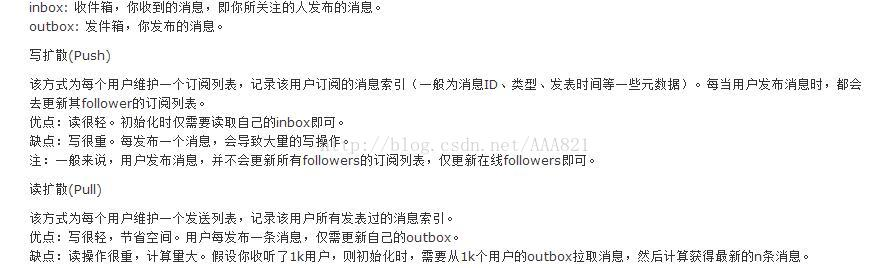

今天看一篇文章时，提到了微信的群聊是写扩散的，第一次接触到写扩散这个名词，于是去查了下资料，有写扩散就有读扩散嘛，定义如下:

 

根据上面的定义，我是这样理解的，什么是写扩散，什么是读扩散，要怎么区分他们，区别之处就在于“主动”

写扩散是主动把消息写到订阅者的消息列表里，这样订阅者就不用去我的outbox拉取消息 ，所以当我要是有很多订阅者时，我就要写很多次，这就是上面定义中说的写很重

读扩散是主动去拉取被订阅者的outbox,这样就不需要被订阅者主动写消息到我的消息列表里来，所以当我要是订阅了很多人时，我就要去读取这些人的所有新消息，所以就出现了读很重

我又联想到了数据库中表之间的关系设计了,两个表之间有关联关系，那这个关系该由谁来维护，同样可以用读扩散和写扩散的概念来思考，其实也可以说，表关系的维护设计，是写扩散和读扩散的具体实现。

