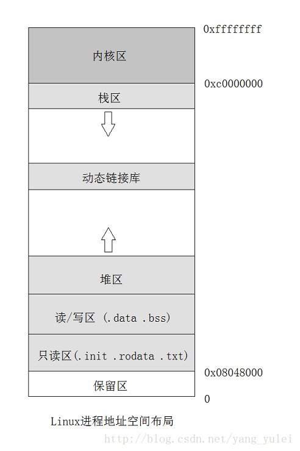

**BSS段:**（bss segment）通常是指用来存放程序中未初始化的全局变量的一块内存区域。BSS是英文Block Started by Symbol的简称。BSS段属于静态内存分配。【存储全局未初始化的变量】。

**数据段** ：数据段（data segment）通常是指用来存放程序中 已初始化 的 全局变量 的一块内存区域。数据段属于静态内存分配。 【存储全局已初始化的变量】。

**代码段：** 代码段（code segment/text segment）通常是指用来存放 程序执行代码 的一块内存区域。这部分区域的大小在程序运行前就已经确定，并且内存区域通常属于 只读 , 某些架构也允许代码段为可写，即允许修改程序。在代码段中，也有可能包含一些 只读的常数变量 ，例如字符串常量等。程序段为程序代码在内存中的映射.一个程序可以在内存中多有个副本.【存储的是二进制后的程序代码】。

**堆（heap）** ：堆是用于存放进程运行中被动态分配的内存段，它的大小并不固定，可动态扩张或缩减。当进程调用malloc/free等函数分配内存时，新分配的内存就被动态添加到堆上（堆被扩张）/释放的内存从堆中被剔除（堆被缩减）【存储初始化的局部变量】。

**栈(stack)** ：栈又称堆栈， 存放程序的 局部变量 （但不包括static声明的变量， static 意味着 在数据段中 存放变量）。除此以外，在函数被调用时，栈用来传递参数和返回值。由于栈的先进先出特点，所以栈特别方便用来保存/恢复调用现场。储动态内存分配,需要程序员手工分配,手工释放【储存的动态未初始化变量】。

下图是APUE中的一个典型C内存空间分布图

