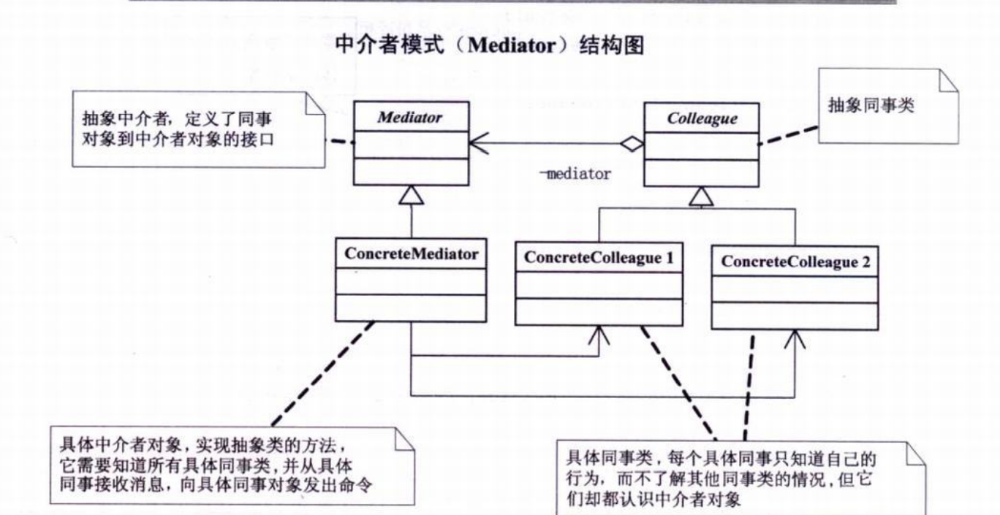

# 中介者模式（调停者模式）

出现的原因：

1. 尽管将一个系统分割成许多对象可以增加其可复用性，但是对象之间的相互连接会降低其可用性。
2. 大量的连接使得一个对象不可呢不在没有其他对象的支持下工作，系统表现为一个不可分割的整体。


中介者模式（Mediator) ,是一个中介对象来封装一系列的对象交互。中介者使得各个对象不需要显示的交互引用，从而使得其耦合松散，而且可以独立的改变他们之间的交互。




```c++
class Mediator;
//抽象人
class Person
{
protected:
	Mediator *m_mediator; //中介
public:
	virtual void SetMediator(Mediator *mediator){} //设置中介
	virtual void SendMessage(string message) {}    //向中介发送信息
	virtual void GetMessage(string message) {}     //从中介获取信息
};
//抽象中介机构
class Mediator
{
public:
	virtual void Send(string message, Person *person) {}
	virtual void SetA(Person *A) {}  //设置其中一方
	virtual void SetB(Person *B) {}
};
//租房者
class Renter: public Person
{
public:
	void SetMediator(Mediator *mediator) { m_mediator = mediator; }
	void SendMessage(string message) { m_mediator->Send(message, this); }
	void GetMessage(string message) { cout<<"租房者收到信息"<<message; }
};
//房东
class Landlord: public Person
{
public:
	void SetMediator(Mediator *mediator) { m_mediator = mediator; }
	void SendMessage(string message) { m_mediator->Send(message, this); }
	void GetMessage(string message) { cout<<"房东收到信息："<<message; }
};
//房屋中介
class HouseMediator : public Mediator
{
private:
	Person *m_A; //租房者
	Person *m_B; //房东
public:
	HouseMediator(): m_A(0), m_B(0) {}
	void SetA(Person *A) { m_A = A; }
	void SetB(Person *B) { m_B = B; }
	void Send(string message, Person *person) 
	{
		if(person == m_A) //租房者给房东发信息
			m_B->GetMessage(message); //房东收到信息
		else
			m_A->GetMessage(message);
	}
};
```

```c++
//测试案例
int main()
{	
	Mediator *mediator = new HouseMediator();
	Person *person1 = new Renter();    //租房者
	Person *person2 = new Landlord();  //房东
	mediator->SetA(person1);
	mediator->SetB(person2);
	person1->SetMediator(mediator);
	person2->SetMediator(mediator);
	person1->SendMessage("我想在南京路附近租套房子，价格800元一个月\n");
	person2->SendMessage("出租房子：南京路100号，70平米，1000元一个月\n");
	delete person1; delete person2; delete mediator;
	return 0;
}
```

