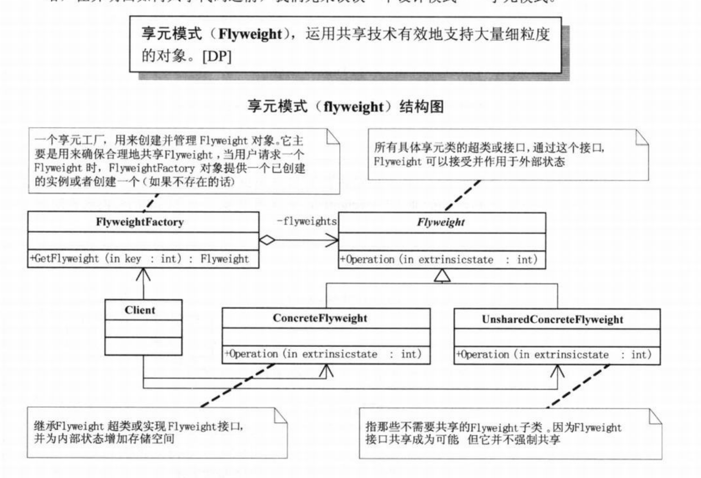

# 享元模式



 围棋字符串的例子、字符串的例子

在GOF的《设计模式:可复用面向对象软件的基础》一书中对享元模式是这样说的：运用共享技术有效地支持大量细粒度的对象。

```c++
#include <iostream>
#include <map>
#include <vector>
using namespace std;

typedef struct pointTag
{
    int x;
    int y;

    pointTag(){}
    pointTag(int a, int b)
    {
        x = a;
    y = b;
    }

    bool operator <(const pointTag& other) const
    {
        if (x < other.x)
        {
            return true;
        }
        else if (x == other.x)
        {
            return y < other.y;
        }

        return false;
    }
}POINT;

typedef enum PieceColorTag
{
    BLACK,
    WHITE
}PIECECOLOR;

class CPiece
{
public:
    CPiece(PIECECOLOR color) : m_color(color){}
    PIECECOLOR GetColor() { return m_color; }

    // Set the external state
    void SetPoint(POINT point) { m_point = point; }
    POINT GetPoint() { return m_point; }

protected:
    // Internal state
    PIECECOLOR m_color;

    // external state
    POINT m_point;
};

class CGomoku : public CPiece
{
public:
    CGomoku(PIECECOLOR color) : CPiece(color){}
};

class CPieceFactory
{
public:
    CPiece *GetPiece(PIECECOLOR color)
    {
        CPiece *pPiece = NULL;
    if (m_vecPiece.empty())
    {
        pPiece = new CGomoku(color);
        m_vecPiece.push_back(pPiece);
    }
    else
    {
        for (vector<CPiece *>::iterator it = m_vecPiece.begin(); it != m_vecPiece.end(); ++it)
        {
            if ((*it)->GetColor() == color)
        {
            pPiece = *it;
            break;
        }
        }
        if (pPiece == NULL)
        {
        pPiece = new CGomoku(color);
        m_vecPiece.push_back(pPiece);
        }
     }
        return pPiece;
    }

    ~CPieceFactory()
    {
        for (vector<CPiece *>::iterator it = m_vecPiece.begin(); it != m_vecPiece.end(); ++it)
        {
            if (*it != NULL)
        {
        delete *it;
        *it = NULL;
        }
    }
    }

private:
    vector<CPiece *> m_vecPiece;
};

class CChessboard
{
public:
    void Draw(CPiece *piece)
    {
    if (piece->GetColor())
    {
            cout<<"Draw a White"<<" at ("<<piece->GetPoint().x<<","<<piece->GetPoint().y<<")"<<endl;
    }
    else
    {
        cout<<"Draw a Black"<<" at ("<<piece->GetPoint().x<<","<<piece->GetPoint().y<<")"<<endl;
    }
    m_mapPieces.insert(pair<POINT, CPiece *>(piece->GetPoint(), piece));
    }

    void ShowAllPieces()
    {
        for (map<POINT, CPiece *>::iterator it = m_mapPieces.begin(); it != m_mapPieces.end(); ++it)
    {
            if (it->second->GetColor())
        {
        cout<<"("<<it->first.x<<","<<it->first.y<<") has a White chese."<<endl;
        }
        else
        {
        cout<<"("<<it->first.x<<","<<it->first.y<<") has a Black chese."<<endl;
        }
    }
    }

private:
    map<POINT, CPiece *> m_mapPieces;
};

int main()
{
    CPieceFactory *pPieceFactory = new CPieceFactory();
    CChessboard *pCheseboard = new CChessboard();

    // The player1 get a white piece from the pieces bowl
    CPiece *pPiece = pPieceFactory->GetPiece(WHITE);
    pPiece->SetPoint(POINT(2, 3));
    pCheseboard->Draw(pPiece);

    // The player2 get a black piece from the pieces bowl
    pPiece = pPieceFactory->GetPiece(BLACK);
    pPiece->SetPoint(POINT(4, 5));
    pCheseboard->Draw(pPiece);

    // The player1 get a white piece from the pieces bowl
    pPiece = pPieceFactory->GetPiece(WHITE);
    pPiece->SetPoint(POINT(2, 4));
    pCheseboard->Draw(pPiece);

    // The player2 get a black piece from the pieces bowl
    pPiece = pPieceFactory->GetPiece(BLACK);
    pPiece->SetPoint(POINT(3, 5));
    pCheseboard->Draw(pPiece);

    /*......*/

    //Show all cheses
    cout<<"Show all cheses"<<endl;
    pCheseboard->ShowAllPieces();

    if (pCheseboard != NULL)
    {
     delete pCheseboard;
    pCheseboard = NULL;
    }
    if (pPieceFactory != NULL)
    {
    delete pPieceFactory;
    pPieceFactory = NULL;
    }
}
```

#### 优点

享元模式可以避免大量非常相似对象的开销。在程序设计时，有时需要生成大量细粒度的类实例来表示数据。如果能发现这些实例数据除了几个参数外基本都是相同的，使用享元模式就可以大幅度地减少对象的数量。

#### 使用场合

Flyweight模式的有效性很大程度上取决于如何使用它以及在何处使用它。当以下条件满足时，我们就可以使用享元模式了。

1. 一个应用程序使用了大量的对象；
2. 完全由于使用大量的对象，造成很大的存储开销；
3. 对象的大多数状态都可变为外部状态；
4. 如果删除对象的外部状态，那么可以用相对较少的共享对象取代很多组对象。