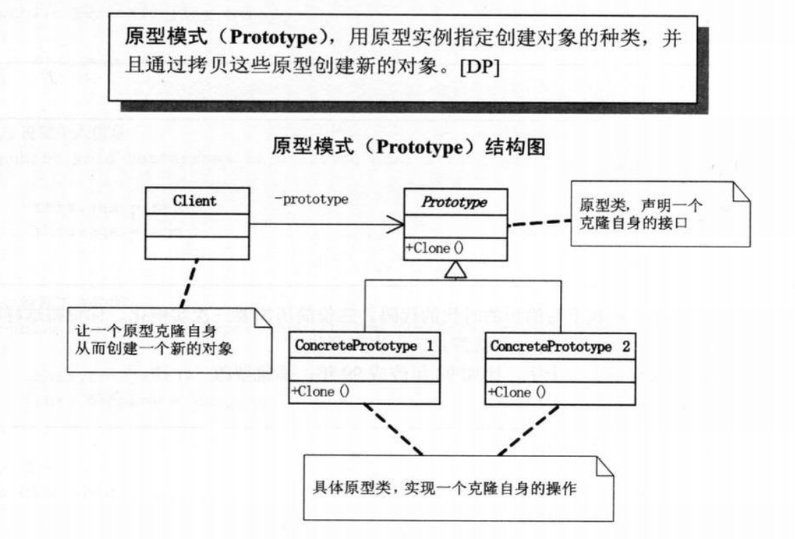

# 原型模式





```c++
#include <string>
#include <iostream>
#include <memory>

class Prototype {

public:
    Prototype(std::string id)
        :m_id(id) {}

    virtual  std::unique_ptr<Prototype> Clone() = 0;

    std::string getId() const {
        return this->m_id;
    }

    virtual ~Prototype()
    {}
private:

    std::string m_id;
};


class ConcreteProtoType : public Prototype
{

public:
    using Prototype::Prototype;

    virtual std::unique_ptr<Prototype> Clone() override {
        
        return std::make_unique<ConcreteProtoType>(this->getId());
    }

    virtual ~ConcreteProtoType() {}

};

int main()
{
    auto concreteProtoType = std::make_unique<ConcreteProtoType>("123");
    auto concreteProtoType1 = concreteProtoType->Clone();
}
```

原型模式更多的体现在 深拷贝 与 浅拷贝 上，`c++` 中更多的体现在 `unique_ptr`与 `shared_ptr`的使用上， 原型模式对整个 c++ 并不是很友好。原因在于 c++ 为手动回收内存，使得需要开发者更多的思考空间。


1. 体现在 原型模式 对外的界限在哪。 （如果整套程序都使用，那就不必考虑了）
2. 深拷贝 还是浅拷贝，最中谁来管理这个对象的声明周期。