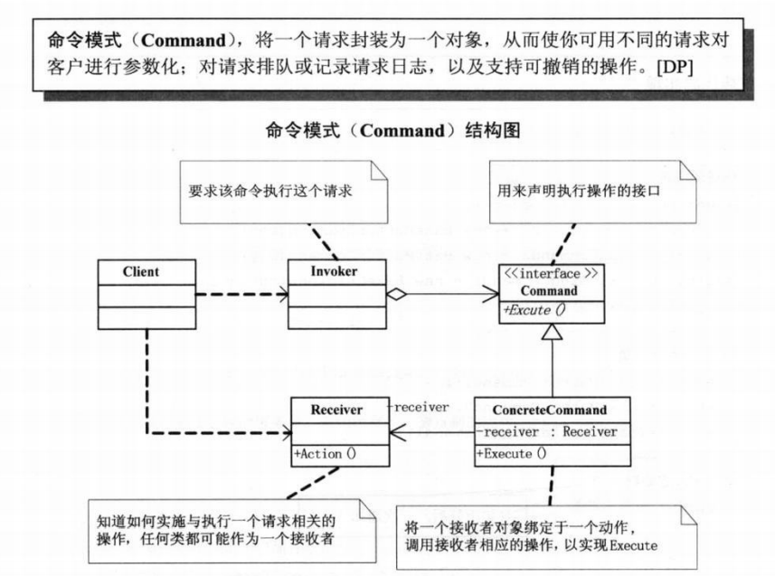

## **设计模式：命令（Command）模式***

命令模式（Command): 将一个请求封装成一个对象，从而你可以用不同的请求对客户端参数化，对请i去排队或记录请求日志，以及可撤销的操作。

在这个例子中举的例子是：画笔 实现绘画 清除 重现 功能

[设计模式：命令（Command）模式](https://www.cnblogs.com/zyrblog/p/9252664.html)

