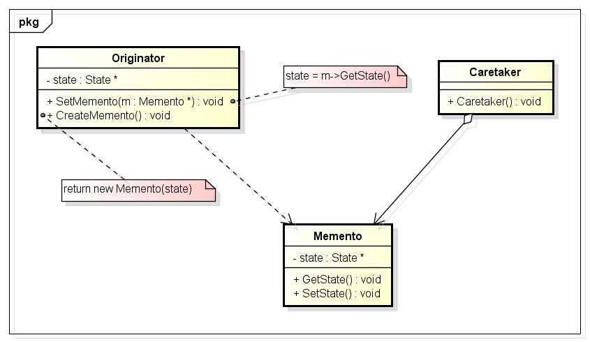
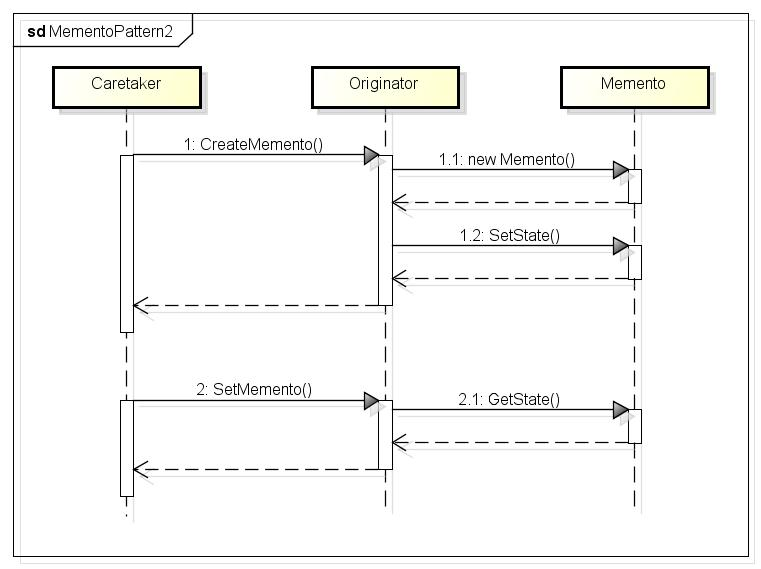

#### 前言

又到年底了，也静不下心来写代码了，大家都很浮躁；翻出经典的《仙剑奇侠传》玩一会；又要打大BOSS，先存一下档吧。这是我的习惯，在打大BOSS之前，都要先存一下档，要是打赢了，就再存一个档，覆盖之前的；如果打输了，就恢复之前的存档，接着重来。我想大家都是这么玩的吧。哎呀，总是打不过。好了，不玩了，但是，游戏中的那个存档行为却让我很着迷，它是如何实现的呢？带着好奇的心，去百度了一下；哦，原来如此。好吧，开始今天的总结吧——备忘录模式。

#### 备忘录模式

在GOF的《设计模式:可复用面向对象软件的基础》一书中对备忘录模式是这样说的：在不破坏封装性的前提下，捕获一个对象的内部状态，并在该对象之外保存这个状态。这样以后就可将该对象恢复到原先保存的状态。

有时有必要记录一个对象的内部状态。为了允许用户取消不确定的操作或从错误中恢复过来，需要实现检查点和取消机制，而要实现这些机制，你必须事先将状态信息保存在某处，这样才能将对象恢复到它们先前的状态。如何实现这个将状态信息保存在某处呢？使用[原型模式](http://blog.csdn.net/caoshangpa/article/details/52796158)？由于对象通常封装了其部分或所有的状态信息，使得其状态不能被其他对象访问，也就不可能在该对象之外保存其状态了。由于原型模式总是返回对象的全部状态信息，同时原型模式使其状态能被其它对象访问，这样就违反了封装的原则，还可能有损应用的可靠性和可扩展性。

再拿上面的《仙剑奇侠传》进行分析，当我们在打大BOSS之前存档，此时就需要将对应的游戏场景，任务信息，人物信息等等状态存储起来；当赢得大BOSS之后，覆盖之前的存档时，就将之前的存档丢弃，新建立一个存档，保存当前的状态信息；如果打输了，恢复存档，就将之前的存档信息读取出来，还原到打大BOSS之前的游戏场景，重新开始打大BOSS。这里面就是使用的备忘录模式。

一个备忘录是一个对象，它存储另一个对象在某个瞬间的内部状态，而后者称为备忘录的原发器。当需要设置原发器的检查点时，取消操作机制会向原发器请求一个备忘录。原发器用描述当前状态的信息初始化该备忘录。只有原发器可以向备忘录中存取信息，备忘录对其他的对象是“不可见”的。

#### UML类图



Memento：备忘录存储原发器对象的内部状态。原发器根据需要决定备忘录存储原发器的哪些内部状态；防止原发器以外的其他对象访问备忘录。备忘录实际上有两个接口，管理者只能看到备忘录的窄接口————它只能将备忘录传递给其他对象。相反，原发器能够看到一个宽接口，允许它访问返回到先前状态所需的所有数据。理想的情况是只允许生成备忘录的那个原发器访问本备忘录的内部状态；
Originator：原发器创建一个备忘录，用以记录当前时刻它的内部状态；我们使用备忘录恢复内部状态；
Caretaker：负责保存好备忘录；但是，不能对备忘录的内容进行操作或检查。

备忘录模式是按照以下方式进行协作的：
管理器向原发器请求一个备忘录，保留一段时间后，将其送回给原发器；而有的时候管理者不会将备忘录返回给原发器，因为原发器可能根本不需要退到先前的状态。备忘录是被动的，只有创建备忘录的原发器会对它的状态进行赋值和检索，如下面的时序图：


#### 使用场合

在以下情况下使用备忘录模式：

1. 必须保存一个对象在某一个时刻的部分或完整状态，这样以后需要时它才能恢复到先前的状态；
2. 如果一个用接口来让其它对象直接得到这些状态，将会暴露对象的实现细节并破坏对象的封装性。

#### 代码实现

```
#include <iostream>
using namespace std;

struct State
{
     wchar_t wcsState[260];
};

class Memento
{
public:
     Memento(State *pState) : m_pState(pState){}

     State *GetState() { return m_pState; }

private:
     friend class Originator;

     State *m_pState;
};

class Originator
{
public:
     Originator() : m_pState(NULL) {}
     ~Originator()
     {
          // Delete the storage of the state
          if (m_pState)
          {
               delete m_pState;
               m_pState = NULL;
          }
     }

     void SetMemento(Memento *pMemento);
     Memento *CreateMemento();

     void SetValue(wchar_t *value)
     {
          memset(wcsValue, 0, 260 * sizeof(wchar_t));
          wcscpy_s(wcsValue, 260, value);
     }

     void PrintState() { wcout<<wcsValue<<endl; }

private:
     State *m_pState; // To store the object's state

     wchar_t wcsValue[260]; // This is the object's real data
};

Memento *Originator::CreateMemento()
{
     m_pState = new State;
     if (m_pState == NULL)
     {
          return NULL;
     }

     Memento *pMemento = new Memento(m_pState);

     wcscpy_s(m_pState->wcsState, 260, wcsValue); // Backup the value
     return pMemento;
}

void Originator::SetMemento(Memento *pMemento)
{
     m_pState = pMemento->GetState();

     // Recovery the data
     memset(wcsValue, 0, 260 * sizeof(wchar_t));
     wcscpy_s(wcsValue, 260, m_pState->wcsState);
}

// Manager the Memento
class Caretaker
{
public:
     Memento *GetMemento() { return m_pMemento; }
     void SetMemnto(Memento *pMemento)
     {
          // Free the previous Memento
          if (m_pMemento)
          {
               delete m_pMemento;
               m_pMemento = NULL;
          }

          // Set the new Memento
          m_pMemento = pMemento;
     }

private:
     Memento *m_pMemento;
};

int main()
{
     Originator *pOriginator = new Originator();
     pOriginator->SetValue(L"On");
     pOriginator->PrintState();

     // Now I backup the state
     Caretaker *pCaretaker = new Caretaker();
     pCaretaker->SetMemnto(pOriginator->CreateMemento());

     // Set the new state
     pOriginator->SetValue(L"Off");
     pOriginator->PrintState();

     // Recovery to the old state
     pOriginator->SetMemento(pCaretaker->GetMemento());
     pOriginator->PrintState();

     if (pCaretaker)
     {
          delete pCaretaker;
     }

     if (pOriginator)
     {
          delete pOriginator;
     }

     return 0;
}
```

我再根据上面的《仙剑奇侠传》来完成备忘录模式，代码如下：

```c++
#include <iostream>
using namespace std;

class RoleStateMemento
{
public:
     RoleStateMemento(unsigned iBlood, unsigned iAttack, unsigned iDefense) : m_iBlood(iBlood), m_iAttack(iAttack), m_iDefense(iDefense){}

private:
     friend class GameRole;

     unsigned GetBloodValue() { return m_iBlood; }
     unsigned GetAttackValue() { return m_iAttack; }
     unsigned GetDefenseValue() { return m_iDefense; }

     unsigned m_iBlood;   // 生命力
     unsigned m_iAttack;  // 攻击力
     unsigned m_iDefense; // 防御力
};

class GameRole
{
public:
     GameRole() : m_iBlood(100), m_iAttack(100), m_iDefense(100){}

     // 存档
     RoleStateMemento *SaveState() { return new RoleStateMemento(m_iBlood, m_iAttack, m_iDefense); }

     // 恢复存档
     void RecoveryState(RoleStateMemento *pRoleState)
     {
          m_iBlood = pRoleState->GetBloodValue();
          m_iAttack = pRoleState->GetAttackValue();
          m_iDefense = pRoleState->GetDefenseValue();
          cout<<"Recovery..."<<endl;
     }

     void ShowState()
     {
          cout<<"Blood:"<<m_iBlood<<endl;
          cout<<"Attack:"<<m_iAttack<<endl;
          cout<<"Defense:"<<m_iDefense<<endl;
     }

     void Fight()
     {
          m_iBlood -= 100;
          m_iAttack -= 10;
          m_iDefense -= 20;

          if (m_iBlood == 0)
          {
               cout<<"Game Over"<<endl;
          }
     }

private:
     unsigned m_iBlood;   // 生命力
     unsigned m_iAttack;  // 攻击力
     unsigned m_iDefense; // 防御力
};

class RoleStateCaretaker
{
public:
     void SetRoleStateMemento(RoleStateMemento *pRoleStateMemento) { m_pRoleStateMemento = pRoleStateMemento; }
     RoleStateMemento *GetRoleStateMemento() { return m_pRoleStateMemento; }

private:
     RoleStateMemento *m_pRoleStateMemento;
};

int main()
{
     GameRole *pLiXY = new GameRole(); // 创建李逍遥这个角色
     pLiXY->ShowState(); // 显示初始的状态

     // 存档
     RoleStateCaretaker *pRoleStateCaretaker = new RoleStateCaretaker();
     pRoleStateCaretaker->SetRoleStateMemento(pLiXY->SaveState());

     // 开始打大BOSS
     pLiXY->Fight();
     pLiXY->ShowState();

     // 读档，从新开始
     pLiXY->RecoveryState(pRoleStateCaretaker->GetRoleStateMemento());
     pLiXY->ShowState();

     return 0;
}
```

#### 总结

备忘录模式在实际应用中也不少；我们在进行文档编辑时，经常使用的撤销操作。使用C++实现备忘录模式的关键点在于Originator类是Memento的友元类，这样就使得管理备忘录的Caretaker对象，以及其它对象都不能读取、设置备忘录，只有Originator类才能进行备忘录的读取和设置。由于备忘录主要是用于对对象的状态进行备份，实现了撤销操作，如果对象的状态数据很大很多时，在进行备忘时，就会很占用资源，这个是我们在实际开发时需要考虑的东西。结合之前的设计模式，在总结[命令模式](http://blog.csdn.net/caoshangpa/article/details/52912355)时，说到命令模式支持事物的回退，而这个就是依靠的备忘录模式来实现的。好了，备忘录模式就总结至此。希望对大家有用。


[备忘录模式](https://blog.csdn.net/caoshangpa/article/details/52956044)