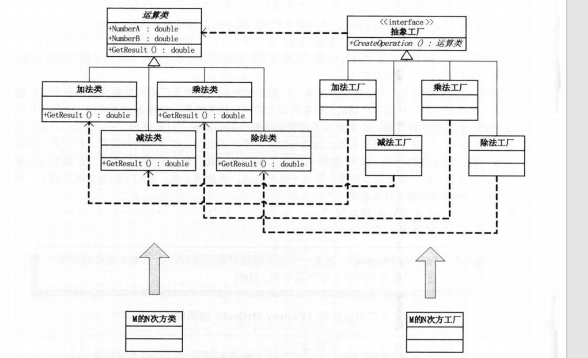
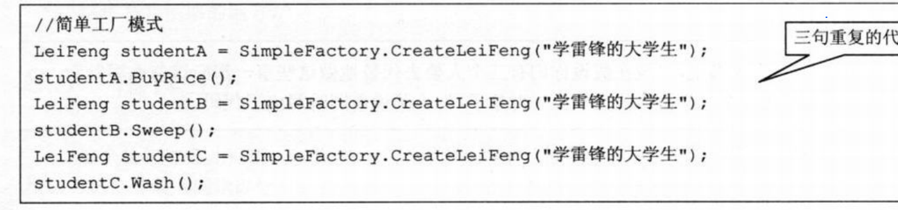
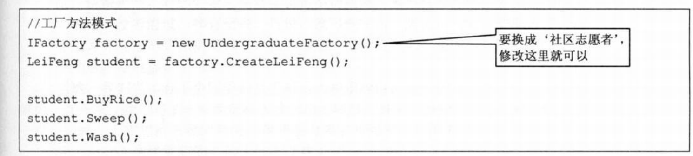

# 工厂方法




简单工厂和工厂方法的在实例化的时候对比：





工厂方法克服了简单工厂违背开放-封闭原则的缺点，又保持了封装对象创建过程的优点。


###### c++ 实现：

```c++
#include <iostream>
#include <memory>

class Leifeng
{
public:
    virtual  void do_good_thing() = 0;
    virtual ~Leifeng() {}
private:

};

class Factor
{
public:
    virtual std::shared_ptr<Leifeng> generate_something() = 0;

};

class Undergradute: public Leifeng
{
public:
    virtual void do_good_thing() override
    {
        std::cout << "我是一个爱做好事的毕业生" << std::endl;
    }
};

class Volunter: public Leifeng
{
public:
    virtual void do_good_thing() override
    {
        std::cout << "我是一个爱做好事的志愿者" << std::endl;
    }
    virtual ~Volunter() {}
};

class UndergraduteFacotr: public Factor 
{
public:
    virtual std::shared_ptr<Leifeng> generate_something() override
    {
        return std::make_shared<Undergradute>();
    }
};


class VolunterFacotr: public Factor
{
public:
    virtual std::shared_ptr<Leifeng> generate_something() override
    {
        return std::make_shared<Volunter>();
    }
};

int main()
{
    auto factor = std::make_shared<VolunterFacotr>();
    auto leifeng = factor->generate_something();
    leifeng->do_good_thing();
}
```

