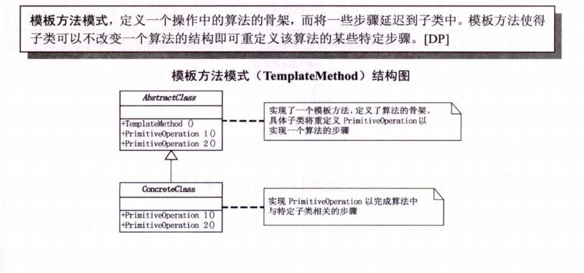

# 模板方法



模板方法 一个例子 ， 老师给学生发题 让学生答题， 每个学生答案都一样，但是题目都是一样的。

因此 类只需要实现关键的题目方法，由子类实习答题方法。 通过统一的计算方法， 提交题目。

```c++
#include <string>
#include <iostream>
#include <memory>

class AbstractClass 
{
public:
    void TemplateMethod()
    {
        std::cout << "TemplateMethod" <<std::endl;
        PrimitiveOperator1();
        PrimitiveOperator2();
    }
private:
    virtual void PrimitiveOperator1() = 0;
    virtual void PrimitiveOperator2() = 0;
};

class MyClass : public AbstractClass
{
public:
    using AbstractClass::AbstractClass;

private:
    virtual void PrimitiveOperator1() override
    {
        std::cout << "PrimitiveOperator1" << std::endl;
    }
    virtual void PrimitiveOperator2() override
    {
        std::cout << "PrimitiveOperator2" << std::endl;
    }
};

int main()
{
    std::unique_ptr<AbstractClass> myClass = std::make_unique< MyClass>();
    myClass->TemplateMethod();
}
```

**优势：**

1. 模板方法模式是通过把不变行为搬移到超类，去除子类中的重复代码来体现它的优势。

2. 模板方法是一个提供了一个很好的代码复用平台。

   

*当不变的和可变的行为方法的子类实现中混合在一起的时候，不变的行为就会在子类重复出现。通过模板方法可以把这些行为搬到单一的地方，这样就能帮助子类拜托重复的不变行为的纠缠。*


