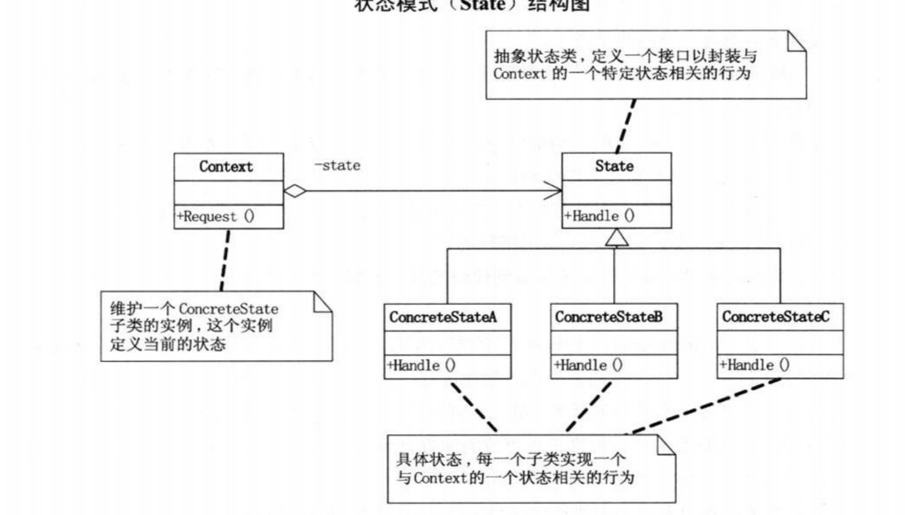

# 状态模式


一个好的方法不宜设计的过长。


状态模式（state）：当一个对象的内在状态改变的时候，允许改变其行为这个对象看起来像是改变了其类。

状态模式主要解决了是一个当控制一个对象状态转换的条件表达式过于复杂时的复杂的情况。把状态判断逻辑庄毅到表示不同状态的一系列类中，可以把复杂的逻辑半段简化。





```c++
#include <vector>
#include <string>
#include <iostream>
#include <memory>
#include <map>

#include<any>
#include <map>
#include <string>
#include <optional>

class Context;

class State
{
public:
    State()
        :m_share() {}
    State(std::any share)
        :m_share(share) {}

    std::any& getShare()
    {
        return m_share.value();
    }
    virtual void Handle(std::shared_ptr<Context> context) = 0;
    virtual ~State() {}

private:
    std::optional<std::any> m_share;
};

class Context :public std::enable_shared_from_this<Context> {

public:
    Context(std::unique_ptr<State> state) 
        :m_state((state.release()))
    {
    }

    State* getState()
    {
        return m_state.get();
    }

    std::unique_ptr<State> setState(std::unique_ptr<State> state)
    {
        m_state.swap(state);
        return state;
    }

    void handle() 
    {
        m_state->Handle(shared_from_this());
    }

private:
    std::unique_ptr<State> m_state;
};

class ConcreteStateA : public State
{
public:
    virtual void Handle(std::shared_ptr<Context> context) override;
};

class ConcreteStateB : public State
{
public:
    virtual void Handle(std::shared_ptr<Context> context) override
    {
        std::cout << "ConcreteStateB" << "Handle" << "..." << std::endl;
        context->setState(std::make_unique<ConcreteStateA>());
    }
};

void ConcreteStateA::Handle(std::shared_ptr<Context> context)
{
    std::cout << "ConcreteStateA" << "Handle" << "..." << std::endl;
    context->setState(std::make_unique<ConcreteStateB>());
}
int main()
{
    auto content = std::make_shared<Context>(std::make_unique<ConcreteStateA>());
    content->handle();
    content->handle();
    content->handle();
}
```

 

把处理放在流里面。

```c++
#include <vector>
#include <string>
#include <iostream>
#include <memory>
#include <map>

#include<any>
#include <map>
#include <string>
#include <optional>

class Context;

class State
{

public:

    State()
        :m_share() {}
    State(std::any share)
        :m_share(share) {}

    std::any& getShare()
    {
        return m_share.value();
    }
    virtual void Handle(std::shared_ptr<Context> context) = 0;
    virtual ~State() {}

private:
    std::optional<std::any> m_share;
};

class Context :public std::enable_shared_from_this<Context> {

public:
    Context(std::unique_ptr<State> state) 
        :m_state((state.release()))
    {
    }

    State* getState()
    {
        return m_state.get();
    }

    std::unique_ptr<State> setState(std::unique_ptr<State> state)
    {
        m_state.swap(state);
        return state;
    }

    void handle() 
    {
        m_state->Handle(shared_from_this());
    }

private:
    std::unique_ptr<State> m_state;
};


class ConcreteStateA : public State
{
public:
    virtual void Handle(std::shared_ptr<Context> context) override;

};

class ConcreteStateB : public State
{
public:
    virtual void Handle(std::shared_ptr<Context> context) override
    {
        std::cout << "ConcreteStateB" << "Handle" << "..." << std::endl;
        context->setState(std::make_unique<ConcreteStateA>());
        context->handle();
    }
};

void ConcreteStateA::Handle(std::shared_ptr<Context> context)
{
    std::cout << "ConcreteStateA" << "Handle" << "..." << std::endl;
    context->setState(std::make_unique<ConcreteStateB>());
    context->handle();
}
int main()
{
    auto content = std::make_shared<Context>(std::make_unique<ConcreteStateA>());
    content->handle();
}
```

