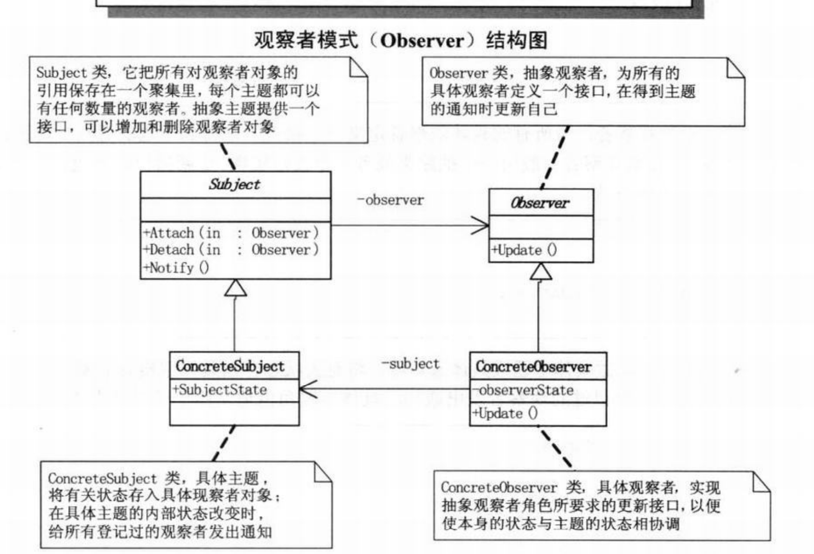

# 观察者模式


观察者模式：定义了一种一对多的依赖关系，让多个观察者对象同时监听同一个主题对象。这个主题对象在状态发生变化时会通知所有观察者对象，使他们能够自己更新自己。





```c++
#include <vector>
#include <string>
#include <iostream>
#include <memory>
#include <map>


#include <map>
#include <string>


class Subject;

class Observer
{
public:
    Observer(std::string name, std::shared_ptr<Subject> subject)
        :m_name(name),
        m_sub(subject)
    {
    }
    virtual void Update() = 0;

    std::string toString()
    {
        return m_name;
    }

protected:
    std::string m_name;
    std::weak_ptr<Subject> m_sub;
};


class Subject
{
private:
    std::map<std::string, std::shared_ptr<Observer>> observers;
    std::string m_state;
public:
    void Attach(std::shared_ptr<Observer> observer)
    {
        observers[observer->toString()] = observer;
    }

    void Detach(std::shared_ptr<Observer> observer)
    {
        observers.erase(observer->toString());
    }

    void setState(std::string state)
    {
        m_state.swap(state);
        Notify();
    }

    std::string getState()
    {
        return m_state;
    }

private:
    void Notify()
    {
        for (const auto& observer : observers)
        {
            observer.second->Update();
        }
    }
};

class Student : public Observer {

public:
    using Observer::Observer;

    virtual void Update()
    {
        if (!m_sub.expired())
        {
            std::cout << "student" << m_sub.lock()->getState() << "my name is " << toString();
        }
    }

};

int main()
{
    auto subject = std::make_shared<Subject>();
    auto student = std::make_shared<Student>("student", subject);
    subject->Attach(student);
    subject->setState("你好");
}
```

将一个系统分割成一系列相互写作的类有一个很不好的副作用，那就是需要维护相关对象之间的一致性。我们不需要维护一致性而使得各个类紧密耦合，这样会给维护、扩展宠用带来不变。


什么时候需要使用观察者模式：

1. 一个对象的改变需要同时改变其他对象
2. 而且不知道具体有多少对象待改变时候，应当考虑挂插着模式
3. 一个抽象模型有两个方面，其中一方面依赖另一方面，这时用观察者模式可以将两者封装在独立的对象中使他们各自独立地改变和复用。


观察者的 `Update` 接口并不一定所有的类能够实现，这时候可以使用委托，委托是函数的抽象，通过c++ 11 将类封装成 仿函数，复制给委托的函数。