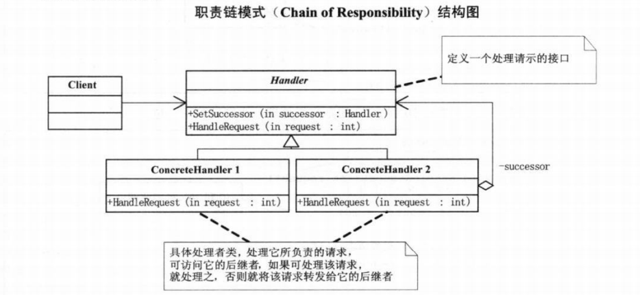

# 责任链模式

责任链（Chain of Responsibility) : 使得多个对象都有机会处理请求，从而避免请求的发送者与接收者之间的耦合关系。将这个对象连成一个链，并沿着这条链传递该请求，**直到有一个对象处理它位置**

向上审批是一个好的责任链例子，但是向上审批 要求责任链有顺序。

1 对 n ，但是只要一种情况满足了 就 ok了

好处:

1. 当用户请提交一个请求时，请求是沿着责任链传递，直至有意 ConcretedHandler 对象负责处理它。
2. 这使得接收者和发送者都没有对方的明确信息，而且链中的对象也不知道链的结构，结果是责任链可减缓对象的相互连接，他们仅需要一个指向其后继者的引用，而不需要保持它所有候选者的调用。
3. 可以随意增加减少一个请求的结构增强给对象指派职责的灵活性
4. 一个请求可能到尾也不能被处理。