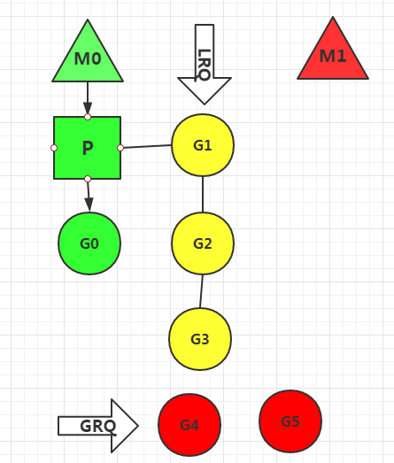
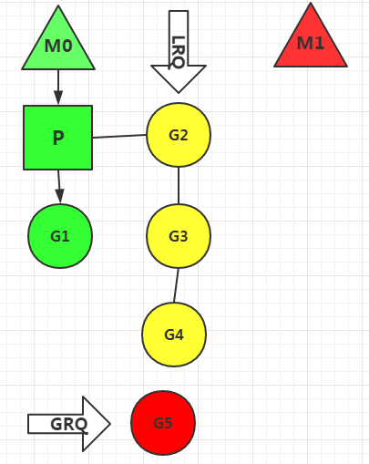
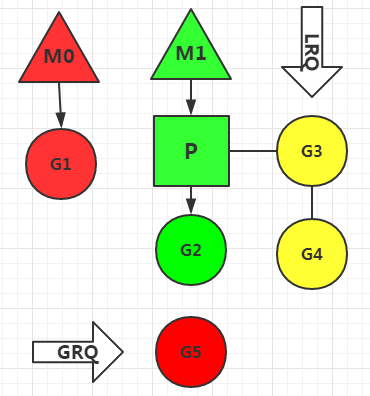
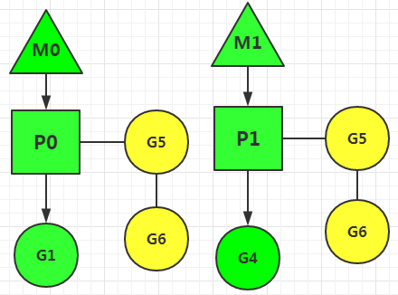

## 什么是协程

对于进程、线程，都是有内核进行调度，有CPU时间片的概念，进行抢占式调度。协程，又称微线程，纤程。英文名Coroutine。协程的调用有点类似子程序，如程序A调用了子程序B，子程序B调用了子程序C，当子程序C结束了返回子程序B继续执行之后的逻辑，当子程序B运行结束了返回程序A，直到程序A运行结束。但是和子程序相比，协程有挂起的概念，协程可以挂起跳转执行其他协程，合适的时机再跳转回来。

## 线程调度原理

N:1模型，多个用户空间线程在1个内核空间线程上运行。优势是上下文切换非常快，因为这些线程都在内核态运行，但是无法利用多核系统的优点。
1:1模型，1个内核空间线程运行一个用户空间线程。这种充分利用了多核系统的优势但是上下文切换非常慢，因为每一次调度都会在用户态和内核态之间切换。POSIX线程模型(pthread)就是这么做的。
M:N模型，内核空间开启多个内核线程，一个内核空间线程对应多个用户空间线程。效率非常高，但是管理复杂。

## goroutine调度原理

本质上goroutine就是协程，但是完全运行在用户态，借鉴了M:N模型。如下图

相比其他语言，golang采用了MPG模型管理协程，更加高效，但是管理非常复杂。
M：内核级线程
G：代表一个goroutine
P：Processor，处理器，用来管理和执行goroutine的。

G-M-P三者的关系与特点：
P的个数取决于设置的GOMAXPROCS，go新版本默认使用最大内核数，比如你有8核处理器，那么P的数量就是8
M的数量和P不一定匹配，可以设置很多M，M和P绑定后才可运行，多余的M处于休眠状态。
P包含一个LRQ（Local Run Queue）本地运行队列，这里面保存着P需要执行的协程G的队列
除了每个P自身保存的G的队列外，调度器还拥有一个全局的G队列GRQ（Global Run Queue），这个队列存储的是所有未分配的协程G。

假设我们的主机是单核的，那么协程运行图是这样：

红色部分表示挂起和休眠，黄色部分表示准备就绪等待运行，绿色部分表示正在运行。
主机是单核的所以只有一个处理器P，但是系统初始化了两个线程M0和M1，处理器P优先绑定了M0线程，M1进入休眠状态。
P的LRQ队列里有G1,G2,G3等待处理。P目前正在处理G0,全局等待队列GRQ里保存着G4,G5，表示这两个协程还未分配给P。
如果G0在短时间内处理完，P就会从LRQ中取出G1继续处理。并且将GRQ全局队列中的部分协程加入LRQ中。
如下图

假设现在G1处理速度很慢，系统就会让M0线程休眠，挂起协程G1，唤醒线程M1进行处理其他的协程。这里M1会将M0未处理的协程取走处理。

等到M1协程队列中所有协程处理完再次唤醒M0，或者M1处理某个协程时间较长被挂起，M0也会被唤醒。
上面的讨论是单核主机情况，如果是多核的，就会运行多个P和M，如下图

M0和M1分别运行在不同的内核线程中，M0处理G1,G2,G3，M1处理G4,G5,G6。
有人会问，当M0处理完所有的协程，而M1还未处理完，系统会如何做呢？
M0会取走M1的一半数量未处理的协程。

## 总结

golang协程设计非常优秀，一方面极大的利用了内核线程和处理器资源，另一方面每个处理器的LRQ队列的协程都处于用户态，这些协程的处理和挂起操作都是用户态的，协程切换开销非常小。相比其他语言的线程设计，更加轻量和高效