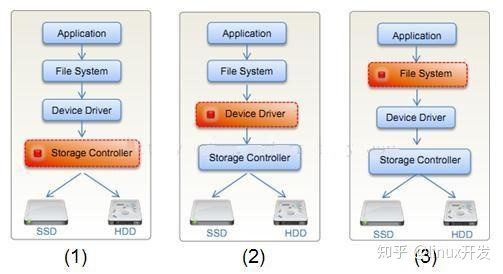
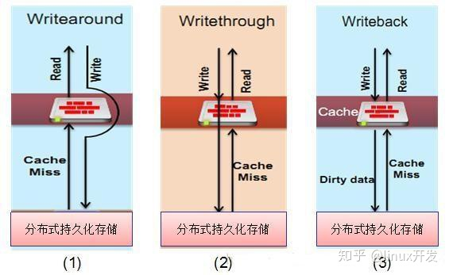

在分布式文件系统中，为了提高系统的性能，常常会引入不同类型的缓存存储系统（算法优化所带来的的效果可能远远不如缓存带来的优化效果）。在软件中缓存存储系统一般可分为了两类：一、分布式缓存，例如：Memcached、Redis、淘宝的Tair等，二、本地缓存，例如：Facebook的flushcache等，其中本地缓存又可以分为两种：本地磁盘缓存（现在一般都采用读写性能比较优异的SSD来做存储）和本地内存缓存。在系统中，为了提高缓存存储系统的性能以及热点数据的命中率，一般在本地磁盘缓存中也会引入内存缓存用于存储经常访问的数据。有时为了减少客户端对服务器的请求，也会在客户端上使用缓存，当然这是要考虑安全问题的。在这里，本文主要讨论分布式文件系统下的本地磁盘缓存。

### **1. 本地磁盘缓存与操作系统的关系**

根据操作系统对硬件的管理以及文件系统的存储逻辑，本地磁盘缓存在操作系统中的位置可大概分为以下三种：

- 一、处于Storage Controller层，OS与应用相互独立，与硬件相关联，由硬件来做读写保护
- 二、处于Device Driver层，与应用独立，与硬件独立，需要第三方来完成读写保护，处于这一层的本地缓存系统有Facebook的flushcache
- 三、处于File System层，OS与应用相关联，与硬件独立，需要第三方来完成读写保护，这一层的本地缓存是在应用中使用最为广泛的，本文所讨论的本地缓存也是基于此层

### **2. 存储设备以及空间**

根据现有的硬件存储技术，SSD的随机读写性能以非常优异，并且其使用寿命也得到了很好的保证，因此被广泛的应用于数据需要持久化存储和高速读写的服务器中。根据性价比来考虑，一般的分布式文件系统的服务器机器中不会放置太大的SSD来做缓存存储设备。——64GB至128GB的SSD是主流。

### **3. 磁盘缓存系统在分布式文件系统中的地位**

缓存系统在整个分布式中以多种形态存在，常见的有以单独一个进程运行的方式存在，这种方式类似于C/S模式，需要进程间的通信；另外就是直接寄宿于分布式文件系统的进程中，由分布式文件系统的进程直接调用缓存的接口来进行数据读写操作，本文主要讨论后一种。

### **4. 分布式文件系统中，本地磁盘缓存的存储策略大概有一下所示的三种：**

- 一、Write Around策略，该策略主要是读缓存，不直接写本地磁盘缓存，而是直接将数据写入分布式持久化存储当中，在读取数据时，如果发现缓存中没有对应的数据则向分布式持久化存储请求，然后再将请求后的数据写入缓存中。优点在于没有一致性问题，数据不会丢失，利于数据集中读取。缺点在于，分布式文件系统中直接将数据写入持久化存储速度会比较慢，对于用户体验会有很大的影响。
- 二、Write Through策略，该策略在读取数据方面与Write Around差不多，但是在数据写入方面有很大的区别，数据在写入的过程中，写入本地缓存的同时也将数据写入分布式持久化存储中。优点在于没有一致性问题，数据不会丢失，利于数据集中读取。缺点在于写入速度将会比较慢，不过这取决于分布式持久化存储的写入性能。
- 三、Write Back策略，该策略主要是读写缓存共用，将数据先写到本地缓存中，然后再通过异步的方式将脏数据同步到分布式持久化存储中，在本地读取数据Miss后才向分布式持久化存储请求，并回写到本地缓存中。优点在于写入速度快，利于数据集中读取，缺点在于会产生一致性问题以及数据可能会丢失。虽然这种策略容会导致数据的丢失，但是在不同层次的存储方案中其是常常被采用个的一种。

### **5. 存储数据类型**

在分布式文件系统中，本地缓存效率极高，数据直接存储于服务器本地，对数据的操作就是对本地文件的操作，但是由于分布式的特征，本地缓存中的数据其它节点无法访问，那么如果相同的一份数据被多台机器缓存于本地，一旦该数据在其中一台机器中被修改，这就会导致一定数据的不一致，因此本地缓存最好只用于存储静态数据——一旦写入就再也不会修改的数据，例如文件的数据块内容、图片等等。

### **6. 索引**

根据项目实践，在分布式文件系统中数据块的网络传输占用了绝大多数的时间，根据对数据随机访问概率的统计数据来分析，当一个文件被连续多次访问之后，其在最近一段时间内被访问到的概率非常之高，因此，为了减少对同一文件的网络IO，设计一个高效且符合实际的场景的本地磁盘缓存非常有必要。高效的缓存系统，必然少不了索引，利用索引快速定位对应数据的文件路径，然后尽可能的挖掘磁盘的读写潜力，让系统瓶颈落在对磁盘的读写上。同时，索引还可以很好的用于控制磁盘当前的使用空间；如果采用Write Back策略，还可以高效计算还未被同步到分布式持久化存储的存储大小；对索引的管理还可以提高缓存的命中率，什么样的数据可以被删除，什么时候删除等等。

**缓存中一般都采用Key-Value的键值对形式将数据存储**，Key由应用传入为了区分Value唯一的标志，为了能加速查找和减少索引的内存占用空间，缓存内部会将Key的内容进行MD5计算，然后存储在索引的数据结构中；Value的内容则以一个文件，或者多个Value存入一个文件中。由于使用SSD作为最后的Value存储，这里我们就简单的将每一个Key作为一个文件存储。另外，为了处理大量的小文件导致文件系统的inode耗尽的问题，可以将小于8KB的数据用leveldb来存储（leveldb对小数据的存储性能非常高）。

**索引的组织方式**有很多种，常用的有标准库的map，list，其它效率更高的有红黑树、B+树等等，这些也都是一种索引在内存中的存储和组织方式，其核心还是离不开对Key值的查找比较。在操作系统中，字符串的比较效率往往要低于系统整数类型，比如对两个32位MD5字符串的比较需要系统进行32次的比较，如果我们将MD5的值用4个unsigned int或者2个unsigned long long来存储的话（这里是在64位操作系统上的），那么直接利用CPU能对整型数进行计算的特性只需要比较4次或者2次即可，这样既可以节省16个字节的内存空间，同时还能加速比较，快速定位。

在索引的内存占用方面我们不必太过于担心，现在的服务中一般的内存配置都是十几GB，用1GB的内存来存储索引也不算太坑老板。假如每个索引所占字节数为32，那么1024 * 1024 * 1024 / 32 = 33554432个索引，如果每个索引所对应内容的平均大小为4KB，那么需要的磁盘空间为33554432 * 4KB = 134217728KB ≈ 128GB，128GB的容量正好与第2点中所说的存储相符。当然如果你开发的分布式文件系统就是用于存储小文件的，那么这些算法就需要额外考虑了。

### **7. 缓存的更新**

在缓存系统中，由于容量有限，因此，在还有数据继续写入的情况下必须删除一些已存在缓存，腾出空间。在我们已知的常用缓存老化方法中大概有如下几种：

先进先出（FIFO: First In, First Out）

最近最少使用（LRU: Least Recently Used）

最少使用频率（LFU: Least Frequently Used）

随机删除（Random）

在实际开发过程中，有时还会采用一些其它的方式，比如，在每个数据中加入生命周期的管理——设置该数据在一定时间内自动失效并将其删除，这种方式需要对系统的时间有很精确的要求，系统时间不能随便被更改。

在分布式系统中，由于缓存会被老化或者删除，那么就会产生当缓存被老化后，某一时刻有同一数据被多人从同一台服务器中访问，所有的访问都会到缓存系统中查找，此时，发现缓存中数据不存在，那么都到分布式持久化存储中读取，返回之后，所有请求的操作会将同一份数据再回写到缓存系统中的问题。对于这个问题我暂时还没有找到什么比较好的处理方法，只能从缓存存储的数据以及业务逻辑上处理。像第5点所说的，缓存只用于存储静态数据，那样数据就可以覆盖，而不会产生一致性的问题。

如果在缓存策略中采用了Write Back策略，那么就需要做，在缓存中还未被持久化到分布式持久化存储的数据的特殊处理，这一类数据在备份持久化之前不能被内部的主动老化策略所删除。

### **8. 性能和命中率**

在支持多线访问的缓存系统中，为提高索引的查找性能，避免锁的高频率碰撞，一般在设计索引的组织方式时会采用hash table的方法，使用多个hash桶，根据对应的hash算法来分散索引的存储，这种方法简单，易于实现，但其也存在无法动态添加hash桶的缺点。每个hash桶中放置的是一个LRU链表，LRU是缓存系统中最常见的数据替换算法，每次淘汰最久没有被访问的数据。每一个hash桶中只对LRU进行上锁，这样就能减少一部分的锁碰撞。memcached中也才用了hash table加LRU链表来管理内存的方法，其高效的管理，使得memcached被广泛用于网站的缓存中，其内存管理示意图如下：

memcache以slab方式管理内存块，从系统申请1MB大小的大块内存并划分为不同大小的chunk，不同slab的chunk大小依次为80字节，80 * 1.25，80 * 1.25^2, …。向memcache中添加item时，memcache会根据item的大小选择合适的chunk。

在项目中，为了权衡性能和命中率之间的关系，有时候常常会降低命中率来换取性能。在数据老化时可以将LRU的最少使用的前几个一起老化，减少每次只老化一个就得锁住当前的LRU链表的频率，从而加速索引的查找和写入，其次是增加hash桶个数，减少hash冲突，同时也减少了对同一LRU链表的操作。

### **9. 索引的持久化**

在Google的文章《Introduction to Distributed System Design》中有阐明关于分布式的设计：design for failure。因此，在分布式文件系统中做好故障处理是及其重要有极其困难的，但是做好进程内的状态保存，当程序重启后能及时恢复到崩溃前的状态还是能够容易实现的。在缓存系统中，数据的索引尤为重要，因此可将其持久化，待程序重新启动后就可以重建索引。这里建议可以使用google的leveldb来做索引的持久化，其高效的读写性能，并不会对系统的性能太大的影响。——这里不考虑机器突然断电的情况。