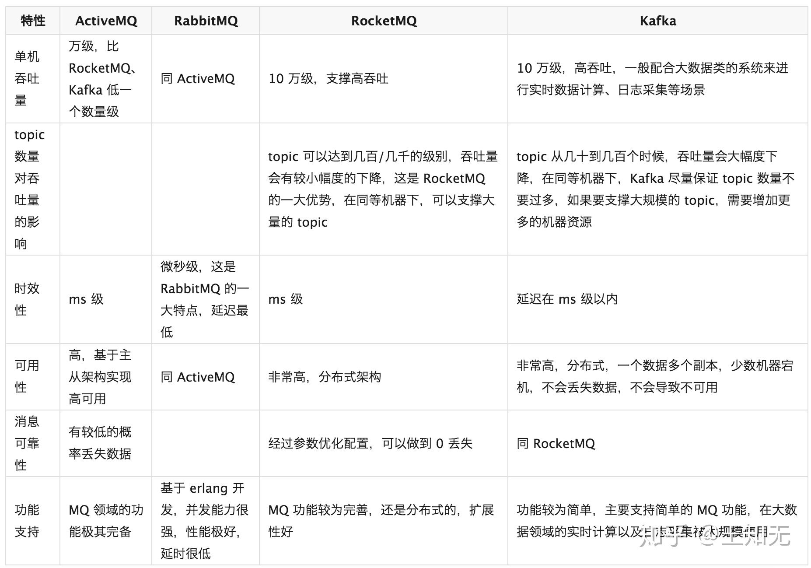

# 我们使用 MQ，我们关心的是什么？

我们使用一个技术的时候，除了使用了他们的便利性外，我们更要关注的是我们需要承担它所带来的麻烦。

消息队列的优点:

- 应用解耦
- 异步处理
- 流量削峰 : 消息队列的性能会比数据库性能更好，并且，横向的扩展能力更强。
- 消息通讯
- 日志处理

日志处理流程：

- Kafka ：接收用户日志的消息队列。
- Logstash ：对接 Kafka 写入的日志，做日志解析，统一成 JSON 输出给 Elasticsearch 中。
- Elasticsearch ：实时日志分析服务的核心技术，一个 schemaless ，实时的数据存储服务，通过 index 组织数据，兼具强大的搜索和统计功能。
- Kibana ：基于 Elasticsearch 的数据可视化组件，超强的数据可视化能力是众多公司选择 ELK stack 的重要原因。

[ELK + kafka 日志方案](http://www.demodashi.com/demo/10181.html)

缺点：

1. 系统可用性降低， 因此 消息队列要做成 HA
2. 系统复杂度高，难以调试
3. 一致性问题

## 消费队列的语义

一共有 3 种，分别如下：

1. 消息至多被消费一次（At most once）：消息可能会丢失，但绝不重传。
2. 消息至少被消费一次（At least once）：消息可以重传，但绝不丢失。
3. 消息仅被消费一次（Exactly once）：每一条消息只被传递一次。

为了支持上面 3 种消费语义，可以分 3 个阶段，考虑消息队列系统中Producer、Message Broker、Consumer 需要满足的条件。

**1. 消息至多被消费一次**

该语义是最容易满足的，特点是整个消息队列吞吐量大，实现简单。

- Producer 发送消息到 Message Broker 阶段

- - Producer 发消息给Message Broker 时，不要求 Message Broker 对接收到的消息响应确认，Producer 也不用关心 Message Broker 是否收到消息了。

- Message Broker 存储/转发阶段

- - 对 Message Broker 的存储不要求持久性。
  - 转发消息时，也不用关心 Consumer 是否真的收到了。

- Consumer 消费阶段

- - Consumer 从 Message Broker 中获取到消息后，可以从 Message Broker 删除消息。
  - 或 Message Broker 在消息被 Consumer 拿去消费时删除消息，不用关心 Consumer 最后对消息的消费情况如何。

**2. 消息至少被消费一次**

适合不能容忍丢消息，允许重复消费的任务。

- Producer 发送消息到 Message Broker 阶段

- - Producer 发消息给 Message Broker ，Message Broker 必须响应对消息的确认。

- Message Broker 存储/转发阶段

- - Message Broker 必须提供持久性保障。
  - 转发消息时，Message Broker 需要 Consumer 通知删除消息，才能将消息删除。

- Consumer消费阶段

- - Consumer 从 Message Broker 中获取到消息，必须在消费完成后，Message Broker上的消息才能被删除。

**3. 消息仅被消费一次**

适合对消息消费情况要求非常高的任务，实现较为复杂。

在这里需要考虑一个问题，就是这里的“仅被消费一次”指的是如下哪种场景：

- Message Broker 上存储的消息被 Consumer 仅消费一次。
- Producer 上产生的消息被 Consumer 仅消费一次。

① Message Broker 上存储的消息被 Consumer 仅消费一次

- Producer 发送消息到 Message Broker 阶段

- - Producer 发消息给 Message Broker 时，不要求 Message Broker 对接收到的消息响应确认，Producer 也不用关心Message Broker 是否收到消息了。

- Message Broker 存储/转发阶段

- - Message Broker 必须提供持久性保障
  - 并且，每条消息在其消费队列里有唯一标识（这个唯一标识可以由 Producer 产生，也可以由 Message Broker 产生）。

- Consumer 消费阶段

- - Consumer 从 Message Broker中获取到消息后，需要记录下消费的消息标识，以便在后续消费中防止对某个消息重复消费（比如 Consumer 获取到消息，消费完后，还没来得及从 Message Broker 删除消息，就挂了，这样 Message Broker 如果把消息重新加入待消费队列的话，那么这条消息就会被重复消费了）。

② Producer 上产生的消息被 Consumer 仅消费一次

- Producer 发送消息到 Message Broker 阶段

- - Producer 发消息给 Message Broker 时，Message Broker 必须响应对消息的确认，并且 Producer 负责为该消息产生唯一标识，以防止 Consumer 重复消费（因为 Producer 发消息给Message Broker 后，由于网络问题没收到 Message Broker 的响应，可能会重发消息给到 Message Broker ）。

- Message Broker 存储/转发阶段

- - Message Broker 必须提供持久性保障
  - 并且，每条消息在其消费队列里有唯一标识（这个唯一标识需要由Producer产生）。

- Consumer 消费阶段

- - 和【① Message Broker 上存储的消息被 Consumer 仅消费一次】相同。

虽然 3 种方式看起来比较复杂，但是我们会发现，是层层递进，越来越可靠。

实际生产场景下，我们是倾向第 3 种的 ② 的情况，每条消息从 Producer 保证被送达，并且被 Consumer 仅消费一次。当然，重心还是如何保证 **Consumer 仅消费一次**，虽然说，消息产生的唯一标志可以在框架层级去做排重，但是最稳妥的，还是业务层也保证消费的幂等性。

## 消息队列有几种投递方式？分别有什么优缺点？

在 「消息队列由哪些角色组成？」 中，我们已经提到消息队列有 **push 推送**和 **pull 拉取**两种投递方式。

一种模型的某些场景下的优点，在另一些场景就可能是缺点。无论是 push 还是 pull ，都存在各种的利弊。

- push

- - 优点，就是及时性。
  - 缺点，就是受限于消费者的消费能力，可能造成消息的堆积，Broker 会不断给消费者发送不能处理的消息。

- pull

- - 优点，就是主动权掌握在消费方，可以根据自己的消息速度进行消息拉取。
  - 缺点，就是消费方不知道什么时候可以获取的最新的消息，会有消息延迟和忙等。

目前的消息队列，基于 push + pull 模式结合的方式，Broker 仅仅告诉 Consumer 有新的消息，具体的消息拉取，还是 Consumer 自己主动拉取。

1. 一个功能的实现，有多种实现方式，有优点就有缺点。并且，一个实现的缺点，恰好是另外一个实现的优点。
2. 一个功能的实现，可能是多种实现方式的结合，取一个平衡点，不那么优，也不那么缺。再说一句题外话，是和否之间，还有灰色地方。

## 如何保证消费者的消费消息的幂等性？

**分析原因**

在 「消息队列有几种消费语义？」 中，我们已经看了三种消费语义。如果要达到消费者的消费消息的幂等性，就需要**消息仅被消费一次**，且**每条消息从 Producer 保证被送达，并且被 Consumer 仅消费一次**。

那么，我们就基于这个场景，来思考下，为什么会出现消息重复的问题？

- 对于 Producer 来说

- - 可能因为网络问题，Producer 重试多次发送消息，实际第一次就发送成功，那么就会产生多条相同的消息。
  - ….

- 对于 Consumer 来说

- - 可能因为 Broker 的消息进度丢失，导致消息重复投递给 Consumer 。
  - Consumer 消费成功，但是因为 JVM 异常崩溃，导致消息的消费进度未及时同步给 Consumer 。
    对于大多数消息队列，考虑到性能，消费进度是异步定时同步给 Broker 。
  - …

**如何解决**

所以，上述的种种情况，都可能导致消费者会获取到重复的消息，那么我们的思考就**无法是解决不发送、投递重复的消息，而是消费者在消费时，如何保证幂等性。**

消费者实现幂等性，有两种方式：

1. 框架层统一封装。
2. 业务层自己实现。

① **框架层统一封装**

首先，需要有一个消息排重的唯一标识，该编号只能由 Producer 生成，例如说使用 uuid、或者其它唯一编号的算法 。

然后，就需要有一个排重的存储器，例如说：

- 使用关系数据库，增加一个排重表，使用消息编号作为唯一主键。
- 使用 KV 数据库，KEY 存储消息编号，VALUE 任一。*此处，暂时不考虑 KV 数据库持久化的问题*。

那么，我们要什么时候插入这条排重记录呢？

- 在消息消费执行业务逻辑**之前**，插入这条排重记录。但是，此时会有可能 JVM 异常崩溃。那么 JVM 重启后，这条消息就无法被消费了。因为，已经存在这条排重记录。

- 在消息消费执行业务逻辑**之后**，插入这条排重记录。

- - 如果业务逻辑执行失败，显然，我们不能插入这条排重记录，因为我们后续要消费重试。
  - 如果业务逻辑执行成功，此时，我们可以插入这条排重记录。但是，万一插入这条排重记录失败呢？**那么，需要让插入记录和业务逻辑在同一个事务当中，此时，我们只能使用数据库**。

② **业务层自己实现**

方式很多，这个和 HTTP 请求实现幂等是一样的逻辑：

- 先查询数据库，判断数据是否已经被更新过。如果是，则直接返回消费完成，否则执行消费。
- 更新数据库时，带上数据的状态。如果更新失败，则直接返回消费完成，否则执行消费。
- …

如果胖友的系统的并发量非常大，可以使用 Zookeeper 或者 Redis 实现分布式锁，避免并发带来的问题。当然，引入一个组件，也会带来另外的复杂性：

1. 系统的并发能力下降。
2. Zookeeper 和 Redis 在获取分布式锁时，发现它们已经挂掉，此时到底要不要继续执行下去呢？

**选择**

正常情况下，出现重复消息的概率其实很小，如果由框架层统一封装来实现的话，肯定会对消息系统的吞吐量和高可用有影响，所以最好还是由业务层自己实现处理消息重复的问题。

当然，这两种方式不是冲突的。可以提供不同类型的消息，根据配置，使用哪种方式。例如说：

- 默认情况下，开启【框架层统一封装】的功能。
- 可以通过配置，关闭【框架层统一封装】的功能。

当然，如果可能的话，尽可能业务层自己实现。但是，实际上，很多时候，开发者不太会注意，哈哈哈哈。

## Kafka、ActiveMQ、RabbitMQ、RocketMQ 有什么优缺点？

这四者，对比如下表格如下：

**ActiveMQ**

一般的业务系统要引入 MQ，最早大家都用 ActiveMQ ，但是现在确实大家用的不多了( 特别是互联网公司 )，没经过大规模吞吐量场景的验证( **性能较差** )，社区也不是很活跃( 主要精力在研发 [ActiveMQ Apollo](https://link.zhihu.com/?target=https%3A//activemq.apache.org/apollo/) )，所以大家还是算了，我个人不推荐用这个了。

**RabbitMQ**

后来大家开始用 RabbitMQ，但是确实 Erlang 语言阻止了大量的 Java 工程师去深入研究和掌控它，对公司而言，几乎处于不可控的状态，但是确实人家是开源的，比较稳定的支持，社区活跃度也高。另外，因为 Spring Cloud 在消息队列的支持上，对 RabbitMQ 是比较不错的，所以在选型上又更加被推崇。

**RocketMQ**

不过现在确实越来越多的公司，会去用 RocketMQ，确实很不错（阿里出品）。 目前已经加入 Apache ，所以社区层面有相应的保证，并且是使用 Java 语言进行实现，对于 Java 工程师更容易去深入研究和掌控它。目前，也是比较推荐去选择的。并且，如果使用阿里云，可以直接使用其云服务。

当然，现在比较被社区诟病的是，官方暂未提供比较好的中文文档，国内外也缺乏比较好的 RocketMQ 书籍，所以是比较大的痛点。

**总结**

- 所以**中小型公司**，技术实力较为一般，技术挑战不是特别高，用 RabbitMQ 是不错的选择

- **大型公司**，基础架构研发实力较强，用 RocketMQ 是很好的选择。

- - 当然，中小型公司使用 RocketMQ 也是没什么问题的选择，特别是以 Java 为主语言的公司。

- 如果是**大数据领域**的实时计算、日志采集等场景，用 Kafka 是业内标准的，绝对没问题，社区活跃度很高，绝对不会黄，何况几乎是全世界这个领域的事实性规范。

- - 另外，目前国内也是有非常多的公司，将 Kafka 应用在业务系统中，例如唯品会、陆金所、美团等等。

**补充**

推荐阅读如下几篇文章：

- [《Kafka、RabbitMQ、RocketMQ等消息中间件的对比》](https://link.zhihu.com/?target=https%3A//blog.csdn.net/belvine/article/details/80842240)
- [《Kafka、RabbitMQ、RocketMQ消息中间件的对比 —— 消息发送性能》](https://link.zhihu.com/?target=http%3A//jm.taobao.org/2016/04/01/kafka-vs-rabbitmq-vs-rocketmq-message-send-performance/)
- [《RocketMQ与Kafka对比（18项差异）》](https://link.zhihu.com/?target=https%3A//www.cnblogs.com/BYRans/p/6100653.html)

当然，很多测评放在现在已经不适用了，特别是 Kafka ，大量评测是基于 0.X 版本，而 Kafka 目前已经演进到 2.X 版本，已经不可同日而语了。

## 消息队列的一般存储方式有哪些？

当前业界几款主流的MQ消息队列采用的存储方式主要有以下三种方式。

**1. 分布式KV存储**

这类 MQ 一般会采用诸如 LevelDB 、RocksDB 和 Redis 来作为消息持久化的方式。由于分布式缓存的读写能力要优于 DB ，所以在对消息的读写能力要求都不是比较高的情况下，采用这种方式倒也不失为一种可以替代的设计方案。

消息存储于分布式 KV 需要解决的问题在于如何保证 MQ 整体的可靠性。

**2. 文件系统**

目前业界较为常用的几款产品（RocketMQ / Kafka / RabbitMQ）均采用的是消息刷盘至所部署虚拟机/物理机的文件系统来做持久化（刷盘一般可以分为异步刷盘和同步刷盘两种模式）。

> 刷盘指的是存储到硬盘。

消息刷盘为消息存储提供了一种高效率、高可靠性和高性能的数据持久化方式。除非部署 MQ 机器本身或是本地磁盘挂了，否则一般是不会出现无法持久化的故障问题。

**3. 关系型数据库 DB**

Apache下开源的另外一款MQ—ActiveMQ（默认采用的KahaDB做消息存储）可选用 JDBC 的方式来做消息持久化，通过简单的 XML 配置信息即可实现JDBC消息存储。

由于，普通关系型数据库（如 MySQL ）在单表数据量达到千万级别的情况下，其 IO 读写性能往往会出现瓶颈。因此，如果要选型或者自研一款性能强劲、吞吐量大、消息堆积能力突出的 MQ 消息队列，那么并不推荐采用关系型数据库作为消息持久化的方案。在可靠性方面，该种方案非常依赖 DB ，如果一旦 DB 出现故障，则 MQ 的消息就无法落盘存储会导致线上故障。

**小结**

因此，综合上所述从存储效率来说，**文件系统 > 分布式 KV 存储 > 关系型数据库 DB** ，直接操作文件系统肯定是最快和最高效的，而关系型数据库 TPS 一般相比于分布式 KV 系统会更低一些（简略地说，关系型数据库本身也是一个需要读写文件 Server ，这时 MQ 作为 Client与其建立连接并发送待持久化的消息数据，同时又需要依赖 DB 的事务等，这一系列操作都比较消耗性能），所以如果追求高效的IO读写，那么选择操作文件系统会更加合适一些。但是如果从易于实现和快速集成来看，**文件系统 > 分布式 KV 存储 > 关系型数据库 DB**，但是性能会下降很多。

另外，从消息中间件的本身定义来考虑，应该尽量减少对于外部第三方中间件的依赖。一般来说依赖的外部系统越多，也会使得本身的设计越复杂，所以个人的理解是采用**文件系统**作为消息存储的方式，更贴近消息中间件本身的定义。

## 如何自己设计消息队列？

参考与推荐如下文章：

- 小火箭 [《关于消息队列的思考》](https://link.zhihu.com/?target=http%3A//yangxikun.com/2017/03/22/message-queue.html)
- zhangxd [《JAVA 高级面试题 1》](https://link.zhihu.com/?target=http%3A//zhangxianda.com/2017/06/22/JAVA%E9%AB%98%E7%BA%A7%E9%9D%A2%E8%AF%95%E9%A2%98/)
- wayen [《面试：分布式之消息队列要点复习》](https://link.zhihu.com/?target=https%3A//segmentfault.com/a/1190000015301449)
- 步积 [《消息队列技术介绍》](https://link.zhihu.com/?target=https%3A//www.jianshu.com/p/689ce4205021) 。如果胖友对 MQ 没有系统了解过，可以认真仔细看看。
- 送人玫瑰手留余香 [《面试阿里后的总结》](https://link.zhihu.com/?target=http%3A//www.voidcn.com/article/p-dzmqlwhn-boa.html)
- yanglbme [《为什么使用消息队列？消息队列有什么优点和缺点？Kafka、ActiveMQ、RabbitMQ、RocketMQ 都有什么优点和缺点？》](https://link.zhihu.com/?target=https%3A//github.com/doocs/advanced-java/blob/master/docs/high-concurrency/why-mq.md)
- 癫狂侠 [《消息中间件—RocketMQ消息存储（一）》](https://link.zhihu.com/?target=https%3A//www.jianshu.com/p/b73fdd893f98)
- hacpai [《【面试宝典】消息队列如何保证幂等性？》](https://link.zhihu.com/?target=https%3A//hacpai.com/article/1542160729029)
- yanglbme [《如何保证消息不被重复消费？（如何保证消息消费时的幂等性）》](https://link.zhihu.com/?target=https%3A//github.com/doocs/advanced-java/blob/master/docs/high-concurrency/how-to-ensure-that-messages-are-not-repeatedly-consumed.md)

