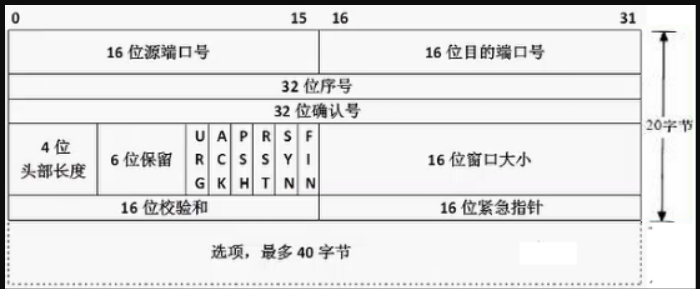
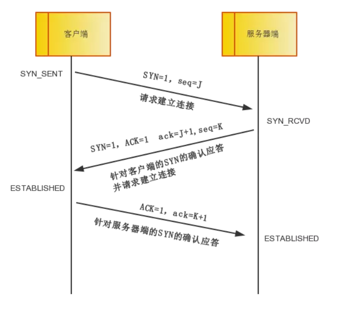
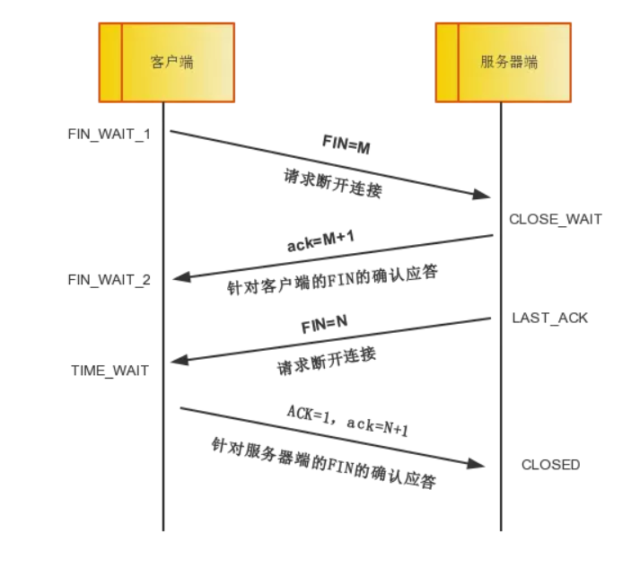

# [一文彻底搞懂 TCP三次握手、四次挥手过程及原理](https://www.cnblogs.com/cooffeeli/p/TCP_Establish_Connection_Close_Connection.html)

 

### TCP 协议简述

TCP 提供面向有连接的通信传输，面向有连接是指在传送数据之前必须先建立连接，数据传送完成后要释放连接。

无论哪一方向另一方发送数据之前，都必须先在双方之间建立一条连接。在TCP/IP协议中，TCP协议提供可靠的连接服务，连接是通过**三次握手**进行初始化的。
同时由于TCP协议是一种面向连接的、可靠的、基于字节流的运输层通信协议，TCP是**全双工模式**，所以需要**四次挥手**关闭连接。

### TCP包首部

网络中传输的数据包由两部分组成：一部分是协议所要用到的首部，另一部分是上一层传过来的数据。首部的结构由协议的具体规范详细定义。在数据包的首部，明确标明了协议应该如何读取数据。反过来说，看到首部，也就能够了解该协议必要的信息以及所要处理的数据。包首部就像协议的脸。

所以我们在学习TCP协议之前，首先要知道TCP在网络传输中处于哪个位置，以及它的协议的规范，下面我们就看看TCP首部的网络传输起到的作用：


下面的图是TCP头部的规范定义，它定义了TCP协议如何读取和解析数据：


TCP首部承载这TCP协议需要的各项信息，下面我们来分析一下：

- **TCP端口号**
  TCP的连接是需要四个要素确定唯一一个连接：
  **（源IP，源端口号）+ （目地IP，目的端口号）**
  所以TCP首部预留了两个16位作为端口号的存储，而IP地址由上一层IP协议负责传递
  源端口号和目地端口各占16位两个字节，也就是端口的范围是2^16=65535
  另外1024以下是系统保留的，从1024-65535是用户使用的端口范围
- **TCP的序号和确认号**：
  **32位序号 seq**：Sequence number 缩写seq ，TCP通信过程中某一个传输方向上的字节流的每个字节的序号，通过这个来确认发送的数据**有序**，比如现在序列号为1000，发送了1000，下一个序列号就是2000。
  **32位确认号 ack**：Acknowledge number 缩写ack，TCP对上一次seq序号做出的确认号，用来响应TCP报文段，给收到的TCP报文段的序号seq加1。
- **TCP的标志位**
  每个TCP段都有一个目的，这是借助于TCP标志位选项来确定的，允许发送方或接收方指定哪些标志应该被使用，以便段被另一端正确处理。
  用的最广泛的标志是 **SYN**，**ACK** 和 **FIN**，用于建立连接，确认成功的段传输，最后终止连接。
  1. **SYN**：简写为`S`，同步标志位，用于建立会话连接，同步序列号；
  2. **ACK**： 简写为`.`，确认标志位，对已接收的数据包进行确认；
  3. **FIN**： 简写为`F`，完成标志位，表示我已经没有数据要发送了，即将关闭连接；
  4. PSH：简写为`P`，推送标志位，表示该数据包被对方接收后应立即交给上层应用，而不在缓冲区排队；
  5. RST：简写为`R`，重置标志位，用于连接复位、拒绝错误和非法的数据包；
  6. URG：简写为`U`，紧急标志位，表示数据包的紧急指针域有效，用来保证连接不被阻断，并督促中间设备尽快处理；

### TCP 三次握手建立连接

所谓三次握手(Three-way Handshake)，是指建立一个 TCP 连接时，需要客户端和服务器总共发送3个报文。

三次握手的目的是连接服务器指定端口，建立 TCP 连接，并同步连接双方的序列号和确认号，交换 TCP 窗口大小信息。在 socket 编程中，客户端执行 connect() 时。将触发三次握手。

三次握手过程的示意图如下：


- **第一次握手**：
  客户端将TCP报文**标志位SYN置为1**，随机产生一个序号值seq=J，保存在TCP首部的序列号(Sequence Number)字段里，指明客户端打算连接的服务器的端口，并将该数据包发送给服务器端，发送完毕后，客户端进入`SYN_SENT`状态，等待服务器端确认。
- **第二次握手**：
  服务器端收到数据包后由标志位SYN=1知道客户端请求建立连接，服务器端将TCP报文**标志位SYN和ACK都置为1**，ack=J+1，随机产生一个序号值seq=K，并将该数据包发送给客户端以确认连接请求，服务器端进入`SYN_RCVD`状态。
- **第三次握手**：
  客户端收到确认后，检查ack是否为J+1，ACK是否为1，如果正确则将标志位ACK置为1，ack=K+1，并将该数据包发送给服务器端，服务器端检查ack是否为K+1，ACK是否为1，如果正确则连接建立成功，客户端和服务器端进入`ESTABLISHED`状态，完成三次握手，随后客户端与服务器端之间可以开始传输数据了。

注意:我们上面写的ack和ACK，不是同一个概念：

- 小写的ack代表的是头部的确认号Acknowledge number， 缩写ack，是对上一个包的序号进行确认的号，ack=seq+1。
- 大写的ACK，则是我们上面说的TCP首部的标志位，用于标志的TCP包是否对上一个包进行了确认操作，如果确认了，则把ACK标志位设置成1。

下面我自己做实验，开一个HTTP服务，监听80端口，然后使用Tcpdump命令抓包，看一下TCP三次握手的过程：

```python
sudo tcpdump -n -t -S -i enp0s3  port 80 

第一次握手，标志位Flags=S
IP 10.0.2.2.51323 > 10.0.2.15.80: Flags [S], seq 84689409, win 65535, options [mss 1460], length 0
第二次握手，标志位Flags=[S.]
IP 10.0.2.15.80 > 10.0.2.2.51323: Flags [S.], seq 1893430205, ack 84689410, win 64240, options [mss 1460], length 0
第三次握手，标志位Flags=[.]
IP 10.0.2.2.51323 > 10.0.2.15.80: Flags [.], ack 1893430206, win 65535, length 0
建立连接后，客户端发送http请求 
IP 10.0.2.2.51321 > 10.0.2.15.80: Flags [P.], seq 1:753, ack 1, win 65535, length 752: HTTP: GET / HTTP/1.1
```

> tcpdump命令解析一下：
> -i : 指定抓包的网卡是enp0s3
> -n: 把域名转成IP显示
> -t: 不显示时间
> -S: 序列号使用绝对数值，不指定-S的话，序列号会使用相对的数值
> port: 指定监听端口是80
> host:指定监听的主机名

我们看下实战中TCP的三次握手过程：

- 第一次握手，客户端51323端口号向服务器端80号端口发起连接，此时标志位flags=S，即SYN=1标志，表示向服务端发起连接的请求，同时生成序列号seq=84689409
- 第二次握手，服务端标志位flags=[S.]，即SYN+ACK标志位设置为1，表示对上一个请求连接的报文进行确认，同时设置ack=seq+1=184689410，生成序列号seq=1893430205
- 第三次握手，客户端对服务端的响应进行确认，所以此时标志位是[.]即ACK=1，同时返回对上一个报文的seq的确认号，ack=1893430206

至此，三次握手完成，一个TCP连接建立完成，接下来就是双端传输数据了

#### 为什么需要三次握手？

我们假设client发出的第一个连接请求报文段并没有丢失，而是在某个网络结点长时间的滞留了，以致延误到连接释放以后的某个时间才到达server。

本来这是一个早已失效的报文段。但server收到此失效的连接请求报文段后，就误认为是client再次发出的一个新的连接请求。于是就向client发出确认报文段，同意建立连接。

假设不采用“三次握手”，那么只要server发出确认，新的连接就建立了。由于现在client并没有发出建立连接的请求，因此不会理睬server的确认，也不会向server发送数据。但server却以为新的运输连接已经建立，并一直等待client发来数据。这样，server的很多资源就白白浪费掉了。

所以，采用“三次握手”的办法可以防止上述现象发生。例如刚才那种情况，client不会向server的确认发出确认。server由于收不到确认，就知道client并没有要求建立连接。

TCP 三次握手跟现实生活中的人与人打电话是很类似的：

> 三次握手：
> “喂，你听得到吗？”
> “我听得到呀，你听得到我吗？”
> “我能听到你，今天 balabala……”

经过三次的互相确认，大家就会认为对方对听的到自己说话，并且愿意下一步沟通，否则，对话就不一定能正常下去了。

### TCP 四次挥手关闭连接

四次挥手即终止TCP连接，就是指断开一个TCP连接时，需要客户端和服务端总共发送4个包以确认连接的断开。在socket编程中，这一过程由客户端或服务端任一方执行close来触发。
由于TCP连接是全双工的，因此，每个方向都必须要单独进行关闭，这一原则是当一方完成数据发送任务后，发送一个FIN来终止这一方向的连接，收到一个FIN只是意味着这一方向上没有数据流动了，即不会再收到数据了，但是在这个TCP连接上仍然能够发送数据，直到这一方向也发送了FIN。首先进行关闭的一方将执行主动关闭，而另一方则执行被动关闭。

四次挥手过程的示意图如下：


挥手请求可以是Client端，也可以是Server端发起的，我们假设是Client端发起：

- **第一次挥手**： Client端发起挥手请求，向Server端发送标志位是FIN报文段，设置序列号seq，此时，Client端进入`FIN_WAIT_1`状态，这表示Client端没有数据要发送给Server端了。
- **第二次分手**：Server端收到了Client端发送的FIN报文段，向Client端返回一个标志位是ACK的报文段，ack设为seq加1，Client端进入`FIN_WAIT_2`状态，Server端告诉Client端，我确认并同意你的关闭请求。
- **第三次分手**： Server端向Client端发送标志位是FIN的报文段，请求关闭连接，同时Client端进入`LAST_ACK`状态。
- **第四次分手** ： Client端收到Server端发送的FIN报文段，向Server端发送标志位是ACK的报文段，然后Client端进入`TIME_WAIT`状态。Server端收到Client端的ACK报文段以后，就关闭连接。此时，Client端等待**2MSL**的时间后依然没有收到回复，则证明Server端已正常关闭，那好，Client端也可以关闭连接了。

#### 为什么连接的时候是三次握手，关闭的时候却是四次握手？

建立连接时因为当Server端收到Client端的SYN连接请求报文后，可以直接发送**SYN+ACK**报文。其中ACK报文是用来应答的，SYN报文是用来同步的。所以建立连接只需要三次握手。

由于TCP协议是一种面向连接的、可靠的、基于字节流的运输层通信协议，TCP是**全双工模式**。
这就意味着，关闭连接时，当Client端发出FIN报文段时，只是表示Client端告诉Server端数据已经发送完毕了。当Server端收到FIN报文并返回ACK报文段，表示它已经知道Client端没有数据发送了，但是Server端还是可以发送数据到Client端的，所以Server很可能并不会立即关闭SOCKET，直到Server端把数据也发送完毕。
当Server端也发送了FIN报文段时，这个时候就表示Server端也没有数据要发送了，就会告诉Client端，我也没有数据要发送了，之后彼此就会愉快的中断这次TCP连接。

#### 为什么要等待2MSL？

**MSL**：报文段最大生存时间，它是任何报文段被丢弃前在网络内的最长时间。
有以下两个原因：

- **第一点：保证TCP协议的全双工连接能够可靠关闭**：
  由于IP协议的不可靠性或者是其它网络原因，导致了Server端没有收到Client端的ACK报文，那么Server端就会在超时之后重新发送FIN，如果此时Client端的连接已经关闭处于`CLOESD`状态，那么重发的FIN就找不到对应的连接了，从而导致连接错乱，所以，Client端发送完最后的ACK不能直接进入`CLOSED`状态，而要保持`TIME_WAIT`，当再次收到FIN的收，能够保证对方收到ACK，最后正确关闭连接。
- **第二点：保证这次连接的重复数据段从网络中消失**
  如果Client端发送最后的ACK直接进入`CLOSED`状态，然后又再向Server端发起一个新连接，这时不能保证新连接的与刚关闭的连接的端口号是不同的，也就是新连接和老连接的端口号可能一样了，那么就可能出现问题：如果前一次的连接某些数据滞留在网络中，这些延迟数据在建立新连接后到达Client端，由于新老连接的端口号和IP都一样，TCP协议就认为延迟数据是属于新连接的，新连接就会接收到脏数据，这样就会导致数据包混乱。所以TCP连接需要在TIME_WAIT状态等待2倍MSL，才能保证本次连接的所有数据在网络中消失。