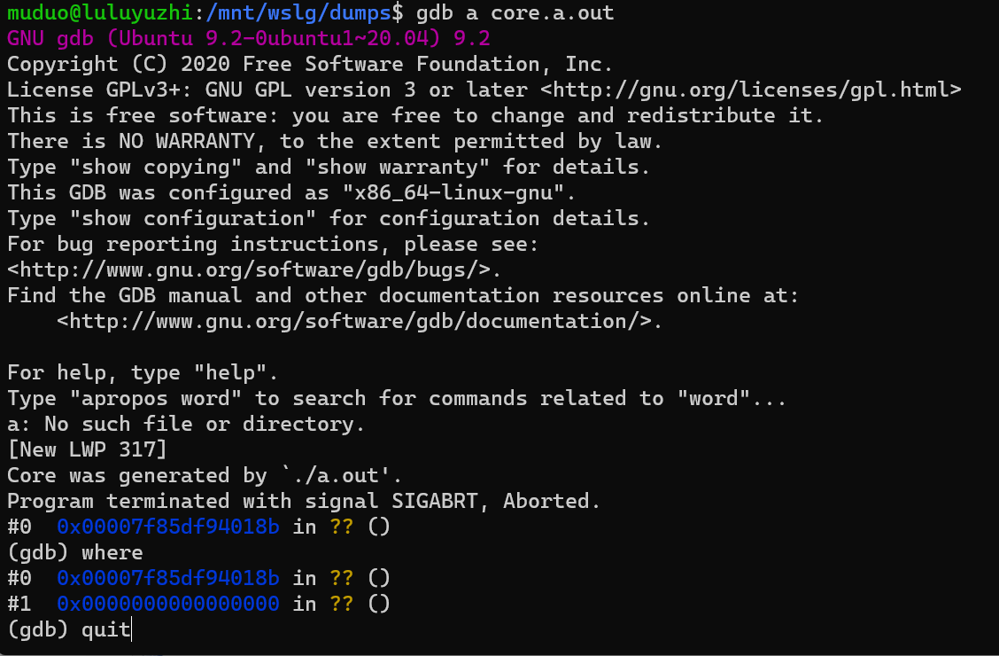

# Linux 调试 Dump 文件


没有太多能说的基本上都是操作，之前使用 Windws 来调试 Dump 文件有 Vs 这个全球第一的 IDE 加成, 整个操作还是比较简单的。

## Linux Core Dump

当程序运行的过程中异常终止或崩溃，操作系统会将程序当时的内存状态记录下来，保存在一个文件中，这种行为就叫做**Core Dump**（中文有的翻译成“核心转储”)。我们可以认为 core dump 是“内存快照”，但实际上，除了内存信息之外，还有些关键的程序运行状态也会同时 dump 下来，例如寄存器信息（包括程序指针、栈指针等）、内存管理信息、其他处理器和操作系统状态和信息。core dump 对于编程人员诊断和调试程序是非常有帮助的，因为对于有些程序错误是很难重现的，例如指针异常，而 core dump 文件可以再现程序出错时的情景。 

## Core Dump 名词解释

在半导体作为电脑内存材料之前，电脑内存使用的是 [**磁芯内存**](http://en.wikipedia.org/wiki/Core_memory)（Magnetic Core Memory），Core Dump 中的 Core 沿用了磁芯内存的 **Core** 表达。

在 ***APUE\*** 一书中作者有句话这样写的：

> Because the file is named *core*, it shows how long this feature has been part of the Unix System.

这里的 core 就是沿用的是早期电脑磁芯内存中的表达，也能看出 Unix 系统 Core Dump 机制的悠久历史。

**Dump** 指的是拷贝一种存储介质中的部分内容到另一个存储介质，或者将内容打印、显示或者其它输出设备。dump 出来的内容是格式化的，可以使用一些工具来解析它。

现代操作系统中，用 Core Dump 表示当程序异常终止或崩溃时，将进程此时的内存中的内容拷贝到磁盘文件中存储，以方便编程人员调试。

## Core Dump 如何产生

上面说当程序运行过程中**异常终止**或**崩溃**时会发生 core dump，但还没说到什么具体的情景程序会发生异常终止或崩溃，例如我们使用 `kill -9` 命令杀死一个进程会发生 core dump 吗？实验证明是不能的，那么什么情况会产生呢？

Linux 中信号是一种异步事件处理的机制，每种信号对应有其默认的操作，你可以在 **[这里](http://man7.org/linux/man-pages/man7/signal.7.html)** 查看 Linux 系统提供的信号以及默认处理。默认操作主要包括忽略该信号（Ingore）、暂停进程（Stop）、终止进程（Terminate）、终止并发生core dump（core）等。如果我们信号均是采用默认操作，那么，以下列出几种信号，它们在发生时会产生 core dump：

| Signal  | Action | Comment                                                      |
| ------- | ------ | ------------------------------------------------------------ |
| SIGQUIT | Core   | Quit from keyboard                                           |
| SIGILL  | Core   | Illegal Instruction                                          |
| SIGABRT | Core   | Abort signal from [abort](http://man7.org/linux/man-pages/man3/abort.3.html) |
| SIGSEGV | Core   | Invalid memory reference                                     |
| SIGTRAP | Core   | Trace/breakpoint trap                                        |

当然不仅限于上面的几种信号。这就是为什么我们使用 `Ctrl+z` 来挂起一个进程或者 `Ctrl+C` 结束一个进程均不会产生 core dump，因为前者会向进程发出 **SIGTSTP** 信号，该信号的默认操作为暂停进程（Stop Process）；后者会向进程发出**SIGINT** 信号，该信号默认操作为终止进程（Terminate Process）。同样上面提到的 `kill -9` 命令会发出 **SIGKILL** 命令，该命令默认为终止进程。而如果我们使用 `Ctrl+\` 来终止一个进程，会向进程发出 **SIGQUIT** 信号，默认是会产生 core dump 的。还有其它情景会产生 core dump， 如：程序调用 `abort()` 函数、访存错误、非法指令等等

**打开 core dump 功能**

- 在终端中输入命令 `ulimit -c` ，输出的结果为 0，说明默认是关闭 core dump 的，即当程序异常终止时，也不会生成 core dump 文件。
- 我们可以使用命令 `ulimit -c unlimited` 来开启 core dump 功能，并且不限制 core dump 文件的大小； 如果需要限制文件的大小，将 unlimited 改成你想生成 core 文件最大的大小，注意单位为 blocks（KB）。
- 用上面命令只会对当前的终端环境有效，如果想需要永久生效，可以修改文件 `/etc/security/limits.conf`文件，关于此文件的设置参看 **[这里](http://manpages.ubuntu.com/manpages/hardy/man5/limits.conf.5.html)** 。增加一行:

```bash
# /etc/security/limits.conf
#
#Each line describes a limit for a user in the form:
#
#<domain>   <type>   <item>   <value>
    *          soft     core   unlimited
```


**查看core文件存储位置**

```shell
sudo cat /proc/sys/kernel/core_pattern #显示的文件夹，按照目录找就ok
```

**修改 core 文件大小**

```shell
ulimit -c
//详细信息
ulimit -a
如果结果是0，我们需要修改其大小
//当前有效的修改
ulimit -c [size]  //这里size一般修改为unlimited,或者是其他数字：2048
```

例如：

```shell
muduo@DESKTOP-L2ICAQT:~$ ulimit -a
core file size          (blocks, -c) 0
data seg size           (kbytes, -d) unlimited
scheduling priority             (-e) 0
file size               (blocks, -f) unlimited
pending signals                 (-i) 15710
max locked memory       (kbytes, -l) 64
max memory size         (kbytes, -m) unlimited
open files                      (-n) 1024
pipe size            (512 bytes, -p) 8
POSIX message queues     (bytes, -q) 819200
real-time priority              (-r) 0
stack size              (kbytes, -s) 8192
cpu time               (seconds, -t) unlimited
max user processes              (-u) 15710
virtual memory          (kbytes, -v) unlimited
file locks                      (-x) unlimited
```

## sleep 调试

```bash
guohailin@guohailin:~$ sleep 10        #使用sleep命令休眠 10 s
^C                           #使用 Ctrl+C 终止该程序,不会产生 core dump
guohailin@guohailin:~$ sleep 10
^\Quit (core dumped)                #使用 Ctrl+\ 退出程序, 会产生 core dump
guohailin@guohailin:~$ ls         #多出下面一个 core 文件
-rw-------  1 guohailin guohailin 335872 10月 22 11:31 sleep.core.21990
```

我们找到  Dump 文件：

通过该命令调试：

```bash
gdb program core
# program 是程序名
# core 是core文件名
```

```bash
gdb sleep sleep.core.21990
```

通过 `where` 指令查看栈

```bash
muduo@luluyuzhi:/mnt/wslg/dumps$ gdb sleep core.sleep
GNU gdb (Ubuntu 9.2-0ubuntu1~20.04) 9.2
Copyright (C) 2020 Free Software Foundation, Inc.
License GPLv3+: GNU GPL version 3 or later <http://gnu.org/licenses/gpl.html>
This is free software: you are free to change and redistribute it.
There is NO WARRANTY, to the extent permitted by law.
Type "show copying" and "show warranty" for details.
This GDB was configured as "x86_64-linux-gnu".
Type "show configuration" for configuration details.
For bug reporting instructions, please see:
<http://www.gnu.org/software/gdb/bugs/>.
Find the GDB manual and other documentation resources online at:
    <http://www.gnu.org/software/gdb/documentation/>.

For help, type "help".
Type "apropos word" to search for commands related to "word"...
Reading symbols from sleep...
(No debugging symbols found in sleep)
[New LWP 279]
Core was generated by `sleep 10'.
Program terminated with signal SIGQUIT, Quit.
#0  0x00007f4c5ee7f334 in __GI___clock_nanosleep (clock_id=<optimized out>, clock_id@entry=0, flags=flags@entry=0,
    req=0x7ffdbaaa53c0, rem=0x0) at ../sysdeps/unix/sysv/linux/clock_nanosleep.c:78
78      ../sysdeps/unix/sysv/linux/clock_nanosleep.c: No such file or directory.
(gdb) where
#0  0x00007f4c5ee7f334 in __GI___clock_nanosleep (clock_id=<optimized out>, clock_id@entry=0, flags=flags@entry=0,
    req=0x7ffdbaaa53c0, rem=0x0) at ../sysdeps/unix/sysv/linux/clock_nanosleep.c:78
#1  0x00007f4c5ee85047 in __GI___nanosleep (requested_time=<optimized out>, remaining=<optimized out>)
    at nanosleep.c:27
#2  0x00005581a7497827 in ?? ()
#3  0x00005581a7497600 in ?? ()
#4  0x00005581a74947b0 in ?? ()
#5  0x00007f4c5edc60b3 in __libc_start_main (main=0x5581a74945b0, argc=2, argv=0x7ffdbaaa5598, init=<optimized out>,
    fini=<optimized out>, rtld_fini=<optimized out>, stack_end=0x7ffdbaaa5588) at ../csu/libc-start.c:308
#6  0x00005581a749487e in ?? ()
(gdb)
```

## 自己编写的程序调试

产生了 core 文件，我们该如何使用该 Core 文件进行调试呢？Linux 中可以使用 GDB 来调试 core 文件，步骤如下：

- 首先，使用 gcc 编译源文件，加上 `-g` 以增加调试信息；
- 按照上面打开 core dump 以使程序异常终止时能生成 core 文件；
- 运行程序，当core dump 之后，使用命令 `gdb program core` 来查看 core 文件，其中 program 为可执行程序名，core 为生成的 core 文件名。

```c++
#include <iostream>
#include <stdio.h>
#include <stdlib.h>

void DumpCrash()
{
    char *pStr = "test_conntent";
    free(pStr);
}

int main()
{
    DumpCrash();
    return 0;
}
```

gdb 调试的程序必须是它能找到的程序，要么在环境变量中， 要么通过路径引用。（可能会出现错误。）



```bash
muduo@luluyuzhi:/mnt/wslg/dumps$ gdb ~/temp/a.out core.a.out
GNU gdb (Ubuntu 9.2-0ubuntu1~20.04) 9.2
Copyright (C) 2020 Free Software Foundation, Inc.
License GPLv3+: GNU GPL version 3 or later <http://gnu.org/licenses/gpl.html>
This is free software: you are free to change and redistribute it.
There is NO WARRANTY, to the extent permitted by law.
Type "show copying" and "show warranty" for details.
This GDB was configured as "x86_64-linux-gnu".
Type "show configuration" for configuration details.
For bug reporting instructions, please see:
<http://www.gnu.org/software/gdb/bugs/>.
Find the GDB manual and other documentation resources online at:
    <http://www.gnu.org/software/gdb/documentation/>.

For help, type "help".
Type "apropos word" to search for commands related to "word"...
Reading symbols from /home/muduo/temp/a.out...
[New LWP 317]
Core was generated by `./a.out'.
Program terminated with signal SIGABRT, Aborted.
#0  __GI_raise (sig=sig@entry=6) at ../sysdeps/unix/sysv/linux/raise.c:50
50      ../sysdeps/unix/sysv/linux/raise.c: No such file or directory.
(gdb) where
#0  __GI_raise (sig=sig@entry=6) at ../sysdeps/unix/sysv/linux/raise.c:50
#1  0x00007f85df91f859 in __GI_abort () at abort.c:79
#2  0x00007f85df98a3ee in __libc_message (action=action@entry=do_abort, fmt=fmt@entry=0x7f85dfab4285 "%s\n")
    at ../sysdeps/posix/libc_fatal.c:155
#3  0x00007f85df99247c in malloc_printerr (str=str@entry=0x7f85dfab24ae "free(): invalid pointer") at malloc.c:5347
#4  0x00007f85df993cac in _int_free (av=<optimized out>, p=<optimized out>, have_lock=0) at malloc.c:4173
#5  0x000055d2de6d61ac in DumpCrash () at test.cpp:8
#6  0x000055d2de6d61bc in main () at test.cpp:13
(gdb)
```

可以看到 错误出现时因为 free 释放了一个 无效指针。

