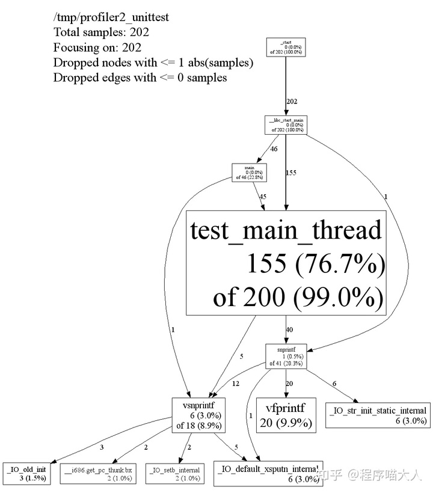
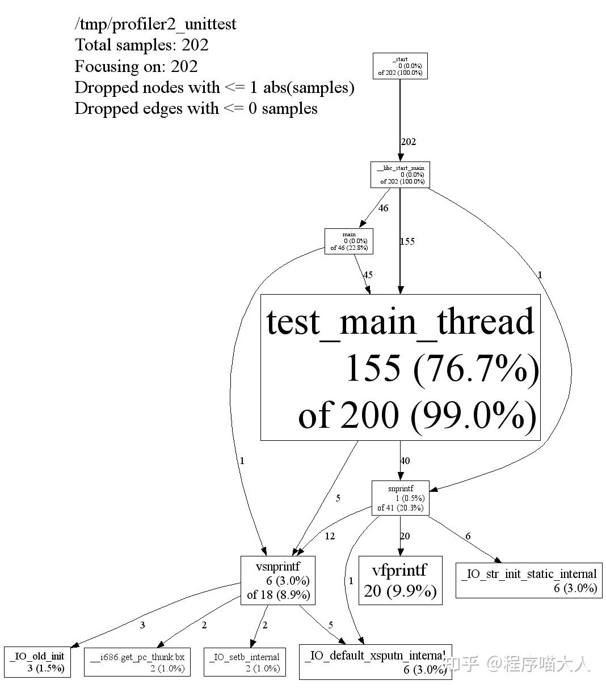

# Linux调试手段

## **如何定位crash问题？**

关于crash问题我一般都是先看crash的报错，再查看堆栈信息，基本70%的crash问题都可以通过查看堆栈信息来定位，剩下的我一般都是结合log或者调试工具一起看。

有的时候crash不会稳定出现在某个地方，这种调试起来比较麻烦，一般都是某块内存出了问题，比如某个对象其实是构造在0x123456地址上，但是我们却使用了0x234567地址来调用对象上的相关函数，这种会导致crash，但是不一定每次都crash在相同的地方，这就需要像二分法一样，分段排查错误，缩小复现范围，然后利用调试工具或log打印某些变量的地址以及变量值等，进而排查问题。

也可通过解core来排查问题，我一般解core都是通过gdb，有的大佬可以非常专业高端的解core，这我基本不怎么了解。。。我主要是做移动端native开发，平时项目中基本用不到解core这种方式。而且现在经常使用XCode调试，真的相当方便。

## **如何调试逻辑问题？**

对于逻辑问题我一般都是打log，也建议大家平时开发过程中在一些关键的地方都打上log，开发过程中可能比较麻烦，但如果真的出了逻辑性的问题，而且又不是稳定复现，又没有对应的log信息，那真的相当麻烦。所以老铁们，多打log，不要嫌麻烦，log在关键时刻能起很大作用。

当然逻辑问题也可以使用gdb或者lldb打断点的方法来调试，在某些关键地方打上断点，然后查看某些变量的值，也可以使用某些IDE调试，我一般使用XCode来打断点进行调试。但这种方法有个缺点，如果程序Release出去后出现了逻辑问题，调试起来就比较麻烦，所以建议还是多打一些log。

## **如何调试内存问题？**

内存问题常见的就是内存泄漏啦，关于内存泄漏我一般都是先写个自己的内存检测的小工具用在项目中，C语言的话那就用宏覆盖malloc和free函数，C++的话那就重写operator new 和 operator delete函数。关于内存问题还有两个重磅调试工具要推荐，valgrind和asan，valgrind想必大家都知道也都用过，其实大家也可以多用下asan，它是gcc自带的工具，非常方便。

## **如何调试死锁问题？**

如果合理使用C++11的RAII风格的锁或者更现代的std::scope_lock，那基本不会发生死锁。但如果真发生了死锁，怎么调试呢？可以使用IDE直接查看当前各个线程的堆栈信息，看哪两个线程处在wait状态，那基本上是这两个线程发生了死锁。

还可以使用gdb+deadlock.py的方式，deadlock.py是个检测死锁的python脚本，可以在gdb中执行，如果真的发生了死锁，直接执行脚本就可以检测出来，代码太长不好贴出来，deadlock.py的代码和使用方式，可以去Facebook的Folly库里找。

## **如何进行性能分析？**

关于性能分析我其实更多的还是在代码中打印函数耗时。

再推荐个性能分析的工具，gperftools，这个工具是Google出品，可以提供整个程序的热点分布图，方便我们找到性能的瓶颈。

## **如何写可靠的代码？**

想要写好代码，做好静态检测是必须的，它可以按照某些设定好的代码规则，帮助我们检测代码的潜在缺陷，找到代码中隐藏的错误，比如参数不匹配、有歧义的嵌套语句、错误的递归、非法计算、空指针问题、越界问题、未初始化问题、内存泄漏问题等等。这里推荐个工具Clang-Tidy，还有个代码检测的平台叫SonarCube，也非常好用。

## **如何打log？**

C++里想打log基本上都会使用log库，有些大佬是自己撸的，有的是使用第三方库，我工作中更多用到的是glog，glog挺好用，但它性能较低，这里推荐使用spdlog，spdlog基本是现代C++中最火的一个第三方log库，功能完备，性能较高，值得推荐。

## **如何进行网络调试？**

不用多说，tcpdump+wireshark。

## **如何进行单元测试？**

也不用多说，直接上gtest吧。这里强调一下，尽量写代码之前先写好测试用例，先想好怎么测试后再开始动手写代码。

文中提到调试死锁的方法：

[**deadlock.py**](https://github.com/facebook/folly/blob/bd600cd4e88f664f285489c76b6ad835d8367cd2/folly/experimental/gdb/deadlock.py)

