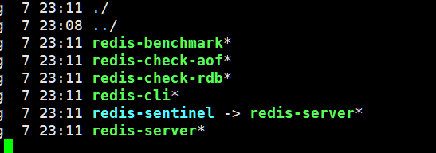

```bash
make PREFIX=/usr/local/redis install
```


启动集群，没有 指定 nodes.conf 文件 会自动分配节点名称

```bash
6913:M 07 Aug 2021 23:17:04.469 * No cluster configuration found, I'm 09c60ebcc6f1d168c106ce249a58e876a99a2043

```

## Redis 集群的数据分片

Redis 集群没有使用一致性hash, 而是引入了 **哈希槽**的概念.

Redis 集群有16384个哈希槽,**每个key**通过CRC16校验后对16384取模来决定放置哪个槽.**集群的每个节点负责一部分hash槽**,举个例子,比如当前集群有3个节点,那么:

- 节点 A 包含 0 到 5500号哈希槽.
- 节点 B 包含5501 到 11000 号哈希槽.
- 节点 C 包含11001 到 16384号哈希槽.

这种结构很容易添加或者删除节点. 比如如果我想新添加个节点D, 我需要从节点 A, B, C中得部分槽到D上. 如果我想移除节点A,需要将A中的槽移到B和C节点上,然后将没有任何槽的A节点从集群中移除即可. 由于从一个节点将哈希槽移动到另一个节点并不会停止服务,所以无论添加删除或者改变某个节点的哈希槽的数量都不会造成集群不可用的状态.

[Redis 5.0 redis-cli --cluster help说明](https://www.cnblogs.com/zhoujinyi/p/11606935.html)

[AOF文件格式](https://blog.csdn.net/Dax1n/article/details/107784307)

[Redis 集群搭建](http://www.redis.cn/topics/cluster-tutorial.html)

[Redis 集群规范](http://www.redis.cn/topics/cluster-spec.html)

